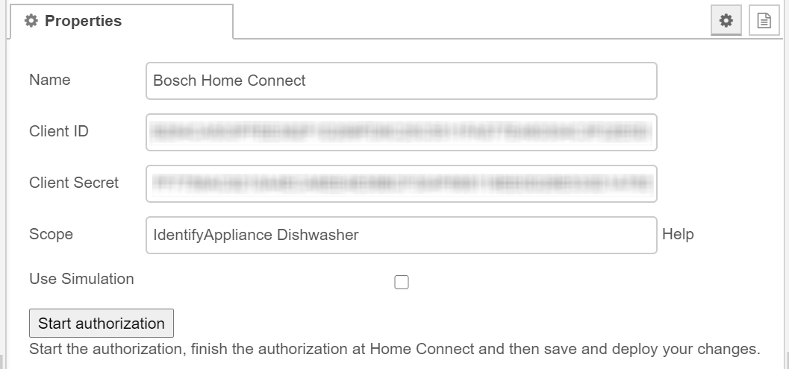
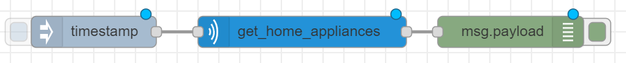
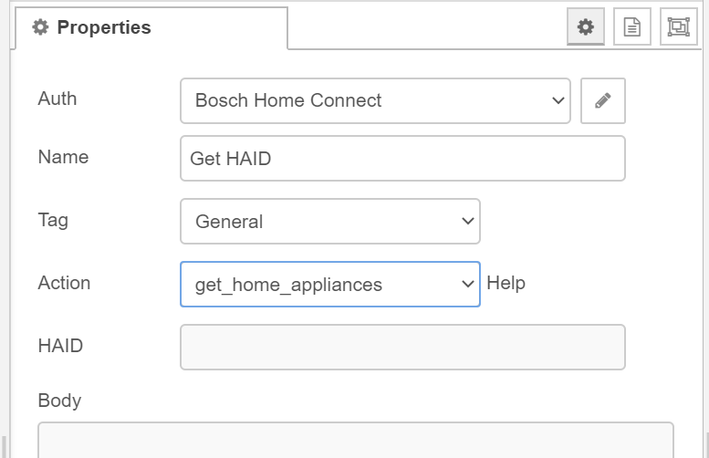

# Smart Energy with Solar Panels and a Bosch Home Connected dishwasher<!-- omit in toc -->

May 18, 2020   
_**Applies to:** Node-RED, DSMR Reader, Bosch Home Connect and Fibaro Home Center 2_

## Table of Contents<!-- omit in toc -->

- [Goal](#goal)
- [TL;DR](#tldr)
- [Why I chose Node-RED](#why-i-chose-node-red)
- [Prerequisites](#prerequisites)
- [Node-RED part](#node-red-part)
  - [Home Connect node installation](#home-connect-node-installation)
  - [Set up authentication with the Bosch Developer API](#set-up-authentication-with-the-bosch-developer-api)
  - [Configure the Home Connect Auth node](#configure-the-home-connect-auth-node)
  - [Get the HAID of your dishwasher](#get-the-haid-of-your-dishwasher)
  - [Functions I wrote](#functions-i-wrote)
    - [Polling State](#polling-state)
    - [DSMR request](#dsmr-request)
    - [Energy return check](#energy-return-check)
- [Fibaro Home Center 2 part](#fibaro-home-center-2-part)
- [More information](#more-information)

## Goal

In the Netherlands there is a law that if you generate more sustainable energy via solar panels than you consume from your energy supplier when the sun is not shining, the energy that you have delivered back to the public network is deducted from this. The energy is stated in kWh and this deduction is called netting.

The government has decided to gradually phase out the netting in 2023. This makes it very important to use the energy of your solar panels as smartly as possible. That is why we are already trying to adapt as much as possible by using devices that require a lot of energy during the day.

One of these devices is our dishwasher made by Bosch. The dishwasher has the Home Connect function available, so why no use it to automate the start of the washing when there is more energy delivered from the solar panels than the other devices in our house at that moment need.

## TL;DR

* Read energy return from our Smart Meter.
* Check if the dishwasher is ready to do the dishes.
* Start the dishwasher program when the solar panels deliver more energy than the house consumes.
* Program it with as little API and network traffic as possible.

## Why I chose Node-RED

If you read my previous articles you know I use the Fibaro System as base of my domotica system. Why do I make this smart energy system with Node-RED and not with LUA in the Home Center?

That is because with the Home Center 2 I can not trigger actions based on events. You have to poll an API for new data, and I want the dishwasher virtual device to be instant updated. Also I don't want to poll API's to much because most public API's like Bosch Home Connect has limits requesting the API.

## Prerequisites

Before you can start with this awesome stuff you must have the following in place:

* Your dishwasher must be connected to [Bosch Home Connect](https://apps.apple.com/nl/app/home-connect-app/id901397789).
* [Node-RED](https://nodered.org/) must be installed.
* [DSMR Reader](https://github.com/dennissiemensma/dsmr-reader) must be installed *and the API enabled* in the configuration settings.

> **Note:** This article is based on a 3-phase power connection, find the correct phase where the dishwasher is connected to and write this down to use later.

## Node-RED part

To minimize polling API's the event Node listens to the home connect events and if the remote control is activated a flow variable is set. Every day from 09:00 to 14:00 another inject node checks every 5 minutes if the variabel is set. If this is true it start polling the kW return on the correct phase in DSMR reader.

### Home Connect node installation

First install the [`node-contrib-home-connect`](https://www.npmjs.com/package/node-red-contrib-homeconnect) node in your Node-RED environment:

```bash
npm install node-contrib-home-connect
```

### Set up authentication with the Bosch Developer API

To use the Home Connect nodes a **Client ID** and **Client Secret** are required. Those can be received from the [Home Connect Developer](https://developer.home-connect.com/) Portal.

After setting up an account, register a new application and select **Authorization Code Grant Flow** as the **OAuth Flow**.
Set the **Redirect URI** to `http://<ip-address>:<port>/homeconnect/auth/callback`. Set the ip-address and port to match your Node-RED installation.

### Configure the Home Connect Auth node

The `home-connect-auth` node handles the authentication for the Home Connect Developer API.

> **Note:** Start the authorization from the **edit `home-connect-auth` dialog**, finish the authorization at the Home Connect website and then save and deploy your changes.

Use the following settings in the **properties** dialog:

| Property       | Information                                                            |
| -------------- | ---------------------------------------------------------------------- |
| Name           | Name of the node (optional)                                            |
| Client Id	     | `Client ID` from the Home Connect Developer Portal     |
| Client Secret	 | `Client Secret` from the Home Connect Developer Portal |
| Scope          | `IdentifyAppliance Dishwasher`                                         |
| Use Simulation | Not selected                                                           |

### Get the HAID of your dishwasher

To direct access the dishwasher you need the `haId` of the device. At first I didn't know how to get this, but I figured out you have to add `IdentifyApplicance` to the `Scope` of the `home-connect-auth` node, else you don't have the authorisation to read general appliance settings.



Create a new flow to trigger a `get_home_appliances` action with the `home-connect-request` node to get information about all your appliances connected to Home Connect:





If you trigger this flow you get a payload in de debug messages sidebar with all your connected appliances:

```json
{
  "homeappliances": [
    {
      "name": "Vaatwasser",
      "brand": "Bosch",
      "vib": "SBEXXXXXXX",
      "connected": true,
      "type": "Dishwasher",
      "enumber": "SBEXXXXXXX/00",
      "haId": "BOSCH-SBEXXXXXXX-0123456789AB"
    }
  ]
}
```

Write down the `haId` value to use it later.

### Functions I wrote

#### Polling State

#### DSMR request

#### Energy return check

## Fibaro Home Center 2 part

## More information

* https://developer.home-connect.com/docs/