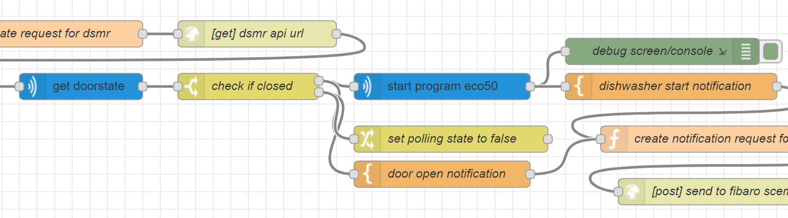

# Smart Energy with Solar Panels and a Bosch Home Connected dishwasher<!-- omit in toc -->

June 1, 2020   
_**Applies to:** Node-RED, DSMR Reader and Bosch Home Connect_

## Table of Contents<!-- omit in toc -->

- [Goal](#goal)
- [TL;DR](#tldr)
- [Why I chose Node-RED](#why-i-chose-node-red)
- [Prerequisites](#prerequisites)
- [How the flow works](#how-the-flow-works)
- [Home Connect node installation](#home-connect-node-installation)
  - [Set up authentication with the Bosch Developer API](#set-up-authentication-with-the-bosch-developer-api)
  - [Configure the Home Connect Auth node](#configure-the-home-connect-auth-node)
  - [Get the HAID of your dishwasher](#get-the-haid-of-your-dishwasher)
- [Check for dishwasher events](#check-for-dishwasher-events)
- [Check for energy return](#check-for-energy-return)
  - [DSMR Reader request](#dsmr-reader-request)
  - [Read how much energy is returned](#read-how-much-energy-is-returned)
- [Finally start the dishwasher](#finally-start-the-dishwasher)
- [More information](#more-information)

## Goal

In the Netherlands there is a law that if you generate more sustainable energy via solar panels than you consume from your energy supplier when the sun is not shining, the energy that you have delivered back to the public network is deducted from this. The energy is stated in kWh and this deduction is called netting.

The government has decided to gradually phase out the netting in 2023. This makes it very important to use the energy of your solar panels as smartly as possible. That is why we are already trying to adapt as much as possible by using devices that require a lot of energy during the day.

One of these devices is our dishwasher made by Bosch. The dishwasher has the Home Connect function available, so why no use it to automate the start of the washing when there is more energy delivered from the solar panels than the other devices in our house at that moment need.

## TL;DR

* Read energy return from our Smart Meter.
* Check if the dishwasher is ready to do the dishes.
* Start the dishwasher program when the solar panels deliver more energy than the house consumes.
* Program it with as little API and network traffic as possible.

## Why I chose Node-RED

If you read my previous articles you know I use the Fibaro System as base of my domotica system. Why do I make this smart energy system with Node-RED and not with LUA on the Home Center?

That is because with the Home Center 2 I can not trigger actions based on *events*. You have to *poll* an API for new data, and I want the dishwasher virtual device to be instant updated. Also I don't want to poll API's to much because most public API's like Bosch Home Connect has limits requesting the API.

## Prerequisites

Before you can start with this awesome stuff you must have the following in place:

* Your dishwasher must be connected to [Bosch Home Connect](https://apps.apple.com/nl/app/home-connect-app/id901397789).
* [Node-RED](https://nodered.org/) must be installed.
* [DSMR Reader](https://github.com/dennissiemensma/dsmr-reader) must be installed *and the API enabled* in the configuration settings.

> **Note:** This article is based on a 3-phase power connection, find the correct phase where the dishwasher is connected to and write this down to use later.

## How the flow works

To minimize polling API's the `dishwasher-event` node listens to the Home Connect events. If remote control is activated on the dishwasher a *flow variable* is set. Every day from 09:00 to 14:00 another inject node checks every 5 minutes if the variable is set. If this is `true` it start polling the kW *returned* energy on the correct phase in DSMR reader. The Eco 50°C program runs 2,5 hours, so after 14:00 the dishwasher should always start, else the dishes are not ready when I come home from work.

## Home Connect node installation

First install the [`node-contrib-home-connect`](https://www.npmjs.com/package/node-red-contrib-homeconnect) node in your Node-RED environment:

```bash
npm install node-contrib-home-connect
```

### Set up authentication with the Bosch Developer API

To use the Home Connect nodes a **Client ID** and **Client Secret** are required. Those can be received from the [Home Connect Developer](https://developer.home-connect.com/) Portal.

After setting up an account, register a new application and select **Authorization Code Grant Flow** as the **OAuth Flow**.
Set the **Redirect URI** to `http://<ip-address>:<port>/homeconnect/auth/callback`. Set the ip-address and port to match your Node-RED installation.

### Configure the Home Connect Auth node

The `home-connect-auth` node handles the authentication for the Home Connect Developer API.

> **Note:** Start the authorization from the **edit `home-connect-auth` dialog**, finish the authorization at the Home Connect website and then save and deploy your changes.

Use the following settings in the **properties** dialog:

| Property       | Information                                                            |
| -------------- | ---------------------------------------------------------------------- |
| Name           | Name of the node (optional)                                            |
| Client Id	     | `Client ID` from the Home Connect Developer Portal                     |
| Client Secret	 | `Client Secret` from the Home Connect Developer Portal                 |
| Scope          | `IdentifyAppliance Dishwasher`                                         |
| Use Simulation | `Not selected`                                                         |

### Get the HAID of your dishwasher

To direct access the dishwasher you need the `haId` of the device. At first I didn't know how to get this, but I figured out you have to add `IdentifyApplicance` to the `Scope` of the `home-connect-auth` node, else you don't have the authorisation to read general appliance settings:


Create a new flow to trigger a `get_home_appliances` action with the `home-connect-request` node to get information about all your appliances connected to Home Connect:


If you trigger this flow you get a payload in de debug messages sidebar with all your connected appliances:

```json
{
  "homeappliances": [
    {
      "name": "Vaatwasser",
      "brand": "Bosch",
      "vib": "SBEXXXXXXX",
      "connected": true,
      "type": "Dishwasher",
      "enumber": "SBEXXXXXXX/00",
      "haId": "BOSCH-SBEXXXXXXX-0123456789AB"
    }
  ]
}
```

Write down the `haId` value to use it later.

## Check for dishwasher events

The Node-RED flow starts with the correct dishwasher event by using the `home-connect-event` node. A *function* node parses the event and a decision is made what to do next.

First I read if the remote control button is pressed on the dishwasher button panel:

```javascript
if (msg.payload.key == 'BSH.Common.Status.RemoteControlStartAllowed') {
    if (msg.payload.value === true) {
        flow.set("CheckForDishwasherStart", true);
        node.status({fill:"green",shape:"ring",text:"RemoteControlStartAllowed: True"});
    }
    else {
        flow.set("CheckForDishwasherStart", false);
        node.status({fill:"yellow",shape:"ring",text:"RemoteControlStartAllowed: False"});
    }
}
```

When you press the button the `BSH.Common.Status.RemoteControlStartAllowed` key is set to `true`. Then I set a flow variable `CheckForDishwasherStart` to `true` to start polling of the DSMR Reader API to check how much power is returned on the dishwasher phase.

## Check for energy return

Every *10 minutes* between 09:00 and 18:00 I check if the flow variable  `CheckForDishwasherStart` is set to `true`. I start to check at 09:00 because before this time I don't want the dishwasher to be running. When the variable is set to `true` I start polling DSMR Reader.

### DSMR Reader request

To get the last telegram from the smart meter I set a time interval of -1 minute to now and get the last reading in that time:

```javascript
var server  = 'http://192.168.1.1';
var authkey = 'XXXXXXXXXXXXXXXXXXXXXXXXXXXXXXXXXXXXXXXXXXXXXXXXXX';

var dt = new Date()
var current_date = dt.getDate();
var current_month = dt.getMonth() + 1;
var current_year = dt.getFullYear();
var current_hrs = dt.getHours();
var current_mins = dt.getMinutes();
var current_secs = dt.getSeconds();

// add 0 before date, month, hrs, mins or secs if they are less than 0
current_date = current_date < 10 ? '0' + current_date : current_date;
current_month = current_month < 10 ? '0' + current_month : current_month;
current_hrs = current_hrs < 10 ? '0' + current_hrs : current_hrs;
current_mins = current_mins < 10 ? '0' + current_mins : current_mins;
current_secs = current_secs < 10 ? '0' + current_secs : current_secs;

var pdt = new Date(dt);
pdt.setMinutes(dt.getMinutes() - 1);
var past_date = pdt.getDate();
var past_month = pdt.getMonth() + 1;
var past_year = pdt.getFullYear();
var past_hrs = pdt.getHours();
var past_mins = pdt.getMinutes();
var past_secs = pdt.getSeconds();

// add 0 before date, month, hrs, mins or secs if they are less than 0
past_date = past_date < 10 ? '0' + past_date : past_date;
past_month = past_month < 10 ? '0' + past_month : past_month;
past_hrs = past_hrs < 10 ? '0' + past_hrs : past_hrs;
past_mins = past_mins < 10 ? '0' + past_mins : past_mins;
past_secs = past_secs < 10 ? '0' + past_secs : past_secs;

lte = current_year + '-' + current_month + '-' + current_date + ' ' + current_hrs + ':' + current_mins + ':' + current_secs;
gte = past_year + '-' + past_month + '-' + past_date + ' ' + past_hrs + ':' + past_mins + ':' + past_secs;

msg.payload = encodeURI(server + '/api/v2/datalogger/dsmrreading?limit=1&ordering=-timestamp&timestamp__gte=' + gte + '&timestamp__lte=' + lte);
msg.headers = {};
msg.headers['X-AUTHKEY'] = authkey;
return msg;
```

The message created by this function is passed to a `http request` node.

### Read how much energy is returned

My dishwasher is connected to phase 2, therefore I read the variable `phase_currently_returned_l2` from the DSMR Reader API JSON response.

The response is parsed in the script as follows:

* If it is tuesday and between 10:00 and 14:00 don't start the dishwasher bevause the heatpump needs all electricity for it's anti legionella program.
* If the current return on phase 2 is more than 1000 W, then pass message through.
* If it is after 14:00, then always start the dishwasher, so it is ready when I arrive at home from work.

```javascript
var phase_currently_returned_l2 = parseInt(msg.payload.results[0].phase_currently_returned_l2.split('.').join(""));

var d  = new Date();
var h  = d.getHours();
var m  = d.getMinutes();
var n  = d.getDay();
var dd = d.getDate();
var mm = d.getMonth()+1;

if(dd < 10) { dd = '0' + dd; } 
if(mm < 10) { mm = '0' + mm; } 
if(m < 10) { m = '0' + m; }

var statusText = phase_currently_returned_l2 + ' W return (' + dd + '-' + mm + ' ' + h + ':' + m + ')';

// if it is tuesday and between 10:00 and 14:00 do nothing because the heatpump gets all
// electricity for it's anti legionella programma
if (n == 2 && h >=10 && h <14 ) {
    statusText = 'halt due heatpump program! (' + dd + '-' + mm + ' ' + h + ':' + m + ')';
    node.status({fill:"red",shape:"ring",text:statusText});
    // set msg to null to end flow processing.
    msg = null;
    return msg;
}
else if (phase_currently_returned_l2 > 1000) {
    // if current W on phase 2 is more than 1000 pass message through.
    node.status({fill:"green",shape:"ring",text:statusText});
    return msg; 
}
else if (h >= 14) {
    // always start dishwasher program after 14:00
    statusText = statusText + ' (override)';
    node.status({fill:"green",shape:"ring",text:statusText});
    return msg;
    
}
else {
    node.status({fill:"yellow",shape:"ring",text:statusText});
    // set msg to null to end flow processing.
    msg = null;
    return msg;
}
```

## Finally start the dishwasher

If all the above check are ok, the last check is to see if the door is still *open*. If the door is *closed* the polling state is set to `false` and the *Eco 50°C* program is started to wash the dishes!



## More information

* https://developer.home-connect.com/docs/