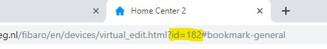

# Intelligent rain detection for your SILENO Robotic Lawnmower<!-- omit in toc -->

July 7, 2019   
_**Applies to:** Fibaro Home Center 2_

## Goals

* Temporary park my lawnmower when there is more than 2 mm/h rain.
* Park my lawnmower until next schedule then there is a rainstorm.
* When the rain gets worse, park my lawnmower until next schedule.

The Gardena SILENO Robotic Lawnmowers have no rain sensor, they just work in the rain. Amazing technology but when there is a rainstorm it's safer to park the mower. I can program a LUA scene in the Fibaro Home Center to look at the weather forecast and park the mower when rain is expected, but forecast changes a lot here in The Netherlands. I found that [BuienRadar](https://www.buienradar.nl/) is accurate and they have a [public API](https://www.buienradar.nl/overbuienradar/gratis-weerdata) (for non commercial use). BuienRadar gives me *current rain conditions in mm/h in 5 minute intervals* for the next 2 hours. With this information I can anticipate on the amount of rain and decide if the mower needs to be parked.

## Table of Contents<!-- omit in toc -->
- [Goals](#Goals)
- [TL;DR](#TLDR)
- [How I implemented it](#How-I-implemented-it)
  - [In words](#In-words)
  - [Before you start](#Before-you-start)
  - [Step 1: Import the Mower Control Virtual Device](#Step-1-Import-the-Mower-Control-Virtual-Device)
    - [Getting the Virtual Device file](#Getting-the-Virtual-Device-file)
    - [Import the Virtual Device file](#Import-the-Virtual-Device-file)
    - [Configure the Virtual Device](#Configure-the-Virtual-Device)
    - [Get the ID of the Virtual Device](#Get-the-ID-of-the-Virtual-Device)
  - [Step 2: Create a Global Variable](#Step-2-Create-a-Global-Variable)
  - [Step 3: Create a Mower Control LUA scene](#Step-3-Create-a-Mower-Control-LUA-scene)
    - [Getting the LUA scene code](#Getting-the-LUA-scene-code)
    - [Create a new LUA scene and import the code](#Create-a-new-LUA-scene-and-import-the-code)
    - [Configure the LUA scene](#Configure-the-LUA-scene)
      - [Set the LUA parameters](#Set-the-LUA-parameters)
      - [Set the Scene parameters](#Set-the-Scene-parameters)
- [Congratulations!](#Congratulations)
- [More information about Virtual Devices](#More-information-about-Virtual-Devices)
- [Downloads](#Downloads)

## TL;DR

* Connect to the Gardena Smart System API to read the status of my lawnmower.
* Check the BuienRadar.nl API every 5 minutes for information about rain.
* Decide to park the lawnmower according to the amount of rain.

## How I implemented it

### In words

[Fibaro Forum](https://forum.fibaro.com/) user [Barlow](https://marketplace.fibaro.com/profiles/fibaro-user-unnamed-97289857-ceae-4d7d-a4b3-16fc03a4999d) did an amazing job by creating a [*Virtual Device*](https://marketplace.fibaro.com/items/gardena-smartsystem) for the Gardena Smart System. But for my intelligent rain detection it is to extensive. I like to utilize only the things I need in my Smart Home to keep the network communication and processing power as low as possible. Therefore I used his LUA scene as a reference and made my own.

The *BuienRadar API* is public (for non commercial use) and combining these two API's with the *Fibaro Home Center* I can act on rain accuratly.

### Before you start

* Get the *latitude* and *longitude* coordinates for the location your lawnmower is working. You can use the website [latlong.net](https://www.latlong.net/) for it.
* Make sure the [iOS](https://apps.apple.com/nl/app/gardena-smart-system/id971199503) or [Android](https://play.google.com/store/apps/details?id=com.gardena.smartgarden) Gardena App is working on your smartphone and have the login information at hand.

### Step 1: Import the Mower Control Virtual Device

#### Getting the Virtual Device file

**Download** the *Virtual Device* file [from my GitHub](https://github.com/joepv/fibaro/blob/master/MowerControl.vfib).

#### Import the Virtual Device file

* **Log in** to your Fibaro Home Center 2 with _admin_ credentials.
* Click on the **Devices** tab in top panel and then on **Add or remove device** button in the left sidebar.
* Click in the **Add Device** screen on the **Choose Files** button in the **To add the Virtual Device** section.
* **Select** the `MowerControl.vfib` file you just downloaded.


#### Configure the Virtual Device

When the import has finished you can give it a **Name** and assign it to a **Room**. I'll skip the *advanced configuration* for now, because first you have to create a new *LUA scene* in the next section to get a scene *id* to configure the *Virtual Device* buttons.

#### Get the ID of the Virtual Device

The easiest way to get the *id* of the *Virtual Device* is to look in the address bar of your browser. After the substring `id=` you'll find the *id* of your new *Virtual Device*. The screenshot below shows an *id* of `182`:



Remember the *id*, or write it on a piece of paper for the next step when you implement the *LUA scene*.

### Step 2: Create a Global Variable

Create a _Global variable_ in your Home Center 2 _Variables Panel_ at `http://192.168.1.2/fibaro/en/panels/variables.html` with the name `MowerPushSend`.

### Step 3: Create a Mower Control LUA scene

#### Getting the LUA scene code

* **Download** the *LUA scene* code file [from my GitHub](https://github.com/joepv/fibaro/blob/master/MowerControl.lua).
* **Open** the downloaded `MowerControl.lua` file with your favorite text editor and **copy the contents to the clipboard**.

#### Create a new LUA scene and import the code

* **Click** on the **Scenes** tab in *top panel* and then on **Add scene** button in the *left sidebar*.
* **Click** in the **New Scene** screen on the **Add** button in the **Add scene in LUA** section.


* A new scene is created with the _Advanced_ tab opened as default.
* **Remove** all code and **paste** the contents of your clipboard in the online code editor to import the LUA scene code.


#### Configure the LUA scene

##### Set the LUA parameters

* At the bottom of the code you have to **set** the `gardenaEmail` and `gardenaPassword` you use with the Gardena App.
* **Change** the `latlon` variable to the coordinates you wrote down earlier in the following format `lat=52.37&lon=4.89`.
* Change `mowerVirtualDevice` to the virtual device id you wrote down earlier.
* Change `phoneId` to the *id* of your phone to receive push messages.

```lua
gardenaEmail    = "user@domain.com"
gardenaPassword = "mysecretpassword"
latlon = "lat=52.37&lon=4.89"
mowerVirtualDevice = 184  -- virtual device id
phoneId = 156
```

##### Set the Scene parameters

* **Click** in the **New Scene** screen on the **General** tab.
* Give the Scene a **Name** and assign it to a **Room**.
* **Set** the parameter **Max. running instances** to  `1`
* **Set** the parameter **Run scene** to `Automatic`

## Congratulations!

Take a beer! Everything is finished, you are ready to go!

## More information about Virtual Devices

You can read more about creating Virtual Devices in the [Creating Virtual Devices](https://manuals.fibaro.com/knowledge-base-browse/creating-virtual-devices/) Fibaro manual.

## Downloads

You can download the files from here:

* [Virtual Device](https://github.com/joepv/fibaro/blob/master/MowerControl.vfib)
* [LUA scene code](https://github.com/joepv/fibaro/blob/master/MowerControl.lua)