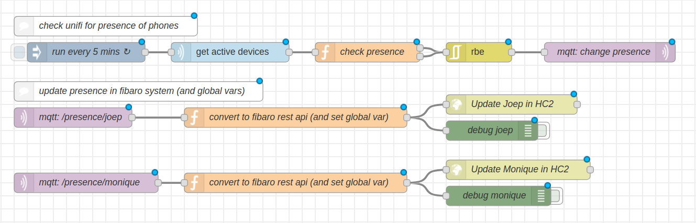
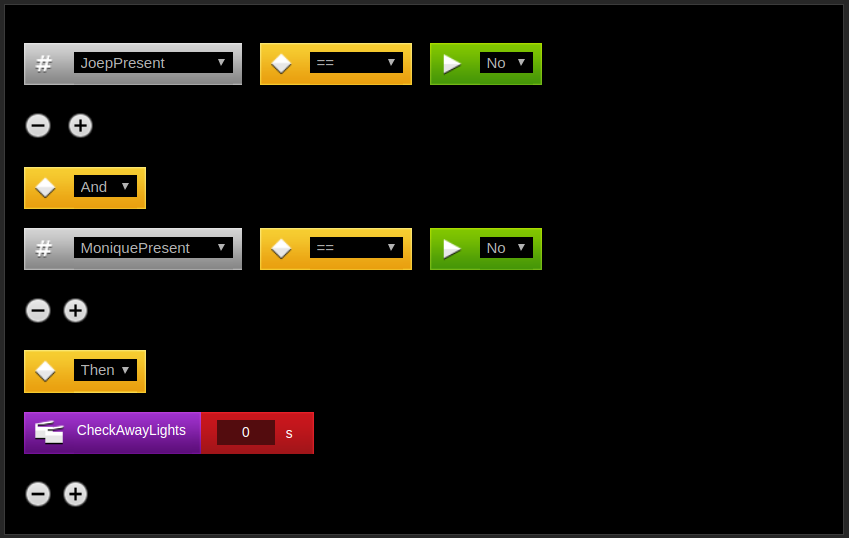

# Presence detection with Unifi, Node-RED and Fibaro Home Center 2

December 10, 2018\s\s
_*Applies to:* Fibaro Home Center 2, Node-RED and MQTT_.

## Goals

* Reliable presence detection.
* Get smartphone presence from Unifi controller.
* Use smartphone presence in Fibaro Home Center 2 LUA scenes.

To my experience is presence detection with use of geofencing unreliable. Therefore I searched for an other rock solid solution to check the presence of our smartphone's. I started with a ping to the IPv4 address of the phone, but power saving disabled Wi-Fi after 15 minutes and all lights in our home turned off while sitting in the living room.

I found some projects reading the UniFi controller online devices list via the UniFi API for reliable presence detection in other domotica controllers, but the Fibaro Home Center 2 can't connect to a _https_ site with a self signed certificate (_update, this is fixed in version 4.520_). So I installed the Node-RED UniFi node and with some JavaScript I update a global variable via de Fibaro REST-API with our presence state. With this global variable set I can use our presence in other graphic blocks and LUA scenes.

## TL;DR

* Get smartphone online status with UniFi node in Node-RED.
* Update on/off-line status in Home Center 2 global variable with Fibaro REST-API.
* Use global variable in graphic blocks and LUA scenes.

## How I implemented it

### In words

With the UniFi node for Node-RED I _poll_ the UniFi controller _every five minutes_ for the presence of our smartphones. Then I use a `rbe` node to _only send changes_ to  MQTT  when the presence actually changed. I put the presence state in MQTT, a Node-RED variabele and a Fibaro Home Center predefined variable, so I can use it everywhere I want. The Home Center 2 predefined variable is updated via de Fibaro REST-API.

### Before you start

The following IPv4 addresses are used in my example:

| Device               | IPv4 address | Port |
| -------------------- | ------------ | ---- |
| UniFi controller     | 192.168.1.1  | 8443 |
| Fibaro Home Center 2 | 192.168.1.2  | 80   |
| MQTT broker          | localhost    | 1883 |

The following table matches the names of the devices in this example:

| UniFi (device name) | MQTT (topic)     | Home Center 2 (predefined variable) |
| ------------------- | ---------------- | ----------------------------------- |
| iPhone Xs (Joep)    | presence/joep    | JoepPresent                         |
| iPhone 8 (Monique)  | presence/monique | MoniquePresent                      |

### Fibaro part

Create two _Predefined variables_ in your Home Center 2 _Variables Panel_ at `http://192.168.1.2/fibaro/en/panels/variables.html`


### Node-RED part

#### Install the node for Node-RED to connect to your UniFi Controller:

`$ npm install node-red-contrib-unifi`

#### Import the following flow in Node-RED



```json
[{"id":"41b73a13.778934","type":"Unifi","z":"58aa6d4.b757b94","name":"get active devices","ip":"192.168.1.1","port":8443,"site":"default","command":"20","x":390,"y":200,"wires":[["cfffa53c.674278"]]},{"id":"7c3a74f2.db975c","type":"inject","z":"58aa6d4.b757b94","name":"run every 5 mins","topic":"","payload":"","payloadType":"date","repeat":"300","crontab":"","once":false,"onceDelay":0.1,"x":170,"y":200,"wires":[["41b73a13.778934"]]},{"id":"2dde5821.7831d8","type":"debug","z":"58aa6d4.b757b94","name":"debug  joep","active":false,"tosidebar":true,"console":false,"tostatus":false,"complete":"payload","x":790,"y":320,"wires":[]},{"id":"cfffa53c.674278","type":"function","z":"58aa6d4.b757b94","name":"check presence","func":"const lastSeenSeconds = 20;\nlet presenceCutoff = (new Date() - (lastSeenSeconds * 1000)) / 1000; \nconst people = {\n    \"presence/joep\": \"iPhone Xs (Joep)\",\n    \"presence/monique\": \"iPhone 8 (Monique)\",\n};\n\nreturn Object.keys(people).map(function(topic) {\n    //let devices = msg.payload[0].filter(device => device.name === people[topic] && device.last_seen > presenceCutoff);\n    let devices = msg.payload[0].filter(device => device.name === people[topic]);\n    return {\n      topic: topic,\n      retain: true,\n      payload: devices.length > 0\n    };\n});","outputs":2,"noerr":0,"x":600,"y":200,"wires":[["a8bb97b0.2bdca8"],["a8bb97b0.2bdca8"]],"outputLabels":["joep presence","monique presence","philipstv state"]},{"id":"dc0c9e7c.7e17e","type":"debug","z":"58aa6d4.b757b94","name":"debug monique","active":false,"tosidebar":true,"console":false,"tostatus":false,"complete":"payload","x":800,"y":420,"wires":[]},{"id":"c78d31a9.34791","type":"http request","z":"58aa6d4.b757b94","name":"Update Joep in HC2","method":"PUT","ret":"obj","url":"http://192.168.1.2/api/globalVariables/JoepPresent","tls":"","x":820,"y":280,"wires":[[]]},{"id":"13b71c11.59c544","type":"http request","z":"58aa6d4.b757b94","name":"Update Monique in HC2","method":"PUT","ret":"obj","url":"http://192.168.1.2/api/globalVariables/MoniquePresent","tls":"","x":830,"y":380,"wires":[[]]},{"id":"6787b168.1465d","type":"mqtt out","z":"58aa6d4.b757b94","name":"mqtt: change presence","topic":"","qos":"0","retain":"true","broker":"9754bc09.98a93","x":970,"y":200,"wires":[]},{"id":"776f7407.48576c","type":"mqtt in","z":"58aa6d4.b757b94","name":"mqtt: /presence/joep","topic":"presence/joep","qos":"0","broker":"9754bc09.98a93","x":150,"y":300,"wires":[["ef265331.a72b7"]]},{"id":"823421.d5701be","type":"mqtt in","z":"58aa6d4.b757b94","name":"mqtt: /presence/monique","topic":"presence/monique","qos":"0","broker":"9754bc09.98a93","x":170,"y":400,"wires":[["5453f578.9b771c"]]},{"id":"ef265331.a72b7","type":"function","z":"58aa6d4.b757b94","name":"convert to fibaro rest api (and set global var)","func":"var aanwezig = \"Yes\";\nglobal.set(\"JoepPresent\", msg.payload);\nif (msg.payload === \"true\") { aanwezig = \"Yes\"; } else { aanwezig = \"No\"; }\nreturn {\n  headers: { 'content-type':'application/json' },\n  payload: { 'name': 'JoepPresent', 'value': aanwezig }\n};","outputs":1,"noerr":0,"x":490,"y":300,"wires":[["2dde5821.7831d8","c78d31a9.34791"]]},{"id":"5453f578.9b771c","type":"function","z":"58aa6d4.b757b94","name":"convert to fibaro rest api (and set global var)","func":"var aanwezig = \"Yes\"\nglobal.set(\"MoniquePresent\", msg.payload)\nif (msg.payload === \"true\") { aanwezig = \"Yes\" } else { aanwezig = \"No\" }\n    return {\n        headers: {'content-type':'application/json'},\n        payload: { 'name': 'MoniquePresent', 'value': aanwezig }\n    };","outputs":1,"noerr":0,"x":490,"y":400,"wires":[["dc0c9e7c.7e17e","13b71c11.59c544"]]},{"id":"9dd7724d.a73bd","type":"comment","z":"58aa6d4.b757b94","name":"update presence in fibaro system (and global vars)","info":"","x":250,"y":260,"wires":[]},{"id":"e2869656.226478","type":"comment","z":"58aa6d4.b757b94","name":"check unifi for presence of phones","info":"","x":200,"y":160,"wires":[]},{"id":"a8bb97b0.2bdca8","type":"rbe","z":"58aa6d4.b757b94","name":"","func":"rbe","gap":"","start":"","inout":"out","property":"payload","x":770,"y":200,"wires":[["6787b168.1465d"]]},{"id":"9754bc09.98a93","type":"mqtt-broker","z":"","name":"mqtt local broker","broker":"localhost","port":"1883","clientid":"","usetls":false,"compatmode":false,"keepalive":"60","cleansession":true,"birthTopic":"","birthQos":"0","birthPayload":"","closeTopic":"","closeQos":"0","closePayload":"","willTopic":"","willQos":"0","willPayload":""}]
```

#### Edit the flow in Node-RED

Change all names and variables to your own in Node-RED and Home Center 2 variables!

### Example: lights off when leaving the house

Now you can create a simple _graphic blocks scene_ in Home Center 2 to check the two predefined variables. If both variables are set to `No` start another scene to check if there are lights left on in the house and turn these off.



