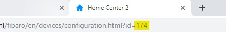
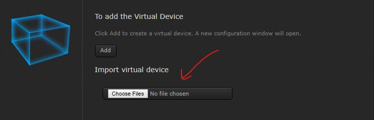
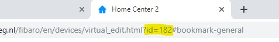
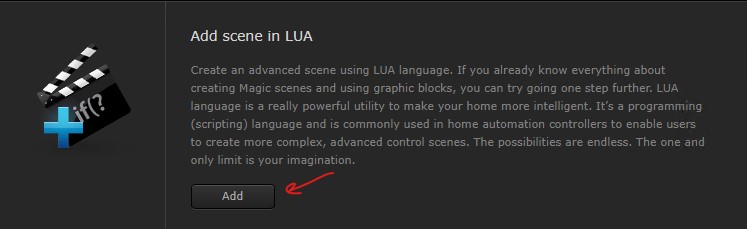
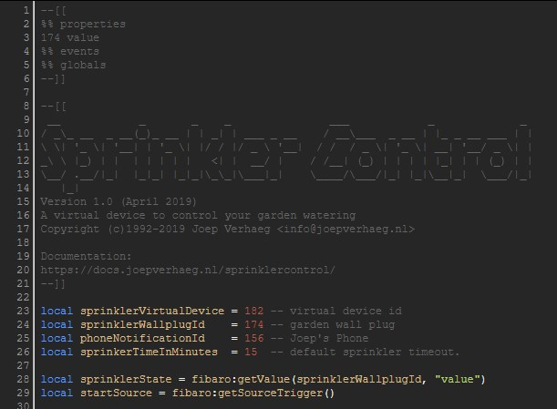
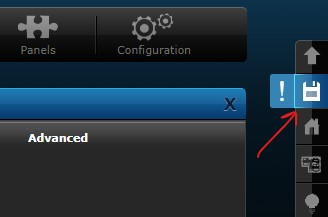
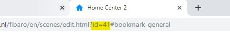
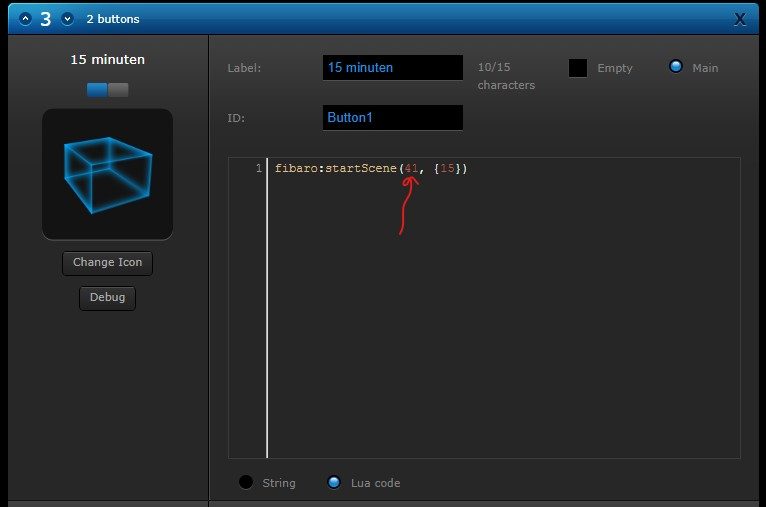
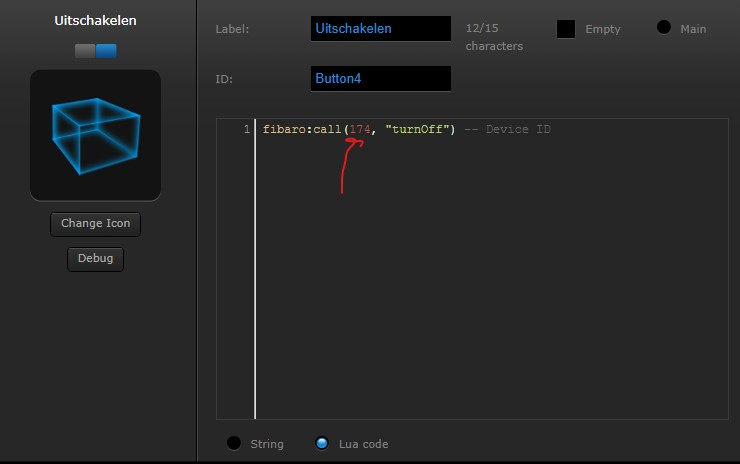

# A virtual device to control your garden watering<!-- omit in toc -->

April 25, 2019  
_**Applies to:** Fibaro Home Center 2_

## Goals

With Fibaro Home Center 2 I can use the *Sprinkler Panel* to fully automate my garden watering with no effort. But sometimes I don't want to fully automate something. For example I just want to push a button and water my garden for 60 minutes. Therefore I created a watering timer by programming a *Virtual Device* and a *LUA scene*. With this virtual device I can control exactly when and how long I want to water my garden.

## Table of Contents<!-- omit in toc -->
- [Goals](#goals)
- [TL;DR](#tldr)
- [How I implemented it](#how-i-implemented-it)
  - [In words](#in-words)
  - [Before you start](#before-you-start)
    - [Get the id of the Wall Plug connected to your watering system](#get-the-id-of-the-wall-plug-connected-to-your-watering-system)
    - [Get the Id of your Phone for receiving notifications](#get-the-id-of-your-phone-for-receiving-notifications)
  - [Step 1: Import the Sprinkler Control Virtual Device](#step-1-import-the-sprinkler-control-virtual-device)
    - [Getting the Virtual Device file](#getting-the-virtual-device-file)
    - [Import the Virtual Device file](#import-the-virtual-device-file)
    - [Configure the Virtual Device](#configure-the-virtual-device)
    - [Get the ID of the Virtual Device](#get-the-id-of-the-virtual-device)
  - [Step 2: Create a Sprinkler Control LUA scene](#step-2-create-a-sprinkler-control-lua-scene)
    - [Getting the LUA scene code](#getting-the-lua-scene-code)
    - [Create a new LUA scene and import the code](#create-a-new-lua-scene-and-import-the-code)
    - [Configure the LUA scene](#configure-the-lua-scene)
      - [Set the LUA parameters](#set-the-lua-parameters)
      - [Set the Scene parameters](#set-the-scene-parameters)
      - [Save and get the ID of the LUA scene](#save-and-get-the-id-of-the-lua-scene)
  - [Step 3: Change LUA scene ID in Virtual Device configuration](#step-3-change-lua-scene-id-in-virtual-device-configuration)
- [Congratulations!](#congratulations)
- [More information about Virtual Devices](#more-information-about-virtual-devices)
- [Downloads](#downloads)

## TL;DR

* One-click watering my garden.
* Easy to start with different predefined time-out's.
* Automatically stop timer at manual control or when the *Sprinkler Panel* sends a turn off command.

## How I implemented it

### In words

First you import the *Virtual Device* I created at my Home Center 2 and note the *id* of the device. Then you create a new *LUA scene* and configure the parameters to suit your system.

Before you start implementing I want to state that I control my whole garden irrigation with **one** *[Fibaro Wall Plug](https://www.fibaro.com/en/products/wall-plug/)*. If you have more than one *Wall Plug* to switch multiple irrigation devices you have to change my *LUA scene*. This is out of scope of this article.

### Before you start

#### Get the id of the Wall Plug connected to your watering system

* **Log in** to your Fibaro Home Center 2 with _admin_ credentials.
* Click on the **Devices** tab in *top panel* and then on your **Wall Plug** connected to the watering system in the *left sidebar*.
* You find the *device id* at the **General** tab or in the **address bar** of your browser. After the substring `id=` you'll find the `id` of your *Wall Plug*. The screenshot below shows an `id` of `174`:



* Remember the *id*, or write it on a piece of paper for the next step when you implement the *LUA scene*.

#### Get the Id of your Phone for receiving notifications 

To get the *id* of your phone for receiving push notifications is a little bit tricky:

* **Open** `http://<fibaro_ipaddres>/api/devices?type=iOS_device` in your browser.
* A `JSON` response will show. **Select** and **copy** all text to the clipboard.
* **Open** `http://jsonprettyprint.com` in your browser.
* **Paste** the text in the *jsonprettyprint.com* website and **click** the **Pretty Print JSON** button.
* Find your phone name in the list. The *id* is shown the line above the name. The example below shows an *id* of `156`:

```json
"id": 156,
"name": "Joep's Phone",
"roomID": 0,
"type": "iOS_device",
"baseType": "",
"enabled": true,
```

* Remember the *id*, or write it on a piece of paper for the next step when you implement the *LUA scene*.

### Step 1: Import the Sprinkler Control Virtual Device

#### Getting the Virtual Device file

**Download** the *Virtual Device* file [from my GitHub](https://github.com/joepv/fibaro/blob/master/SprinklerControl.vfib).

#### Import the Virtual Device file

* **Log in** to your Fibaro Home Center 2 with _admin_ credentials.
* Click on the **Devices** tab in top panel and then on **Add or remove device** button in the left sidebar.
* Click in the **Add Device** screen on the **Choose Files** button in the **To add the Virtual Device** section.
* **Select** the `SprinklerControl.vfib` file you just downloaded.



#### Configure the Virtual Device

When the import has finished you can give it a **Name** and assign it to a **Room**. I'll skip the *advanced configuration* for now, because first you have to create a new *LUA scene* in the next section to get a scene *id* to configure the *Virtual Device* buttons.

#### Get the ID of the Virtual Device

The easiest way to get the *id* of the *Virtual Device* is to look in the address bar of your browser. After the substring `id=` you'll find the *id* of your new *Virtual Device*. The screenshot below shows an *id* of `182`:



Remember the *id*, or write it on a piece of paper for the next step when you implement the *LUA scene*.

### Step 2: Create a Sprinkler Control LUA scene

#### Getting the LUA scene code

* **Download** the *LUA scene* code file [from my GitHub](https://github.com/joepv/fibaro/blob/master/SprinklerControl.lua).
* **Open** the downloaded `SprinklerControl.lua` file with your favorite text editor and **copy the contents to the clipboard**.

#### Create a new LUA scene and import the code

* **Click** on the **Scenes** tab in* top panel* and then on **Add scene** button in the *left sidebar*.
* **Click** in the **New Scene** screen on the **Add** button in the **Add scene in LUA** section.



* A new scene is created with the _Advanced_ tab opened as default.
* **Remove** all code and **paste** the contents of your clipboard in the online code editor to import the LUA scene code.



#### Configure the LUA scene

##### Set the LUA parameters

At the top of the code you have to **set** the *id's* of your devices configured in Home Center 2 and the default sprinkler time-out.

* **Change** the `174 value` to the *id* you wrote down in the [Get the Id of the Wall Plug](#get-the-id-of-the-wall-plug-connected-to-your-watering-system).

```lua
--[[
%% properties
174 value
%% events
%% globals
--]]
```

* **Change** the following variables to the *id's* you wrote down earlier:

```lua
local sprinklerVirtualDevice = 182 -- virtual device id
local sprinklerWallplugId    = 174 -- garden wall plug
local phoneNotificationId    = 156 -- Joep's Phone
local sprinkerTimeInMinutes  = 15  -- default sprinkler time-out.
```

The following table explains the variables:

| Variable               | Description                                                              |
| ---------------------- | ------------------------------------------------------------------------ |
| sprinklerVirtualDevice | Sprinkler Control Virtual Device Id (you just created)                   |
| sprinklerWallplugId    | Fibaro Wall Plug Id that switches watering device on/off                 |
| phoneNotificationId    | Id of phone that receives notifications, *set to 0 to disable*           |
| sprinkerTimeInMinutes  | Default sprinkler time-out when no arguments are passed to the LUA scene |

##### Set the Scene parameters

* **Click** in the **New Scene** screen on the **General** tab.
* Give the Scene a **Name** and assign it to a **Room**.
* **Set** the parameter **Max. running instances** to  `2`
* **Set** the parameter **Run scene** to `Automatic`

##### Save and get the ID of the LUA scene

* **Click** the **Save** button on the *right toolbar* to save the *LUA scene*.



* After the browser refreshes you'll find the *id* of the new *LUA scene* in the address bar of your browser. The screenshot below shows an *id* of `41`:



* Remember the *id*, or write it on a piece of paper for the next step when you change the *Virtual Device* buttons.

### Step 3: Change LUA scene ID in Virtual Device configuration

* **Click** on the **Devices** tab in *top panel* and open your earlier created **Virtual Device** in the *left sidebar*.
* **Open** the **Advanced** tab and **scroll down** to the **button** setup.

All buttons are configured with a line of *LUA code* to start the [Sprinkler Control LUA scene](#step-2-create-a-sprinkler-control-lua-scene) with two parameters:



In this example `41` is the scene *id* and `15` the *time-out in minutes*. You can change the time-out values of the buttons to your own needs. You have to **change** the scene *id* to the *id* you wrote down earlier in the [Save and get the ID of the LUA scene](#save-and-get-the-id-of-the-lua-scene) section of this article.

In *LUA code* in the **Turn Off** button you have to **change** de device *id* to the *id* you wrote down earlier in the  [Get the Id of the Wall Plug](#get-the-id-of-the-wall-plug-connected-to-your-watering-system) section of this article. The screenshot below shows an `id` of `174`:



## Congratulations!

Take a beer! Everything is finished, you are ready to go!

## More information about Virtual Devices

You can read more about creating Virtual Devices in the [Creating Virtual Devices](https://manuals.fibaro.com/knowledge-base-browse/creating-virtual-devices/) Fibaro manual.

## Downloads

You can download the files from here:

* [Virtual Device](https://github.com/joepv/fibaro/blob/master/SprinklerControl.vfib)
* [LUA scene code](https://github.com/joepv/fibaro/blob/master/SprinklerControl.lua)