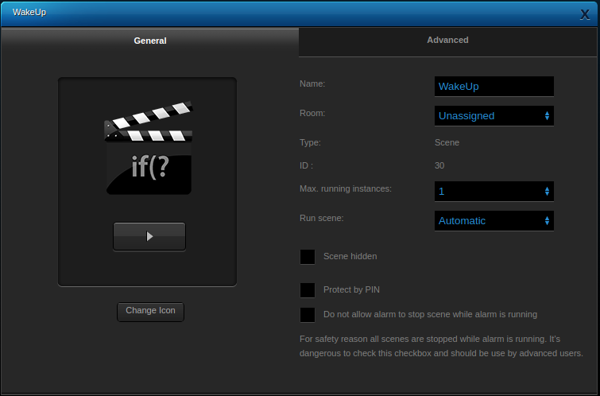

# Advanced wake-up with Fibaro Home Center 2 and Philips Hue

December 6, 2018  
_**Applies to:** Fibaro Home Center 2 and Philips HUE bridge._

## Goals

* Use my Philips Hue led strips as a wake-up light.
* Use 1 app to schedule the whole home wake-up routine.
* Start the morning routine when walking downstairs (check motion).
* Turn on the lights only when it's dark (read lux).

In our bedroom we integrated a Philips Hue lightstrip in the ceiling and use this with the Philips Hue app as a wake-up light. It beautifully fakes a sunrise in our whole room. As we use the Hue app to set our wake-up _alarm_ I use this app to trigger the Home Center to run a wake-up routine for the rest of the house.

## TL;DR

* Set recurring wake-up schedule in the Philips Hue app.
* Home Center LUA scene 1 reads schedules at 04:00 with the keyword _Wake_ in it.
* If schedule is set for today and motion is detected at the hallway after the scheduled time (scene 2), run wake-up routine.

## How I implemented it

### In words

Reading Hue schedules from the bridge cannot be done with the Fibaro Hue plug-in. Therefore I wrote a LUA scene to read the Hue schedules from the Hue bridge and run the wake-up routine at the schedules wake-up time. I achieved this with 2 LUA scenes:

1. *Scene 1* _runs every minute_ and polls the Hue bridge schedules at 04:00. If a wake-up is scheduled for today write the wake-up times to a _global variable_. Every minute it checks if there is a wake-up planned by reading the same _global variable_ and if so it sets the _WakeUpReady_ global variable to _1_.
2. *Scene 2* _runs when motion detected_ by a Fibaro Motion Sensor. If it detects motion it checks if the global variable _WakeUpReady_ is set to _1_ and runs the wake-up routine.

### Scene 1 explained

You can download the full LUA scenes at the bottom of this page. I only describe snippets of my code to make you understand what it does and show the challenges I ran into.

#### Tag your Hue schedule with a wake-up string in it!

To know which schedules are used for wake-up I set all those schedules with the _Wake_ keyword in it. Like _Wake-up weekday's_ and _Wake-up weekends_. In the LUA scene I find these schedules with the code `if name:find('Wake') and status == 'enabled' then ... end`.

#### Recurring day's are saved as a bitmask in the Hue bridge

The Hue API states:

```
W[bbb]/T[hh]:[mm]:[ss]
Every day of the week given by bbb at given time
```

The Hue bridge saves the recurring day's as a bitmask. You have to convert this bitmask to weekday's. So you can check if the alarm is set for _today_. The first step is to convert decimal to a binary. I did this with the folowing LUA function:

```lua
function bin(dec)
    local result = ""
    repeat
        local divres = dec / 2
        local int, frac = math.modf(divres)
        dec = int
        result = math.ceil(frac) .. result
    until dec == 0
    local StrNumber
    StrNumber = string.format(result, "s")
    local nbZero
    nbZero = 8 - string.len(StrNumber)
    local Sresult
    Sresult = string.rep("0", nbZero)..StrNumber
    return Sresult
end
```

Then I have a binary representation of the scheduled weekday's. For example:

```
mo tu we th fr sa su
 1  1  1  1  0  1  0
```

You see the alarm is set for monday, tuesday, wednesday, thursday and saturday. With this I can determine if the alarm is set for _today_:

```lua
if name:find('Wake') and status == 'enabled' then
  local huedays, huetime = string.match(timepattern, 'W(.*)/T(.*)')
  -- Hue starts at monday, LUA starts at sunday, so I have to fix this.
  local dayofweek = os.date("*t").wday-1
  if dayofweek == 0 then dayofweek = 7 end
  local scheduleddays = bin(huedays)
  -- dayofweek+1 because a week is 7 days and binary is 8 digits, so
  -- a have a pre 0
  local waketoday = string.sub(scheduleddays, dayofweek+1, dayofweek+1)
  if waketoday == '1' then
    wakeUpAlarms =  wakeUpAlarms .. huetime:sub(1, -4) .. '|'
  end
  ...
end
```

#### Write wake-up time to global variable

If there is an alarm schedule for today write it to a _global variable_ for later use:

```lua
if wakeUpAlarms ~= '' then
  fibaro:setGlobal("WakeUpTime", wakeUpAlarms:sub(1, -2)) -- remove last |
else
  -- If no schedules are set, write disabled to the global variable.
  fibaro:setGlobal("WakeUpTime", "disabled")
end
```

#### Set WakeUpReady global variable for motion sensor LUA scene

The LUA scene runs every minute using the code `setTimeout(tempFunc, 60*1000)`. At _04:00_ it checks the schedules in the Hue bridge, but _every minute_ it checks the _WakeUpTime_ global variable to set the _wakeupReady_ global variable to _1_. This variable triggers the second LUA scene used by the motion sensor.

```lua
local wakeupTime  = fibaro:getGlobal("WakeUpTime")
if wakeupTime ~= "disabled" then
  local waketimes = {}
  for match in (wakeupTime..'|'):gmatch("(.-)"..'|') do
    table.insert(waketimes, match);
  end
  for k, v in pairs(waketimes) do
    if os.date("%H:%M") == v then
      fibaro:setGlobal("WakeUpReady", 1)
      fibaro:debug("It's wake-up time! Set motion detector ready!")
    end
  end
end
```

### Scene 2 explained (motion sensor part)

With scene 1 I created a global variable setting to determine if the wake-up routine must run. Now I create a second scene to act if there is motion in our hallway.

#### Check for motion and if alarm is not armed

First I want to check if there is motion and if the alarm is _not_ armed with the line:

```lua
if tonumber(fibaro:getValue(158, "value")) > 0 and tonumber(fibaro:getValue(158, "armed")) == 0 then
...
```

#### Run wake-up routine only if it's dark outside

The Philips Hue wake-up schedule runs always because our bedroom had curtains and the room is always dark. Downstairs I only want to run the wake-up routine when it's dark outside. The _wakeupReady_ global variable check's if the routine needs to run when there is motion (set with scene 1). `fibaro:getValue(160, "value")` gets the current lux reading from the Fibaro motion sensor. If the illuminance is below _20_ I want to turn on my lights.

```lua
if wakeupReady == "1" then
      fibaro:setGlobal("WakeUpReady", 0) -- Disable trigger for current wake-up time.
      -- check lux
      local currentLux = tonumber(fibaro:getValue(160, "value")) -- id 160 is sensors light device.
      -- If it's dark then start wake-up routine
      if currentLux < 20 then
        fibaro:debug("Illuminance measuring " .. currentLux .. " lx, starting wake-up routine.")
        fibaro:call(44, "setValue", "8") -- Spots keuken (8%)
        fibaro:call(29, "setValue", "5") -- Tafel eethoek (5%)
        fibaro:call(106 , "turnOn") -- Bolles (aan)
        fibaro:call(118 , "turnOn") -- Spot voordeur (aan)
        fibaro:call(156, "sendPush", "Started wake-up routine. Debug: " .. currentLux .. " lx")
      else
        fibaro:debug("Illuminance measuring " .. currentLux .. " lx, do nothing.")
        fibaro:call(156, "sendPush", "Skipped wake-up routine. Debug: " .. currentLux .. " lx")
      end
...
```

## Download my scenes complete LUA code

You can download the full LUA scene code from here:

* Scene 1: [Wakeup.lua](https://github.com/joepv/fibaro/blob/master/Wakeup.lua)
* Scene 2: [MotionRoutine1.lua](https://github.com/joepv/fibaro/blob/master/MotionRoutine1.lua)

**You have to change the _device id's_ from my motion sensors in this scene to your own id's!**

Set the scenes to run _automatic_ in the Fibaro Home Center 2:

