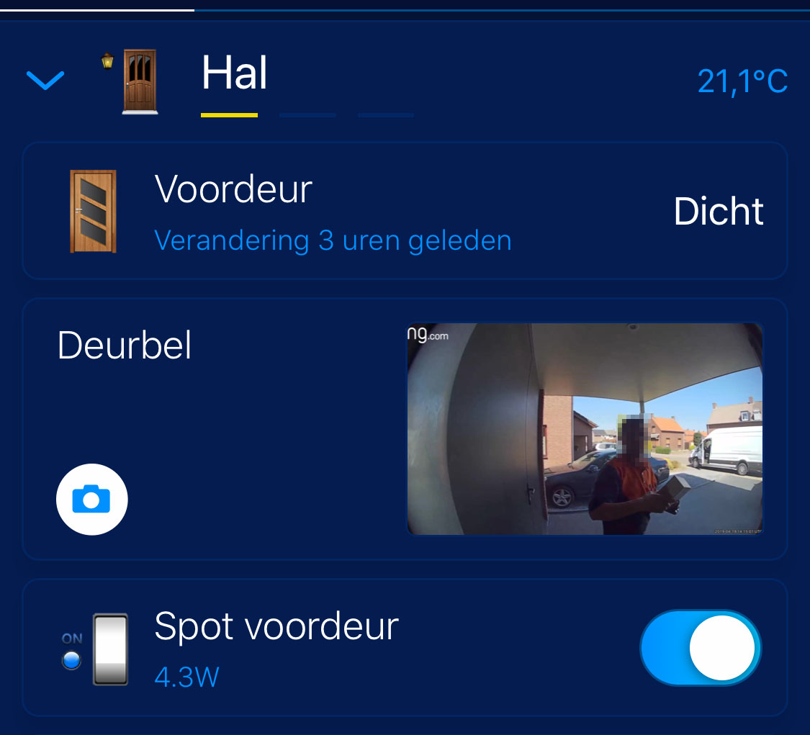

The Ring Video Doorbell API is closed. So it is very difficult to integrate the doorbell into other systems.
Also it is not possible to get a snapshot of the last ringer. 

With the use of a *Python* library which uses the reverse engineered API and *ffmpeg* I managed to get a snapshot in the *Fibaro Home Center App*. To serve the snapshot I use *Node-RED* because I have it already running. You can also use *Apache* or *NGINX*.

## TL;DR

* Check for the *last* ring, and download the video.
* Extract *one frame* from the video with *ffmpeg* to create a *snapshot*.
* Serve the snapshot with HTTP.
* Configure the Fibaro Home Center 2 with a new camera to view the snapshot.

## How I implemented it

### What do you need?

* A Raspberry PI (like) or full blown (Intel NUC) Linux computer.
* Python installed.
* ffmpeg installed.
* Node-RED or a HTTP server installed.
* A Fibaro Home Center 2 offcourse.

### Linux part

Install Python, PIP and ffmpeg

`sudo apt-get install python python-pip ffmpeg`

Install the [Python Ring Door Bell Library](https://github.com/tchellomello/python-ring-doorbell)

`pip install ring_doorbell`

I use Node-RED to serve HTTP in this post, but if you want to use NGINX or Apache you have to install this first. This is out of the scope of this article.

### Python part

On your Linux machine create a new folder and download `FibaroRingCam.py` in it. This Python script will connect to your ring bell and check for new "dings". If a new person rings your doorbell *it will download the video and creates a snapshot from it*.

In the script you have to edit the following lines with your own (login) information:

```python
myring = Ring('user@ring.com', 'password')
mypath = '/home/joep/FibaroRingCam/'
```

Now run the file. You can run it as a service, but that is out of the scope of this article.

### Node-RED part

Add the following node to Node-RED and edit the path of the file node to the path of the `last_ding.jpg` snapshot.


```json
[{"id":"d1f4395b.cd0778","type":"comment","z":"30de6047.723c","name":"Fibaro Ring Camera Snapshot","info":"","x":160,"y":180,"wires":[]},{"id":"e42e6aeb.e610e8","type":"http in","z":"30de6047.723c","name":"[get] /last_ding.jpg","url":"/last_ding.jpg","method":"get","upload":false,"swaggerDoc":"","x":130,"y":220,"wires":[["9329fca.9bf87"]]},{"id":"9329fca.9bf87","type":"file in","z":"30de6047.723c","name":"last_ding.jpg","filename":"/home/joep/FibaroRingCam/last_ding.jpg","format":"","chunk":false,"sendError":false,"x":350,"y":220,"wires":[["5dd8cb15.ea08b4"]]},{"id":"5dd8cb15.ea08b4","type":"http response","z":"30de6047.723c","name":"serve last_ding.jpg","statusCode":"","headers":{"content-type":"image/jpeg"},"x":590,"y":220,"wires":[]}]
```

### Fibaro part

Add a new camera in Fibaro Home Center 2:


Give the camera a usefull name and change the advanced settings to the following settings:

| Parameter    | Setting                   |
| ------------ | ------------------------- |
| Protocol     | http                      |
| IP address   | <node-red ip address:port |
| JPG path     | last_ding.jpg             |
| MJPG stream  | last_ding.jpg             |


**Note! The MJPG stream does not work, you have NO video! I'm still searching for a solution to play the last Ring video as camera stream.**

## The result

Now you see a snapshot from the latest ringer in the Fibaro Home Center 2 web interface:


And in the Fibaro Home Center app:



## Download

You can download the Python script from here:

* [FibaroRingCam.py](https://github.com/joepv/fibaro/blob/master/FibaroRingCam.py)
