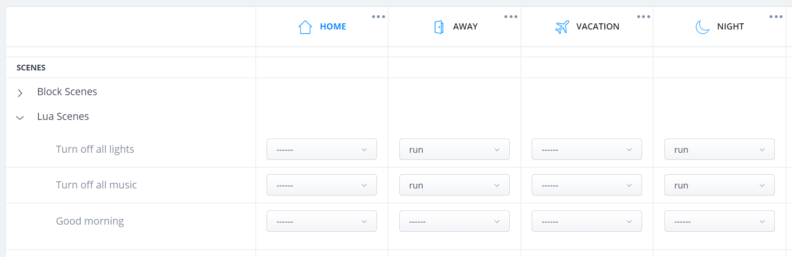
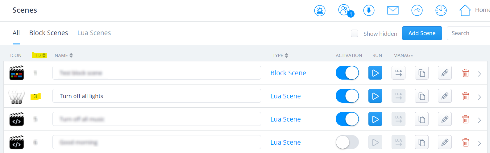

The first question you will ask yourself is whether you want to migrate big bang or device by device. The latter is a time-consuming job, so you quickly think of option 1. But this also has a number of drawbacks. I thought about both options for a long time and to make the choice easier for you, I have listed a number of facts:

The Fibaro *configuration transfer* does the following:

- Migration of all sections, rooms and icons.
- The assigned rooms, associations, parameters and icons are transfered for all Z-Wave devices.
- All cameras are transfered (with the exception of the plug-ins).
- Thermostats are included, but must be reconfigured.
- The transfer basically makes a backup of your HC2 and downloads it on the HC3 (via the cloud). Your HC2 will be in readonly mode after the migration.

As you can read, *Virtual Devices* and *scenes* **are not** included in the **automatic** migration from the HC2 to the HC3. *Virtual Devices* have been replaced by *Quick Apps* and *LUA scenes* have been completely changed. These now work with *conditions* and *triggers*, which is quite an improvement.

> Because I have to recreate all *scenes* and convert my *Virtual Devices* to *Quick Apps* I decided to **not** migrate big bang, but **manually** exclude the Z-Wave devices from the HC2 and include them again on the HC3. So I start with a clean system.

## To keep my home automation, I did the following

First I wrote down my (most important) *scenes*. Over the years I have built quite a bit of automation. The following routines are most important to me. I really don't want to miss these in my daily life:

- **Morning routine**: wake up with music and sunrise emulation (lighting) in the bedroom. In twilight / dark weather, the lighting is also dimmed in the rooms to be entered (when leaving the bedroom), so I will always walking around in an illuminated house.
- **Leaving / arriving home routines**: When leaving the house presence detection automatically switches off the music and light. If necessary the vacuum cleaner goes into action. When I get home, turn on the music and lights as it was when the last person left.

The other *scenes* that I have built are supportive. I migrate these to the new HC3 when all devices has been transferred.

## An example

A good example is the *scene* that switches off all lighting. I use this routine when going to bed and when the last person leaves the house.

I use *variables* in this routine because when going to bed some lights have to stay on and when leaving the house all lights have to go out. In the HC2 these parameters are read with use of *Global Variables* that determine whether the house is in *night* or in *away* mode. In the HC3 I use the new *profiles* function.

## The transfer from variables to profiles

In a *LUA scene* the current *profile* cannot yet be read with a Fibaro function, so I put this self-written function at the top of the code so I can retrieve the name of the active *profile* with `getActiveProfileName`:

```lua
function getActiveProfileName()
    local profiles = api.get("/profiles")
    for _, profile in ipairs(profiles.profiles) do
        if (profile.id == profiles.activeProfile) then
            return profile.name
        end
    end
end
```

Now you can easily request which *profile* is active and link actions to it:

```lua
local activeProfile = getActiveProfileName()
if (activeProfile == "Away") then
    fibaro.debug("Scene1", "Hey! Nobody is present!"
end
```

## Easy determine which light devices are turned on

With the HC3 it is also much easier to determine whether a device is *a light* and whether it is *on* or *off*. In the example below I fetch all devices that are marked as *light* and with the new *property* `state` I check whether the bulb is *on* or *off*. The nice thing about the new `state` *property* is that you no longer have to check whether you are dealing with a binary switch or a dimmer module (a binary switch is a *bool* in the HC2 and a dimmer an *integer*).

```lua
local lightsOn = {}
local lightsf = api.get("/devices?interface=light")
for _, light in ipairs(lightsf) do
    if (light.visible == true and light.properties.state == true) then
        table.insert(lightsOn, light.id)
    end
end

if (next(lightsOn) ~= nil) then
    fibaro.call(lightsOn, "turnOff")
end
```

💡 After you added all lights that are still *on* to an list, you no longer have to program a *loop* to run through all the devices to turn them *off*. You can now pass the list to the `[fibaro.call]` command and the HC3 will *turn off* all devices in the list!

## Link the scene to the house "state"

*Scenes* can now have *conditions*. I could use these to determine if the house is in *night* or *away* state but in this case I'm **not** using this. I'm using the *profiles* screen in the *settings* menu of the HC3. This gives me an easy overview and can determine under which house *state* a scene should be started:



When I program these *conditions* in the *LUA scene* I have to check which routines start when *leaving* the house by going though **all** *scenes*. By using this screen I have a clear overview if I want to make adjustments in the future.

## The Home Center 2 part

Now that the *scene* in the new HC3 is programmed to turn off all lights, I can call it with the REST API from the HC2. To accomplisch this I first create a new *LUA scene*:

```lua
--[[
%% properties
%% events
%% globals
--]]

-- HC3 connection variables.
local tcpTimeout = 2000
local host       = "192.168.1.2"
local username   = "user"
local password   = "password"
local sceneId    = 3

-- Bsse64 encode function.
local b = 'ABCDEFGHIJKLMNOPQRSTUVWXYZabcdefghijklmnopqrstuvwxyz0123456789+/'
function enc(data)
    return ((data:gsub('.', function(x) 
        local r,b='',x:byte()
        for i=8,1,-1 do r=r..(b%2^i-b%2^(i-1)>0 and '1' or '0') end
        return r;
    end)..'0000'):gsub('%d%d%d?%d?%d?%d?', function(x)
        if (#x < 6) then return '' end
        local c=0
        for i=1,6 do c=c+(x:sub(i,i)=='1' and 2^(6-i) or 0) end
        return b:sub(c+1,c+1)
    end)..({ '', '==', '=' })[#data%3+1])
end

-- Run scene on HC3 with use of REST API.
local credentials = enc(username .. ":" .. password)
local url = "https://" .. host .. "/api/scenes/" .. tostring(sceneId) .. "/execute"
net.HTTPClient():request(url, {
    success = function(resp)
        fibaro:debug(resp.status)
    end,
    error = function(err)
        fibaro:debug(err.data)
    end,
    options = {
        checkCertificate = false,
      	timeout = tcpTimeout,
        headers = {
        	['Content-Type']  = 'application/json',
        	['Authorization'] = 'Basic ' .. credentials
      	},
        method = 'POST',
        data = "{}"
    }
})
```

💡 Enter the variables for your configuration in the script. The `id` of the *scene* can be found in your HC3 at *Settings* → **Scenes**:



From within the old HC2 "all lights off" *LUA scene* I start the new *scene* to trigger the HC3 to run the script for the already migrated lights. Use the `id` of the just created *scene* in the following code:

```lua
if fibaro:countScenes(72) < 1 then
    fibaro:startScene(72)
else
    fibaro:debug("Scene already running.")
end
```

## The link between both systems has now been established

With this method I have established a link between both systems. Now I can *exclude* lights on the HC2 and *include* them on the HC3 one by one. I will not notice anything in my automations, because the old system controls the new one to also switch off the already migrated lights.