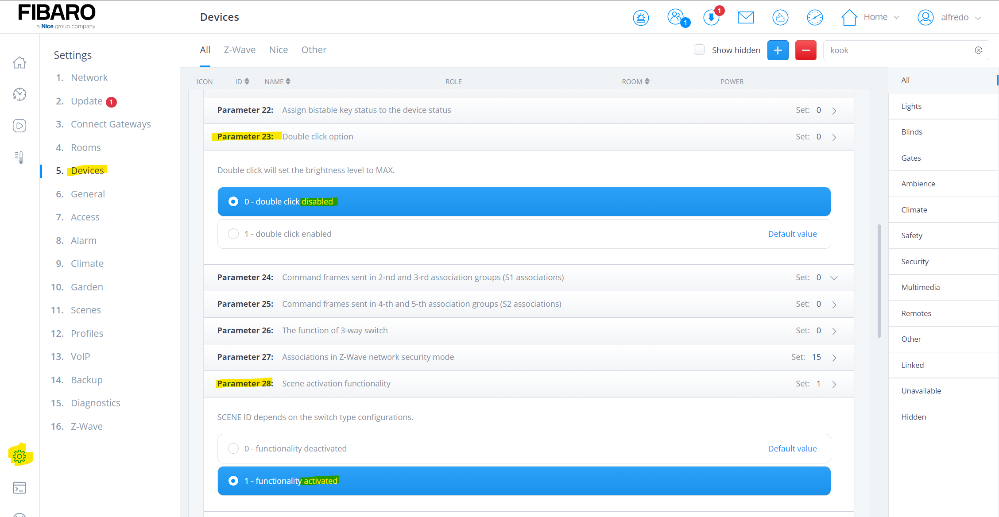
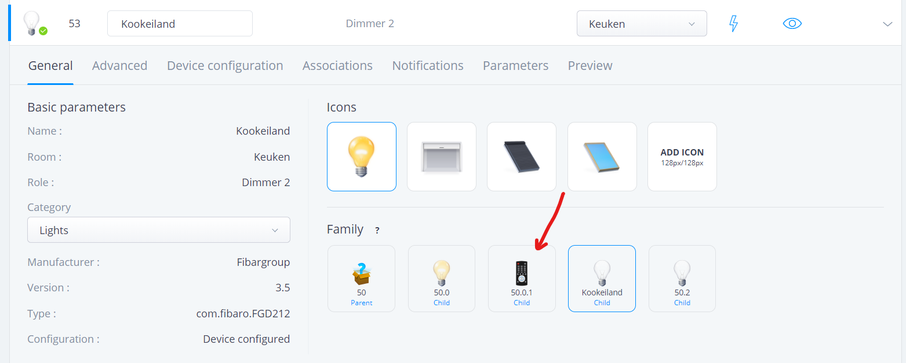
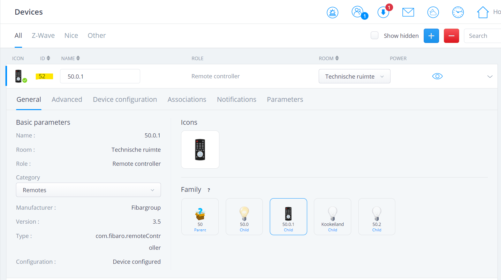
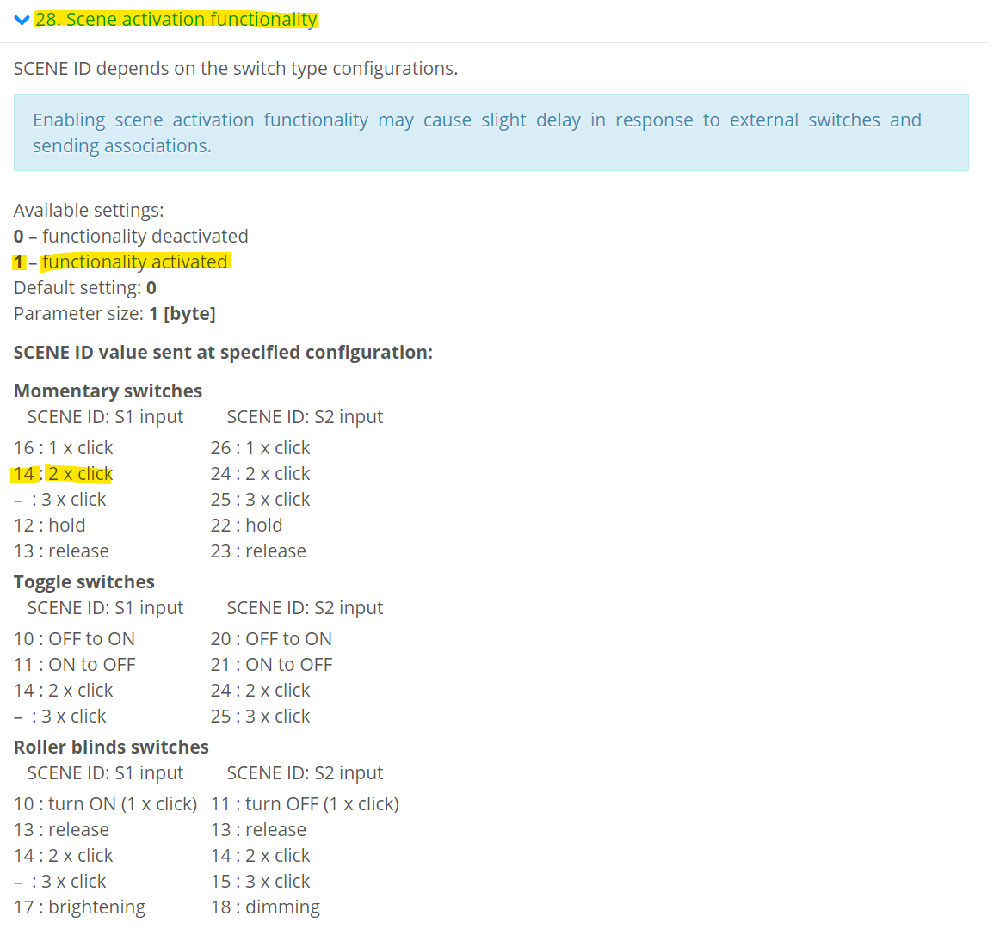
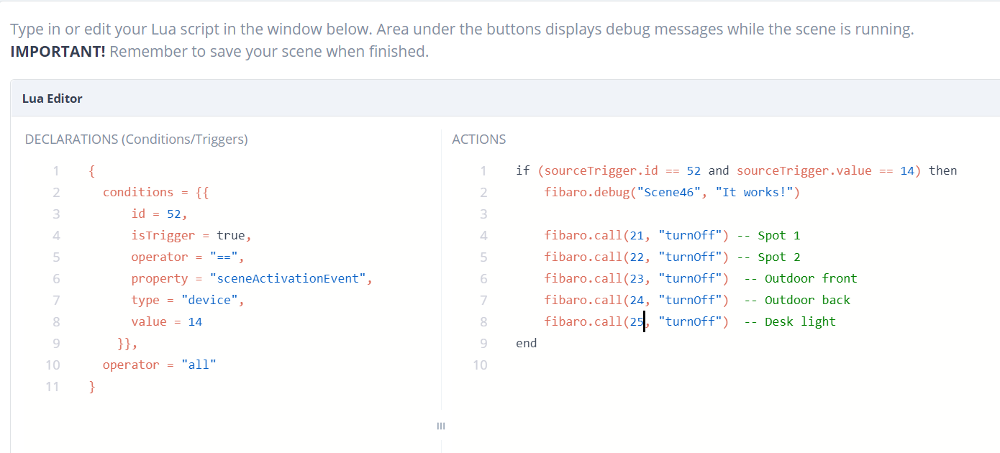

A very cool function of a number of Fibaro modules, such as the *Dimmer 2* and *(Double) Smart Module*, is the **scene activation** functionality. With this option you can easily use a momentary switch to start a scene. For example, you can program that a scene is started on the controller when you press the momentary switch twice.

Setting the **condition** for "capturing" the command works slightly differently in the Home Center 3 than in the Home Center 2. The HC3 works with **triggers** and **conditions**. I will explain this in detail in this article.

## Setting parameters in your Fibaro module

As an example I use a *Fibaro Dimmer 2*. For the parameters of other Fibaro modules, it is best to look at the [Fibaro website](https://manuals.fibaro.com/).

To use the scene activation of the dimmer module, you must first adjust the parameters of the Fibaro module. You do this by going to **Devices** under the **Settings** menu and search for the light bulb in the list. When you have found the bulb or controller, click on the **parameters** tab .:



First you set the parameter **28 on the actor. Scene activation functionality** to **1 - functionality activated**. This ensures that the **scene id** is sent to the controller when pressed twice.

Because Fibaro dimmers send the maximum brightness command when pressing a switch twice, I also set parameter **23. Double click option - set the brightness level to MAX** to **0 - double click disabled**. This ensures that the bulb does not switch on at maximum brightness every time the scene is activated.

> You can also set the parameters directly on the Remote Controller of the dimmer module, but this is not necessary for now. For the condition later in this article you do need the ID of the controller, so you can also set the parameters there.

If you have set the parameters on the bulb, it is now best to find the corresponding remote controller. This is very easy by clicking on the **remote control icon** in the **General** tab of the device:



You jump to the controller of the Fibaro dimmer. **It is important to write down the ID here. You will need this ID to create the condition that will capture the 2x pressing of the momentary switch.**



💡***Note: this is a difference with the HC2 where you could use the ID of the bulb device, this no longer works in the HC3!***

In my example the ID of the lamp is **53** and the ID of the remote controller **52**.

## Look up the scene code in the manual of your module

You now set the dimmer module correctly for controlling a scene in the HC3. Before we can program a trigger in a block or LUA scene, we first look in the module manual to find out which code is sent to the HC3. Assuming you have connected the momentary switch to the S1 input of the dimmer, you see in the list below that the **id 14** is sent with 2x pushing the switch:



## Creating the LUA scene

When you have set all parameters and found the **scene value id** you can create a *LUA scene* in your HC3.

The structure of a LUA scene has completely changed in the HC3 compared to the HC2. The editor is now divided into three sections:

1. **Condition**: here you determine the triggers and conditions under which the scene will be started.
2. **Action**: the LUA code to be executed when the triggers and conditions are met.
3. **Debugger**: logging of errors generated by your code. You can now filter these messages!

As an example, you define the following condition:

```lua
{
    conditions = {
        {
            id = 52,
            isTrigger = true,
            operator = "==",
            property = "sceneActivationEvent",
            type = "device",
            value = 14
            }
    },
    operator = "all"
}
```

By setting the parameter `isTrigger = true`, the LUA code in the **actions section** will be executed **as the condition is met**. If you are going to enter multiple conditions, you can use this to determine whether a condition can trigger the scene or whether it only needs to meet a certain status to execute the scene with another trigger.

For example, if you want run the scene only on *Monday, Wednesday and Friday* when you press the momentary switch twice, enter the following **condition**:

```lua
{
    conditions = {
        {
            id = 52,
            isTrigger = true,
            operator = "==",
            property = "sceneActivationEvent",
            type = "device",
            value = 14
        },
        {
            type = "date",
            property = "cron",
            operator = "match",
            value = {"*", "*", "*", "*", "1,3,5", "*"}
        }
	},
    operator = "all"
}
```

I am using an `operator =" all "` **parameter**. This indicates that **all** conditions must be met to execute the LUA code in the actions section. More information about **triggers** and **conditions** can be found in the [LUA scenes manual](https://manuals.fibaro.com/home-center-3-lua-scenes/) from Fibaro.



## Even more control in your LUA code

LUA code in the actions section is now triggered by pressing the momentary switch twice.

You can go one step further by defining multiple triggers and executing certain pieces of code based on the source trigger. In the LUA code you can check the variable what triggered the scene by reading the `sourceTrigger`:

```lua
if (sourceTrigger.id == 52 and sourceTrigger.value == 14) then
end
```

## That it!

In this article I showed you how to use **scene activation** with a momentary switch on a Home Center 3 using **triggers**, **conditions** and the *property* **sceneActivationEvent**.