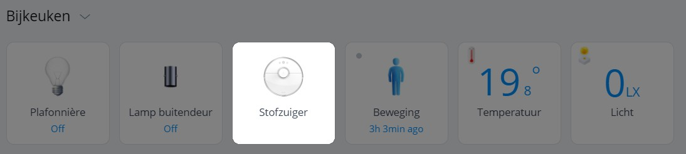

There was some fuzz in the forums that no more parameters could be sent to LUA scenes using the HTTP REST API of the Home Center 3.

On the Home Center 2 (HC2) LUA scenes were *misused* as a plug-in extension for Virtual Devices. Home Center 3 (HC3) has Quick Apps to create devices. The concept of Quick Apps is basically an evolution of the well-known Virtual Devices. They integrate fully as a native device in the Web GUI and Fibaro App and you can program them a lot better with object-oriented LUA code.

You can create functions in the Quick App code. As an example I will take the Quick App that I am creating to control our BellFires gas fire.

To set the flame height I made a function:

```lua
function QuickApp:setFlame(level)
  ...
end
```
You can control the Quick App from the Fibaro App, or in LUA scenes. For example, you can switch off the fireplace from a scene with the command:

```lua
fibaro.call(QA ID, "setFlame, 0)
```

But you can also call the function from the HTTP REST API by sending a POST request in Node-RED to the URL:

```
https://HC3 IP/api/devices/QA ID/action/setFlame
```

With the `payload`:

```javascript
var flameHeight = 5

var hc3Flame = {
  headers: { 'content-type':'application/json' },
  payload: { 'args': [flameHeight] }
};


return hc3Flame ;
```

You can immagine the possibilities are endless. It's cool that the Quick Apps integrate completely as devices into the system and are very easy to use in scenes, the Fibaro App and third party software.

