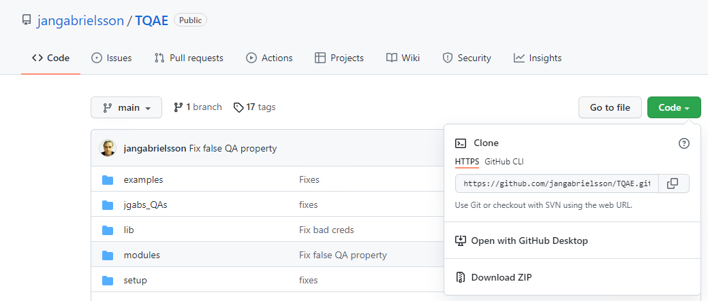
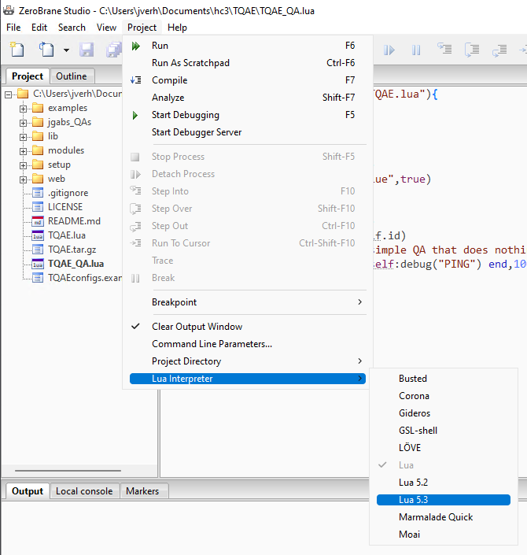
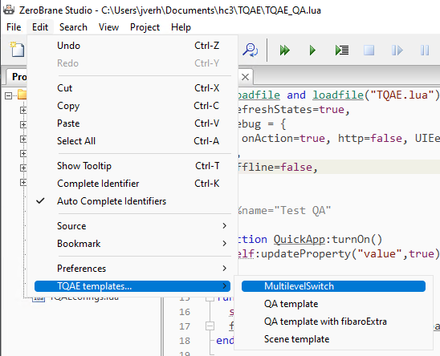
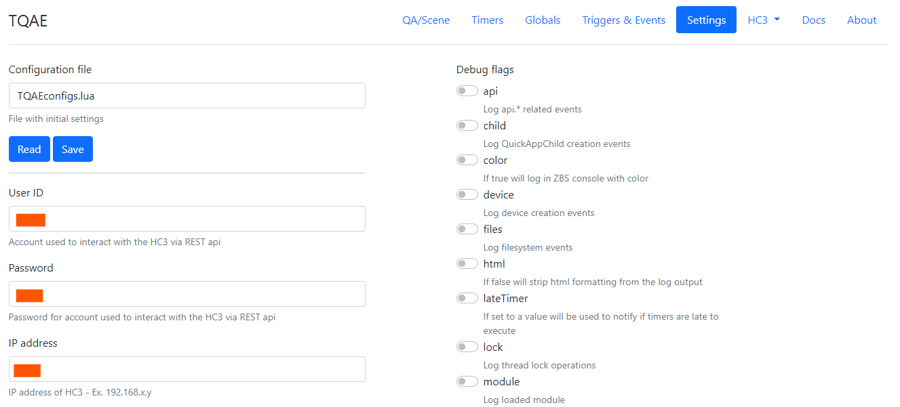

Why install an IDE if the HC3 has an online editor? The code editor embedded in the HC3 web interface is great. It has code completion and is very fast. But if you work on bigger Quick Apps you want to debug your code more easily by using brakepoints for example. [@jgab](https://forum.fibaro.com/topic/55045-tiny-quickapp-emulator-tqae/) ([Jan Gabrielsson](https://github.com/jangabrielsson)) at the [Fibaro Forum](https://forum.fibaro.com/) created a QuickApp emulator that lets you easily develop Quick Apps from ZeroBrane Studio.

## What is so special about Tiny QuickApp Emulator?

This toolset allows you to build Quick Apps *offline* (yes, you read that right) or connect to your HC3 to interact with existing devices, global variables, etc... This allows you to develop with the power of [ZeroBrane Studio](https://studio.zerobrane.com/) and you can experiment with your code without disrupting your running HC3.

## Okay, I am convinced, how do I install it?

In this article I install ZeroBrane Studio and TQAE on Windows 11, but it is multi platform and also works on Linux of MacOS if you change the path notation.

1. **Download** [ZeroBrane Studio](https://studio.zerobrane.com/download) and **install** the software.
2. If you are a GitHub hero `git clone https://github.com/jangabrielsson/TQAE.git` else **download** and extract the ZIP file from Jan Gabrielsson's ([repository](https://github.com/jangabrielsson/TQAE)).
   
    

3. Now **start** ZeroBrane Studio and **open** the `TQAE_QA.lua` sample file from the cloned or extracted folder.
4. **Set** the **Project Directory** to the TQAE folder by clicking: **Project -> Project Directory -> Set From Current File** menu option.

    

5. **Set** the **Lua Interpreter** to **Lua 5.3** by clicking **Project -> Lua Interpreter -> Lua 5.3** menu option.

    

6. **Copy** the `TQAEplugin.lua` file from the `TQAE\setup` folder to `C:\Users\<UserId>\.zbstudio\packages`.
7. **Copy** the `TQAE\setup\codeTemplates.lua` and `TQAE\setup\fileDownloads.lua` files from the same folder to `C:\Users\<UserId>\.zbstudio\tqae`.
8. **Restart** ZeroBrane Studio and now you have some specific TQAE menus and **code autocompletion** for Fibaro commands:

    

9.  **Change** the following code at the **top** of the `TQAE_QA.lua` file to set the emulator in *offline* mode for first testing:

    ```lua
    _=loadfile and loadfile("TQAE.lua"){
    refreshStates=true,
    debug = { 
        onAction=true, http=false, UIEevent=true, trigger=true
    },
    offline=true,
    }
    ```

10. The basic setup is ready now. **Execute** the current file to start the emulator.

## Connect to your HC3

When you did above steps correctly the emulator starts and the **output pane** shows:

```
---------------- Tiny QuickAppEmulator (TQAE) v0.42 -------------
[04.01.2022] [21:00:00] |SYS  | Running offline
[04.01.2022] [21:00:00] |SYS  | Using config file TQAEconfigs.lua
[04.01.2022] [21:00:00] |SYS  | Created WebAPI at http://192.168.1.10:8976/web
[04.01.2022] [21:00:00] |SYS  | sunrise 08:16, sunset 16:06
[04.01.2022] [21:00:00] [DEBUG] [QUICKAPP1001]: Test QA 1001
[04.01.2022] [21:00:00] [DEBUG] [QUICKAPP1001]: This is a simple QA that does nothing besides logging "PING"
[04.01.2022] [21:00:00] [DEBUG] [QUICKAPP1001]: PING
```

To **connect to your HC3** for interaction with your *devices*, *scenes*, *Quick Apps* and *Global Variables*:

1. **Start** your favorite **browser** and go to http://localhost:8976/web. The TQAE web GUI should load:

    

2. Fill in the login **credentials** and **IP address** from your **HC3** and click on the **Save** button.
3. **Restart** the currently running proces in ZeroBrane Studio to connect to the HC3.

## Example: read a Global Variable from your HC3

To test if the connection works I'm going to read the `IsJoepAway` Global Variable from my HC3:


1. **Stop** the currently running proces in ZeroBrane Studio if it's running.
2. Create a new file or **change** the `TQAE_QA.lua` code to the following to read the value from the `IsJoepAway` Global Variable:

    ```lua
    _=loadfile and loadfile("TQAE.lua"){
    refreshStates=true,
    debug = { 
        onAction=true, http=false, UIEevent=true, trigger=true,
    },
    offline=false,
    }

    --%%name="Test QA"

    function QuickApp:turnOn()
    self:updateProperty("value",true)
    end

    function QuickApp:onInit()
    self:debug(self.name,self.id)
    local status = fibaro.getGlobalVariable("IsJoepAway")
    fibaro.debug("QUICKAPP1001", status)
    end 
    ```

3. You can see that I use Fibaro commands like `fibaro.getGlobalVariable()` and `fibaro.debug()` as you would when programming a Quick App on the HC3.
4. **Execute** the current file to start the emulator again:

```
---------------- Tiny QuickAppEmulator (TQAE) v0.42 -------------
[04.01.2022] [22:07:06] |SYS  | Using config file TQAEconfigs.lua
[04.01.2022] [22:07:06] |SYS  | Created WebAPI at http://192.168.2.45:8976/web
[04.01.2022] [22:07:06] |SYS  | sunrise 08:40, sunset 16:42
[04.01.2022] [22:07:06] |SYS  | Polling HC3 /refreshStates
[04.01.2022] [22:07:06] [DEBUG] [QUICKAPP1001]: Test QA 1001
[04.01.2022] [22:07:06] [DEBUG] [QUICKAPP1001]: false
```

5. The last debug line shows the correct value read from the HC3!

## Using the Tiny Quick App Emulator

Now you have the emulator up and running you can have a look at the settings it provides. Take a note that TQAE is under heavy development and this is a small set of options to get you going. 💡

### Emulator options

The following parameters kan be set in the **header** of the Lua file:

| Parameter               | Description                                                                                   |
| ----------------------- | --------------------------------------------------------------------------------------------- |
| `verbose=<bool>`        | Enable verbose logging, default value is `false`                                              |
| `modPath=<path>`        | Path to the folder where the modules are stored, default path is  `..\TQAEmodules\`           |
| `temp=<path>`           | Temporary files path, default path is `..\temp\`                                              |
| `startTime=<time>`      | An alternative starting time for the emulator, for example `05/15/2021-10:15`                 |
| `localModules=<table>`  | List of modules that should be loaded into the QA environment, for example `{"myModule.lua"}` |
| `globalModules=<table>` | List of modules that should be loaded into the emulator environment, for example `{"UDPlua"}` |
| `paramsFile=<path>`     | Path to the file containing the emulator parameters, default path is `TQAEconfigs.lua`        |

You set them in the header of the file like:

```lua
_=loadfile and loadfile("TQAE.lua") {
    verbose=true,
}

--%%name = "My first QA"

function QuickApp:onInit()
	self:debug("Hello!")
end
```

### Quick App options

The following options can be set with the `--%%` directive:

| Parameter                     | Description                                                                                                                                                                                                                      |
| ----------------------------- | -------------------------------------------------------------------------------------------------------------------------------------------------------------------------------------------------------------------------------- |
| `--%%name=<string>`           | Quick App name                                                                                                                                                                                                                   |
| `--%%type=<string>`           | Type of Fibaro device, default is `com.fibaro.binarySensor`                                                                                                                                                                      |
| `--%%id=<number>`             | If not specified a number starting from 1001 will be assigned, be aware if device with same ID as a Quick App on the HC3, the emulated Quick App will shadow the one on the HC3.                                                 |
| `--%%properties=<table>`      | Initial properties for the Quick App.                                                                                                                                                                                            |
| `--%%interfaces=<table>`      | Initial interfaces for the Quick App, for example `{"power"}`                                                                                                                                                                    |
| `--%%quickVars=<table>`       | Initial quickAppVariables for the Quick App, for example `{a=99, b = "Hello"}`                                                                                                                                                   |
| `--%%proxy=<boolean>`         | Use the proxy Quick App on the HC3                                                                                                                                                                                               |

You set them in the header of the file like:

```lua
_=loadfile and loadfile("TQAE.lua") {
}

--%%name = "My first QA"
--%%type = "com.fibaro.binarySwitch"

function QuickApp:onInit()
	self:debug("Hello!")
end
```

### Run offline

A big advantage is that I can run the emulator offline to not interfere with my HC3 setup when developing a complex new Quick App for my home automation.

As I described in the initial setup you can set the following header to run in offline mode:

```lua
_=loadfile and loadfile("TQAE.lua"){
  refreshStates=true,
  debug = { 
    onAction=true, http=false, UIEevent=true, trigger=true,
  },
  offline=false,
}
```

To add fake *Global Variables* or *devices* you can use the `hc3_emulator` command. To create a *Global Variable* use the following code:

```lua
if hc3_emulator then
    hc3_emulator.create.globalVariable{name=testVar,value="Y"}
end
```

When you encapsulate your *emulator only* code in the `if hc3_emulator then .. end` block your Quick App can be copied as-is to the HC3 because the HomeCenter isn't aware of the `hc3_emulator` variable and therefore doesn't execute it.

## More information

I showed you the basics of the Tiny Quick App emulator because [the documentation at the Fibaro forum](https://forum.fibaro.com/topic/55045-tiny-quickapp-emulator-tqae/) can be a bit overwelming. It's an amazing job that Jan Gabrielsson has done and there is a lot more possible with TQAE.

If you are still interested head over to the [Fibaro forum](https://forum.fibaro.com/topic/55045-tiny-quickapp-emulator-tqae), there is a lot more information and video's to read and watch!