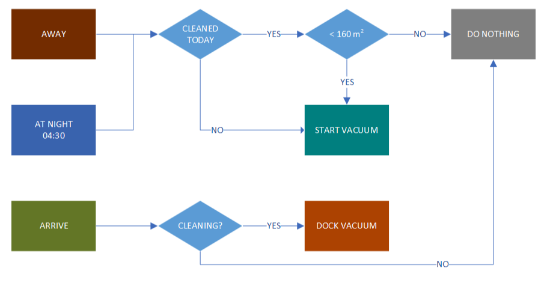
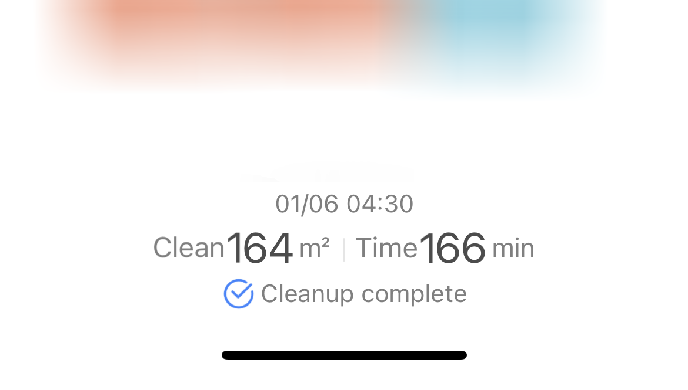
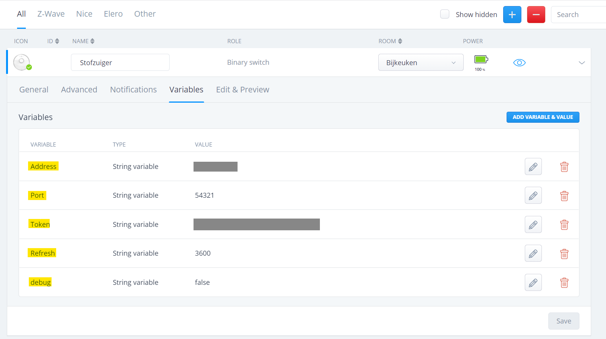
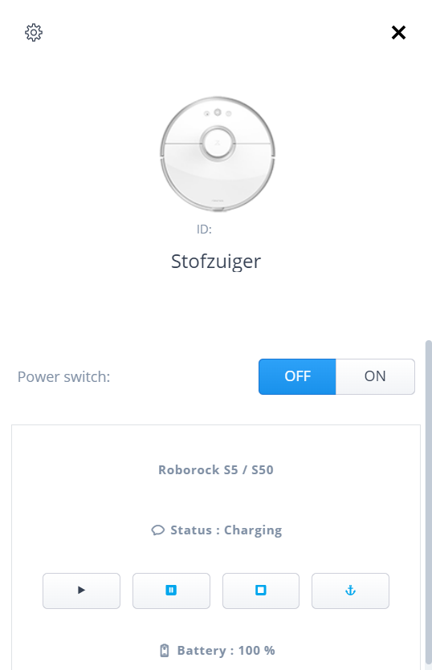
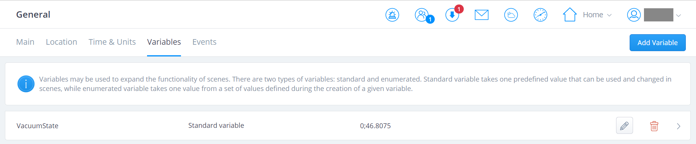

In 2018, I automated the vacuuming by our Roborock vacuum cleaner in such a way that if no one was home during the day, it automatically started vacuuming. If we were home all day, the vacuum cleaner would automatically make its rounds at night. This automation flow I created with Node-Red because it was very easy to implement.

Mid 2021 I found on the French Fibaro Forum [a topic](https://www.domotique-fibaro.fr/topic/15043-quick-app-xiaomi-roborock-vacuum/) about a Quick App for the Xiaomi Roborock Vacuum cleaners. Forum member [Lazer](https://www.domotique-fibaro.fr/profile/133-lazer/) ported the Virtual Device that was developped for the Home Center 2. 

This got me exited to implement native control of the Roborock Vacuum on my Home Center 3 and to level up the intelligence of my home automation.

## Goals

- Full control from HC3 scenes and Quick Apps without third party tooling.
- Vacuum automatically when everybody left the house.
- Automatically dock the vacuum cleaner when someone arrives at home while it is still busy.
- Keep track of how many square meters have been vacuumed to determine whether the entire house has been vacuumed.
- When everyone has left again and the vacuum cleaner was not yet ready, the vacuuming starts again.
- Vacuum at night if the entire house is not vacuumed during the day.

I visualised the flow in a diagram:



## TL;DR

1. Obtain the Xiaomi Roborock token,
2. Install and configure Quick App,
3. Change QuickApp code to set clean area to a Global Variable,
4. Add control parameters to presence detection and night scenes.

## Prerequisites

### Obtain the Xiaomi Roborock token

To connect to the Xiaomi Roborock you'll need to obtain the token of your vacuum cleaner. The method of obtaining the token changes over time (Xiaomi strengthened the security), if you Google how to get it, you'll be fine.

### Download the Xiaomi Roborock Quick App

Download the Xiaomi Roborock Quick App from [this topic](https://www.domotique-fibaro.fr/topic/15043-quick-app-xiaomi-roborock-vacuum/) on the French Fibaro Forum. **Attention**, there is an [2.01 update on page 2](https://www.domotique-fibaro.fr/topic/15043-quick-app-xiaomi-roborock-vacuum/?page=2&tab=comments#comment-239019)!

### Determine the area of ​​your home

To determine the area that the vacuum cleaner needs to vacuum in order to have cleaned your entire home you open the Xiaomi Home App on your Android or iPhone and view the cleaning history of the device. Select an option with a full cleanup and the map appears on the screen. At the bottom you'll find the square meters you'll need later on, so write it down.



## Install the Quick App

1. **Start** your favorite browser and open your Home Center 3 dashboard by typing the correct URL for your HC3,
2. Go to **Settings** and **Devices**,
3. **Click** the blue **+** icon to add a new device,
4. In the **Add Device** dialog click on **Other Device**,
5. Choose **Upload File** and upload the `.fqa` file downloaded from the French Fibaro Forum,
6. Go to the device and edit the Quick App variables to set them to your Roborock settings:

    

> I've set the refresh interval to 1 hour because that is enough for my usage. Don't set it lower than 10 seconds, because the processor of the HC3 will be too busy with encryption/decryption operations of the frames exchanged with the robot and it will slow down.

If you have configured the Quick App correctly it looks like this:



## Create a Global Variable

The goal is to check whether the entire house has been vacuumed when away or at night and vacuum (again) if necessary.

To read the square meters that have been vacuumed in scenes or other Quick Apps I **created** a **Global Variable** named `VacuumState` and set its value to: `0;1234`.

The `0` before the semicolon indicated if the Roborock already did a cleaning session today. The `1234` after the decimal will be replaced by the square meters from the last cleaning session after I made the adjustments for this in the Quick App.

In the following screenshot you see the Global Variable I created and it's updated with `46.8075` square meters:



*This indicates the vacuum will start again when everybody leaves home or at night because the total clean area is `164 m2`.*

## Edit the Xiaomi Roborock Quick App

To refresh the Global Variable at every Roborock status refresh I added the following code on line `386` in the `Xiaomi:getStatus(...)` function:

```lua
local gvarVacuumStateState = fibaro.getGlobalVariable("VacuumState")
local vacDone, vacState = gvarVacuumStateState:match("(.*);(.*)")
local newVacState = tostring((result.clean_area or 0)/1000000)
fibaro.setGlobalVariable("VacuumState", vacDone .. ";" .. newVacState)
```

> You can work with two Global Variables for status and square meters, but I like to minimize my variables and save it on one line. It's easy in Lua code to split it to two local variables.

## Presence detection Lua scene

On my HC3 I have a presence detection scene that runs when somebody leaves or arrives at home. I added the following Lua code when the *everybody left at home* condition is triggered:

```lua
local gvarVacuumStateState = fibaro.getGlobalVariable("VacuumState")
local vacDone, vacState = gvarVacuumStateState:match("(.*);(.*)")

if (tonumber(vacDone) == 0) then
  fibaro.setGlobalVariable("VacuumState", "1;" .. vacState)
  fibaro.call(200, "clean") -- Turn on vacuum.
  fibaro.debug("Scene1", "Start away vacuum downstairs...")
elseif (tonumber(vacDone) == 1 and tonumber(vacState) < 160) then
  fibaro.setGlobalVariable("VacuumState", "1;" .. vacState)
  fibaro.call(200, "clean") -- Turn on vacuum.
  fibaro.debug("Scene1", "Start away vacuum downstairs again because previous clean was not done...")
else
  fibaro.debug("Scene1", "No away vacuum cleaning needed. Already done.")
end
```

This code checks if a full cleanup is done today by checking how many square meters the robot vacuum cleaner has covered today. If it is less than `160` it will clean again.

When the first person arrives at home you can simply run `fibaro.call(244, "dock")` to automatically dock the vacuum.

## Night scheduler Quick App

For scheduled tasks I created a Quick App which runs automations at specific times. Basically it is a simple time clock. If no one has been out of the house all day vacuum cleaner was not turned on manually, then I want to clean the house at `04:30` at night. The following code checks if the `Night` profile is active on the HC3 and starts the cleanup if the conditions are met:

```lua
function getActiveProfileName()
    local profiles = api.get("/profiles")
    for _, profile in ipairs(profiles.profiles) do
        if (profile.id == profiles.activeProfile) then
            return profile.name
        end
    end
end

function QuickApp:myScheduler()    
    if (os.date("%H:%M") == "04:30") then
        local activeProfile = getActiveProfileName()
        self:debug("Profile: ".. activeProfile .. " is active")
        if (activeProfile ~= "Vacation") then
            local gvarVacuumStateState = fibaro.getGlobalVariable("VacuumState")
            local vacDone, vacState = gvarVacuumStateState:match("(.*);(.*)")
            if (tonumber(vacDone) == 0) then
                fibaro.call(200, "clean") -- turn vacuum bijkeuken.
                self:debug("Start nightly vacuum downstairs...")
            elseif (tonumber(vacDone) == 1 and tonumber(vacState) < 160) then
                fibaro.setGlobalVariable("VacuumState", "0;" .. vacState)
                fibaro.call(200, "clean") -- turn vacuum bijkeuken.
                self:debug("Start nightly vacuum downstairs again because previous clean was not done...")
            end
        end
    end
    
    local s = os.date("%S")
    local timeout = 60000 - (s * 1000)
    fibaro.setTimeout(timeout, function() -- wait 1 minute
        self:myScheduler()
    end)
end

function QuickApp:onInit()
    self:debug("onInit")
    self:myScheduler()
end
```

This Lua function loops every minute with the code:

```lua
local s = os.date("%S")
local timeout = 60000 - (s * 1000)
fibaro.setTimeout(timeout, function() -- wait 1 minute
  self:myScheduler()
end)
```

## That it!

In this article I showed you how to implement native control of the Roborock Vacuum on the Home Center 3 and level up the intelligence of your robot vacuum in your smarthome.