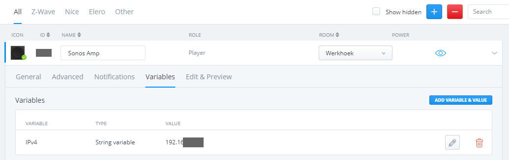
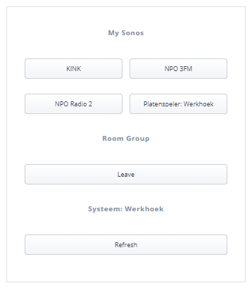

In this article I show you how to use my *Sonos Group Controller* Quick App to control your [Sonos System](https://www.sonos.com/) with [Home Center 3](https://www.fibaro.com/en/products/home-center-3/) Lua scenes. If you know how to install a Quick App you can skip to the [Usage in Lua scenes](#usage-in-lua-scenes) section.

## Why I made this Quick App

There are some Sonos Quick Apps already available for the Home Center 3, but none of them can group and ungroup Sonos speakers. I wanted to create a Quick App that has little to no impact on my network. With the Home Center 3 it's not possible to subscribe to Sonos API events and you have to use polling. I don't like this to retrieve status updates so I used the minimal [Sonos Player](https://marketplace.fibaro.com/items/sonos-player-for-hc3) from [tinman](https://marketplace.fibaro.com/profiles/fibaro-user-unnamed-0d8b1f6e-6a22-4ed5-92be-7927e3617067)/[Intuitech](https://intuitech.de/) as a base to start.

## Possibilities

From a Lua scene (or Quick App) you can:

- Start a Sonos Favorite at a specified volume.
- Set the volume of a Sonos speaker.
- Save the player state (like `PLAY`/`STOP`) and automatically pause.
- Get the previous player state and resume this state.
- Create or add a Sonos speaker to a group.
- Remove a Sonos speaker from a group.

You can do more with the Quick App, like play an InTune / webradio station or play a local `.mp3` file from your NAS. Also you can send standard commands like `play`, `pause`, `stop`, `next` and `previous` but in this blog I focus on the above list.

## Installation

The installation is pretty straigtforward with minimal configuration.

### Prerequisites

- My [Sonos Group Controller Quick App](https://docs.joepverhaeg.nl).
- To spice it up, my [Sonos S2 icon set](https://forum.fibaro.com/files/file/476-sonos-s2-icons-by-joep/).

### Adding the device

1. **Start** your favorite browser and open your Home Center 3 dashboard by typing the correct URL for your HC3,
2. Go to **Settings** and **Devices**,
3. **Click** the blue **+** icon to add a new device,
4. In the **Add Device** dialog click on **Other Device**,
5. Choose **Upload File** and upload the `.fqa` file downloaded earlier,
6. Go to the device and **edit** the Quick App variables to set the **IPv4 address** of your Sonos speaker:

 

If you have configured the Quick App correctly the **first 4 favorites** from your **My Sonos** list will be added as buttons:



### My Sonos list notice

Sonos stores playlists, InTunes stations and albums in *My Sonos* in alphabetical order. You cannot adjust this. The first 4 items are shown, but you can play all favorites easily which I show you later on.

## Usage in Lua scenes

With the following code examples I'll show you how you can use the *Sonos Group Controller* Quick App to fully automate your music expecience in your smarthome.

> In all examples the variable `qaId` is the `ID` of your Quick App.

### E.g. 1: Save Sonos player state when everybody left the house

```lua
fibaro.call(qaId, "savePlayStateAndPause")
```

This command saves the current player state (like `PLAY`/`STOP`) and pauses the player.

Useful in presence detection automations where you want to save the state of your players and automatically pause all players when everybody left the house.

### E.g. 2: Set the previous Sonos player state when the first person arrives at home

```lua
fibaro.call(qaId, "setPreviousPlayerState")
```

This command retrieves the previous saved player state (like `PLAY`/`STOP`) and turns the speaker back on if it was playing music.

Useful in presence detection automations where you want to automatically set the previous state of your players when the first person arrives at home.

### E.g. 3: Play a My Sonos favorite at a specific volume

```lua
fibaro.call(qaId, "playFavorite", "title", "15")
```

Easily play a favorite from the **My Sonos** list by using the **title** of the favorite. The **second parameter** is the **volume** at which you want to play this favorite. First the volume is set before the favorite is played, so that you are not surprised with a loud volume from a previous listening session.

Useful for time based automations like alarm clocks.

### E.g. 4: Add the Sonos player to a group (or create a new one)

```lua
local playerSource = "x-rincon:" .. fibaro.getValue(1001, "model")
fibaro.call(1002, "playFromUri", playerSource , "")
```

With this command you can add a player to a group (or create one). Use the `playerUuid` from the speaker that is currently playing the music (the group master).

In this example the livingroom speaker with an `id` of `1001` is playing and you want to create a group with the kitchen speaker (with an `id` of `1002`). You first contruct the Uri with the `id` from the livingroom speaker and then add this Uri to the kitchen speaker. Now the Sonos System creates a group.

Useful for automatic grouping in motion based automations.

### E.g. 5: Remove the Sonos player from a group

```lua
fibaro.call(qaId, "LeaveGroup")
```

When you send this command to a Sonos speaker it automatically leaves the group it is in.

Also useful for automatic grouping in motion based automations.

### E.g. 6: Play an mp3, InTune or other audio source from an Uri

```lua
fibaro.call(qaId, "playFromUri", "uri", "meta")
```

With this command you can send an Uri or InTune station `id` to the player. It loads the source and automatically starts playing.

### E.g. 7: Set the volume of a speaker

```lua
fibaro.call(qaId, "setVolume", "15")
```

Simply set the volume to a defined value. This is useful to lower the volumes of players at night, so you're not suprised by a high volume in the morning.

### Basic player commands

Besides all powerfull commands shown you can send standard commands to the Sonos player:

```lua
fibaro.call(qaId, "play")
fibaro.call(qaId, "pause")
fibaro.call(qaId, "stop")
fibaro.call(qaId, "next")
fibaro.call(qaId, "prev")
```

## Download

You can download my *Sonos Group Controller* Quick App from my [GitHub repository](https://github.com/joepv/sonos-group-controller-quickapp/releases/tag/v1.0.0). The [Sonos_Group_Controller.v1.0.zip](https://github.com/joepv/sonos-group-controller-quickapp/releases/tag/v1.0.0) file contains the Quick App import file and quickstart documentation.