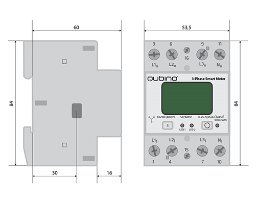
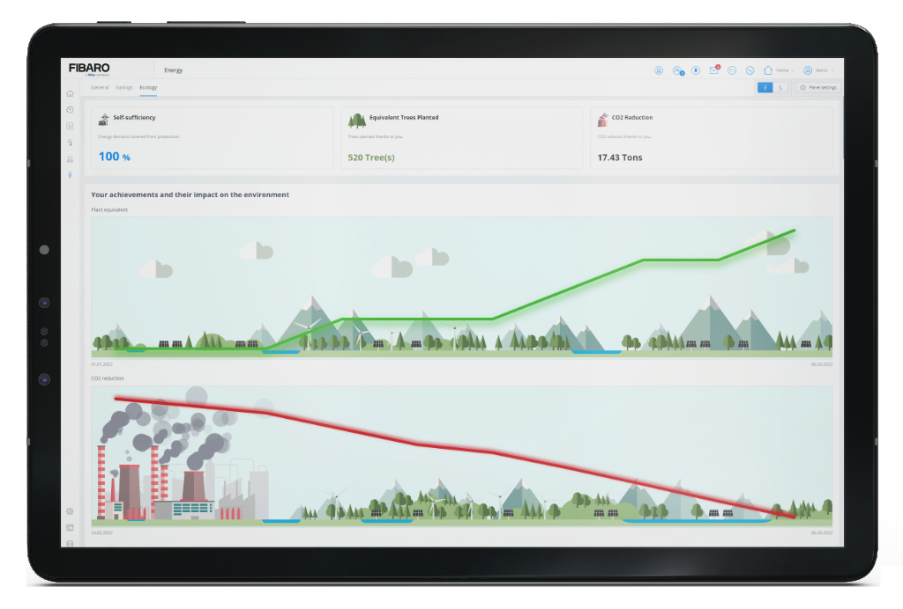

The FIBARO Energy Panel had a big update in firmware 5.093. I'll show you how it gives you insight in your home energy usage and what is needed to fully utilize it.

## Why intelligent energy management?

Intelligent energy management is more important than ever. In the Netherlands alone, it is expected that energy rates for an average household increase in 2022 with at least 700 to 1000 euros!

> With your home automation system you can collect real-time and historical consumption data and get advice with high reliability. This allows you to find an optimal balance of energy use in your home.

Monitoring energy is not only insight into your consumption, but also the efficient use of energy in your home. With good insights you ensure that you use the energy in your home smart and you can reduce your total consumption by optimally utilizing the sustainable yield of your solar panels.

Monitoring your energy consumption contributes to:

- Reduction of energy costs and / or energy bills,
- Reduction of energy consumption by 15%, sometimes even 30%!
- Invoice control of energy suppliers with validated data,
- CO2 reduction, which has a positive effect on global warming,
- Insight into different types of energy consumption (active and reactive energy),
- Mapping incorrectly configured devices.

## How does this work with the FIBARO Home Center 3 (Lite)?

Your Home Center 3 (Lite) manages the energy reports of all connected equipment as well as devices that *deliver* energy and devices that *consume* energy. This makes it possible to monitor by yourself and to use automation to control your energy consumption.

## Which other devices do I need?

First make sure that you have *minimum firmware 5.093* installed on your Home Center 3 (Lite). In addition, you need Z-Wave devices with the *Power Meter* and *Energy Meter* class or a *Quick App integration* for non Z-Wave devices.

### Modules

Besides the FIBARO actors, the *Qubino Smart Meter* Z-Wave modules are the most suitable solution to monitor energy with the FIBARO System. These devices can *actively* measure the consumption of a single room or a complete house. The modules are also very suitable to place between the solar inverter and the electricity grid.

### Quick App P1 integration

If you are not able to place a *Qubino Smart Meter* Z-Wave module between your home network and the electricity grid then you can use my  **[Wi-Fi P1 meter Quick App](https://marketplace.fibaro.com/items/wi-FI-P1 meter-smart-meter integration)** that reads the data directly from your Smart Meter. By using the **[HomeWizard P1 meter](https://www.homeewizard.nl/homewizard-wi-fi-p1-meter)** and my Quick App allows you to read energy consumption *direct* from the Smart Meter. This allows you to feed the data to the *Energy Panel* (for monitoring) and shows the real-time data, at phase level, to use for automation in Lua Scenes / Quick Apps.

## The Energy Panel

If you have placed a *Qubino Smart Meter* Z-Wave module between your home network and the electricity grid, or if you use the **[Wi-Fi P1 meter Quick app](https://marketplace.fibaro.com/items/wi-FI-P1 meter-smart-meter integration)** you need to configure these as *Main Energy Meters*

By adding the devices as *Main Energy Meters* in the general options of the Home Center 3, the system will automatically calculate the remaining power consumption, which is not measured by connected Z-Wave devices. This is shown in the Energy Panel as ***rest*** and gives you a complete picture of your energy consumption in your house:

If you have placed a *Qubino Smart Meter* Z-Wave module between your solar inverter and the electricity grid, or if you use the **[SolarEdge Monitor QuickApp](https://marketplace.fibaro.com/items/solaredge-monitor)** the energy meters are configured as devices that report *production*. This data is also displayed in the Energy Panel and the HC3 will calculate the energy balance and costs!

## In summary

To gain insight into your energy consumption / production you can:

- Install a **[Qubino 1 or 3 phase Smart Meter](https://qubino.com/products/3-phase-smart-meter/)** Z-Wave module in your home network to measure:
    - Energy production by solar panels.
    - Energy consumption of a heat pump.
    - Energy consumption when charging an electric car.
    - Main energy consumption of your home network.
- Connect a **[HomeWizard P1 meter](https://www.homewizard.nl/homewizard-wi-fi-p1-meter)** to your smart meter and read the data with the **[Wi-Fi P1 meter Quick App](https://marketplace.fibaro.com/items/wi-fi-p1-meter-smart-meter-integration)** to measure the main energy consumption in your home,
- Read the energy data from your solaredge inverter with the **[SolarEdge Monitor QuickApp](https://marketplace.fibaro.com/items/solaredge-monitor)**.

You then configure these devices as *Main Energy Meters* in the Home Center 3 and the *Energy Panel* will then show the consumption of the *individual* installed Z-Wave modules that have the class *Energy Meter* (such as a Dimmer 2 module or a Wall Plug) **and the Home Center 3 will automatically subtract this consumption of the consumption that is monitored by the *Main Energy Meters***.

Now you get insight in the consumption that is reported by home appliances that are not connected to the Z-Wave network.