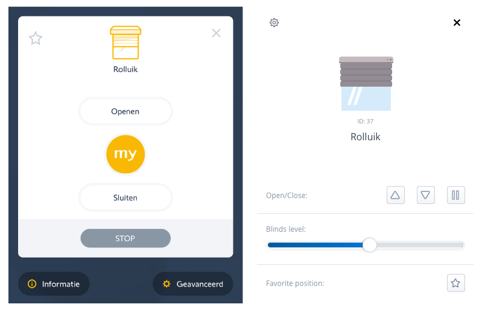
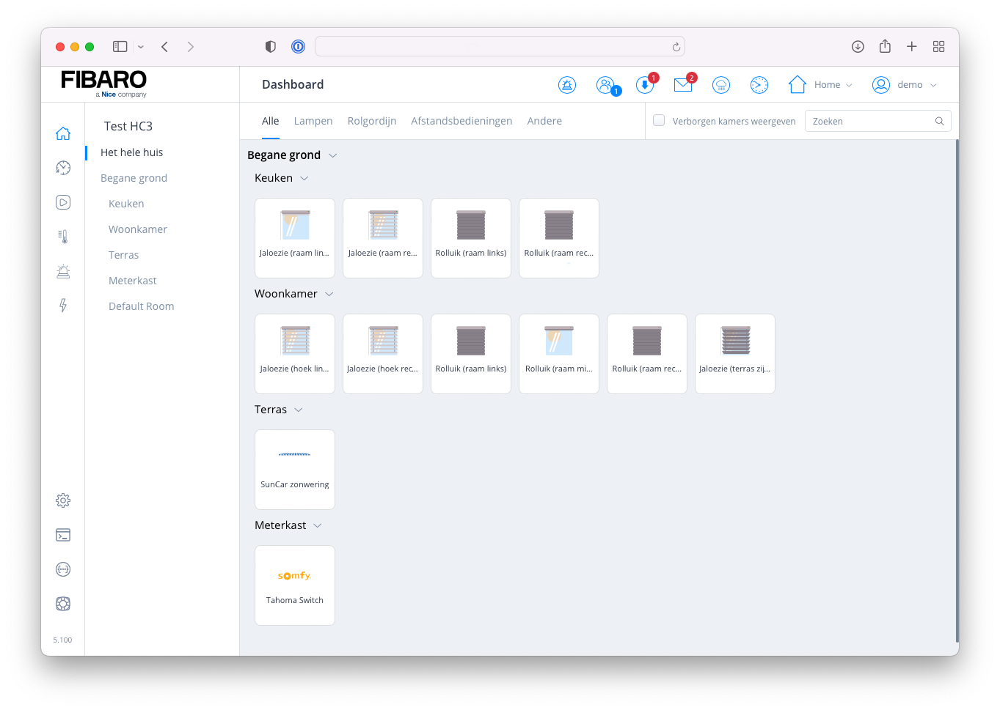
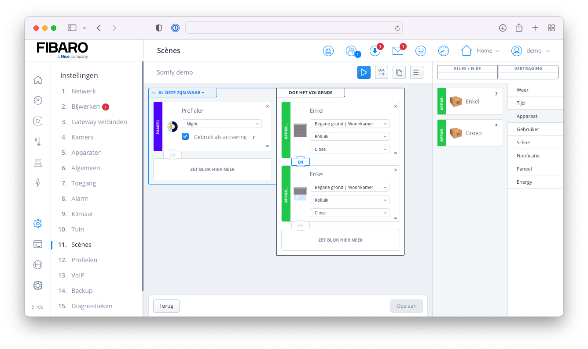
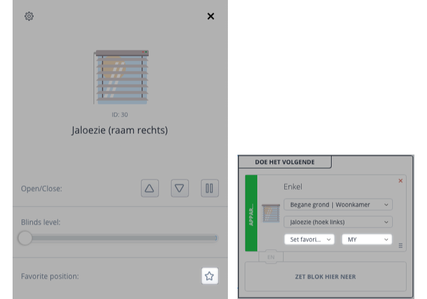

💡 <strong>At the moment I'm working on an official local Somfy API integration for the Home Center 3 that will replace this Quick App. Sign up for my newsletter to be the first to know when this official Somfy Quick App is released!</strong> 💡

To come straight to the point, every smart home owner who has Somfy equipment wants to have it connected to his Home Center 3 in order to integrate the devices into scenes and build cool automations with it. Integrating a Somfy product with the Home Center 3 is not that easy, but I managed to create a Quick App to integrate the *[TaHoma switch](https://www.somfy.nl/producten/1870595/tahoma-switch)*!



## How Somfy works with the HC3

The [Roller Shutter 3](https://www.fibaro.com/en/products/smart-roller-shutter/) Z-wave module made by FIBARO allows you to control electric blinds, awnings, roller shutters, roller blinds, and gates with the HC3. For Somfy devices this module is not an option, so I created a Quick App that reads the Somfy devices from the [TaHoma switch](https://www.somfy.nl/producten/1870595/tahoma-switch) box and creates child devices with the `com.fibaro.rollerShutter` device type. This allows you to control the devices in almost the same way the Roller Shutter 3 Z-wave module does.

The Quick App supports the following device types:

| Device                  | Tested |
| ----------------------- | ------ |
| Roller shutter          | Yes    |
| Exterior screen         | Yes    |
| Screen                  | No     |
| Awning                  | Yes    |
| Pergola                 | No     |
| Garage door             | No     |
| Window                  | No     |
| Venetian blind          | Yes    |
| Exterior venetian blind | No     |

Because I only can test motorized roller shutters, I got help from Tim ([Peertje Projecten](https://peertjeprojecten.nl/)) who gave me access to his *TaHoma Switch* so that I could test more device types!

### Commands

The standard **open**, **close** and **level** commands are supported. **Automatically the Favorite Position button is mapped to the My button on the Somfy system.** How cool is that!

### Device status

Most Somfy devices are not capable of reporting their status. Devices that use the IO protocol are capable but at the moment this is not implemented in this Quick App. You need to be aware of this when creating scenes with the HC3. Maybe I will implement this in the future, but I can’t say when.



## Download

You can download my *Somfy TaHoma Switch* Quick App and documentation from the [FIBARO Marketplace](https://marketplace.fibaro.com/items/somfy-tahoma-switch-integration).

## Installation

### Prerequisites

Before you can integrate your Somfy devices into the Home Center 3 (HC3) you must meet the following prerequisites:

- You need a [TaHoma switch](https://www.somfy.nl/producten/1870595/tahoma-switch),
- Your Somfy devices needs to be **configured** and **connected** to the TaHoma switch via the [TaHoma app](https://www.somfy.nl/producten/smart-home-en-afstandbediening/tahoma-smart-home/tahoma-app),
- My [Somfy TaHoma Quick App](https://marketplace.fibaro.com/items/somfy-tahoma-switch-integration) installed on your HC3.

### Quick App installation

1. **Start** your favorite browser and open your Home Center 3 dashboard by typing the correct URL for your HC3,
2. Go to **Settings** and **Devices**,
3. **Click** the blue **+** icon to add a new device,
4. In the **Add Device** dialog click on **Other Device**,
5. Choose **Upload File** and upload the `.fqa` file downloaded from the [FIBARO Marketplace](https://marketplace.fibaro.com/items/somfy-tahoma-switch-integration).
6. Additionally you can change the icon of the Quick App with the attached icon.

### Quick App configuration

1. Go to **Settings** and **Devices**,
2. **Expand** the imported **Tahoma Switch** device,
3. **Select** the **Variables** tab,
4. Fill in the **userid** and **userPassword** fields with the credentials you use to login the TaHoma app on your phone or tablet.
5. If you press the blue **Save** button the Quick App will be initialised, reads all devices from the TaHoma box and automatically creates child devices in your HC3.


## Block scene example

With motorised roller shutters you don't have to keep manually changing your blinds when you go to bed at night. With this example I’ll show you that **my Quick App fully supports block scenes** by creating a block scene to close the roller shutters when you activate the *Night profile* in the HC3:



## Lua scene example

In this example I’ll show you how to automatically lower your exterior screens when the sun gets strong by reading the current UVI value from my [Ventus W830 weather station](https://docs.joepverhaeg.nl/ventus-w830/):

```lua
local uvi = fibaro.getValue(50) -- read the current UVI
if uvi > 4 then
	fibaro.call(60, "close") -- send close to the 
end
```

This will automatically maintain an optimal temperature inside your home with just 4 lines of code!

## Using the “My” (or favorite) position

Somfy remotes have a **my** button to easily set your blinds to a favorite position. In the Quick App I mapped the **Favorite position** button of the child devices to the **my** button action. Most Somfy devices are based on the RTS protocol and don’t allow to set a certain level. By assigning a favorite position to your **my** button you can still set your blinds to a certain position in a Home Center 3 scene.



## Support

The Somfy API may change in the future and **I cannot provide any support or advice of any kind when you use my Quick App**. I made this Quick App in my spare time as a hobby and am publishing the Quick App for others to enjoy the integration in their smart homes too.

## Disclaimer

This Quick App has been written in such a way that it respects the Somfy API guidelines. Your use of the Somfy TaHoma switch Quick App is solely at your own risk. If your public IP address is blocked by the Somfy API servers, that is your own responsibility. If Somfy changes or stops offering the API that this Quick App uses, I will not be responsible for the failure of automations made with this Quick App.

## Notice of Non-Affiliation

I’m not affiliated, associated, authorized, endorsed by, or in any way officially connected with [FIBARO](https://www.fibaro.com) nor [FIBARO Benelux](https://fibarobenelux.com), or any of its subsidiaries or its affiliates. All product and company names as well as related images are registered trademarks of their respective owners.