With the Home Center 3 (HC3) it is possible to configure a smart alarm system with the connected Z-Wave sensors. The advantage is that you can use the sensors not only for the alarm, but also for other automation purposes. The disadvantage is that your alarm is not certified (for home insurance) and is not monitored 24/7 by an alarm support team.

I started to build our smart home alarm a while ago and in this blog I explain how I installed the sensors, configured the HC3 and how the Z-Wave technology works to make the wireless communication between the sensors and the controller secure.

The advantage that I can use the sensors for other automations made me decide to set up the alarm system with the HC3. For example, you can program the system that the window sensor sends you a push message when it starts to rain and the window is still open. When the alarm is set the system reminds you that there is still a window open and if it’s closed it’s armed like a traditional alarm. 

Check the following screenshot how easy this can be made with a simple block scene:

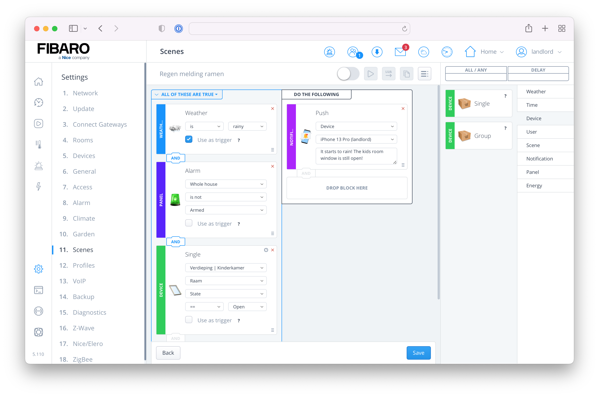

## Which sensors to use?

To build the alarm system with the Home Center 3 I use contact and motion sensors. I bought the [FIBARO Door/Window Sensor 2](https://www.fibaro.com/en/products/door-window-sensor/) that is available in different colors. This is nice because the sensors are less noticeable in our interior because they are (almost) in the same color as the frame.

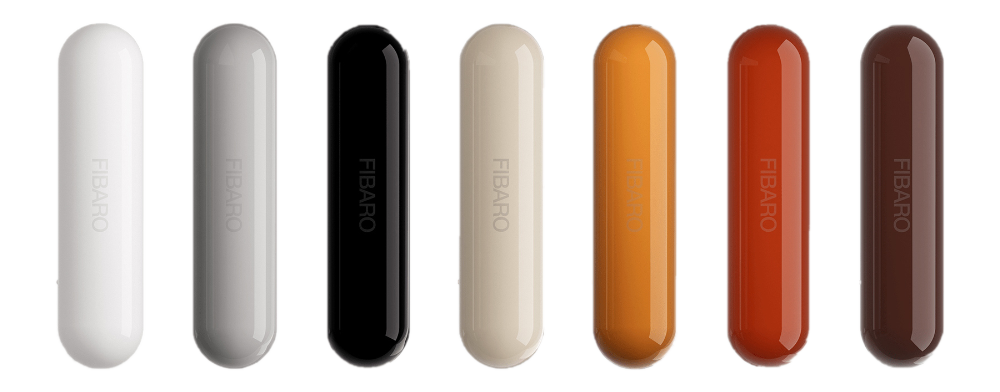

Contact sensors are an essential component in a home alarm system as they detect when any door or window is opened. Besides contact sensors I use motion sensors, but I limit them to specific rooms like the hallway, staircase, living room and the office because they can have false alarms. I chose the [FIBARO Motion Sensor](https://www.fibaro.com/en/products/motion-sensor/) which is a universal Z-Wave multi-sensor and has a built-in accelerometer to detect any tampering of the device. This means that if a burglar places something over the sensor or rips it from the ceiling the sensor alerts you immediately and the sensor starts flashing.

> Installing a motion sensor near your staircase is one of the most efficient ways to limit the movement of burglars within your home.

If you want to spread out the cost, I suggest starting with contact sensors on all entry points on the ground floor and expand from there.

## How I installed the sensors in my home

I placed a contact sensor on *every* window and door. I created a *tracking zone* in specific rooms by installing a motion sensor. As the FIBARO motion sensors are PIR sensors, they respond best when installed in a corner of the room or perpendicularly to the walking direction.

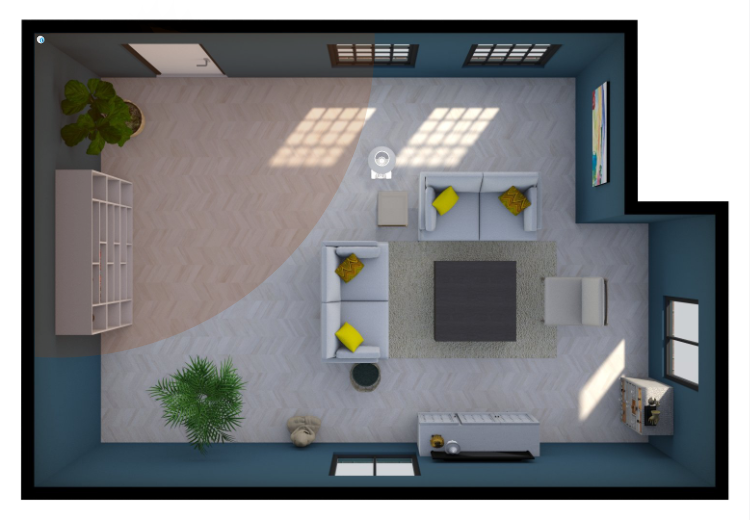

By installing the sensors like this the contact sensors alert when someone is entering your home and the motion sensors provide security when burglars find their way into your home without opening a door or window.

## Securely connect the sensors to your HC3

Before I show you how to easily connect all sensors to the HC3, I will first explain what secure Z-Wave is. I found this very confusing at first and figured it all out by reading a lot about the topic. I wanted to use secure Z-Wave because I’m building a wireless alarm system and I don’t want the signal to be intercepted and hacked on day 1.

### What is secure Z-Wave?

Secure Z-Wave uses end-to-end secure communication. This secures the data while it's transferred from one device to another. For example, when a Z-Wave PIR device detects motion the data send to the Home Center 3 is encrypted on the motion detector and only the Home Center 3 can decrypt it. As the data travels though the air, the message cannot be read or tampered with by another device that is sniffing Z-Wave radio transmission. The Z-Wave specification for secure Z-Wave also states that *data freshness* is guaranteed, which means that the devices can assure that the message has been sent recently.

According to Z-Wave specification the Home Center 3 maintains backward compatibility and interoperability so both secure and non-secure Z-Wave devices can be added to the HC3 and can operate in the same Z-Wave network.

### Security 0 vs Security 2 (S0 vs S2)

As of April 2017 Security 2 (S2) is added to the Z-Wave certification which provides more advanced security. The encryption level of S2 is rated at 128-bit AES which is very secure. 

With S0 the developers of the device firmware had to implement their own security. Now with S2 the protocol is specified in the Z-Wave framework and the developers can easily implement this protocol into the Z-wave device. This ensures that all Z-Wave devices that use the S2 protocol have the same security implementation and standard.

> The Z-Wave Alliance doesn’t require the S2 Protocol for 500 series devices, but FIBARO implemented it according specification in the Home Center 3. For 700 series devices (like the Home Center 3 Lite) the S2 protocol is required for certification.

### A note on Z-Wave S2 on the HC3

From firmware 5.080 there are two Z-Wave engines available in the Home Center 3. The new 3.0 *beta* Z-Wave engine has native support for S2. Version 2.0 has only support for S0. If you want to use the new engine with S2 support you have to reset your HC3 to factory default via the **Recovery Mode**:

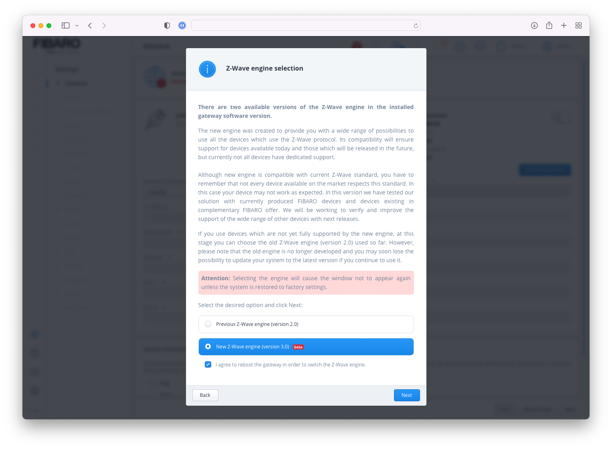

Note that you have to re-add all your devices, custom scenes and Quick Apps. FIBARO will release an update in the near future to allow you to migrate from the Z-Wave 2.0 engine to the new 3.0 engine.

## Connect all sensors to your Home Center 3

Before installing the sensors in your home, I recommend connecting them to the HC3. The FIBARO Door/Window Sensor 2 and Motion Sensor don’t support [Z-Wave SmartStart](https://z-wavealliance.org/smartstart/) yet so this saves you a lot of hassle not having to walk around with your controller.

### Limit false alarms with pets

The FIBARO motion sensors are pet friendly. The sensitivity setting of the sensor can be adjusted to exclude the detection of small animals, like your cat or dog. You can change the sensitivity with **Parameter 1** in the device settings. How higher you set the value how less sensitive the sensor is. When you have pets you have to go through trial and error to get a correct setting to not detect your pet. My experience is that our old cat was not detected with the default setting of **15** when I used the motion detectors for lights only.

## An introduction to alarm zones

In a traditional alarm system an alarm zone is a sensor slot on the alarm control panel. A slot is defined as a specific area of the house with one sensor connected to it. For example you configure a motion sensor to a sensor slot in the living room and you configure a window sensor in the same room to another slot. Considering most alarm systems have 8 slots, you have to create a slim design. The big advantage of building an alarm system with the HC3 is that you can add multiple sensors to an alarm zone and you can create multiple zone configurations for the same room or section.

## Advanced zone configuration with the HC3

Besides adding multiple sensors to an alarm zone or adding a house section (like the upper floor) to a zone I created a specific “zone” to arm only the door and window sensors. Not arming the motion sensors allows us to walk around the house at night without setting off the alarm. This is ideal when you have young children.

Another design choice I made is to exclude specific bedroom window sensors. Most of the time we sleep with the bedroom windows open and with the HC3 alarm panel it is very easy to configure the alarm system to this use case and keep the rest of the house armed.

By designing multiple zone configurations I have the flexibility to arm the full house when everybody is away and arm specific parts of the house when we are at home.

### Creating alarm zones

1. **Start** your favorite browser and open your Home Center 3 dashboard by typing the correct URL for your HC3;
2. Go to **Settings** and **8. Alarm**;
3. **Select** the **Alarm Zones** tab;
4. **Click** the blue **Add Zone** button to add a new zone;
5. Give your zone a **name** and select the **room** or house **section** to add;
6. **Click** the **Save** button to save the new zone.

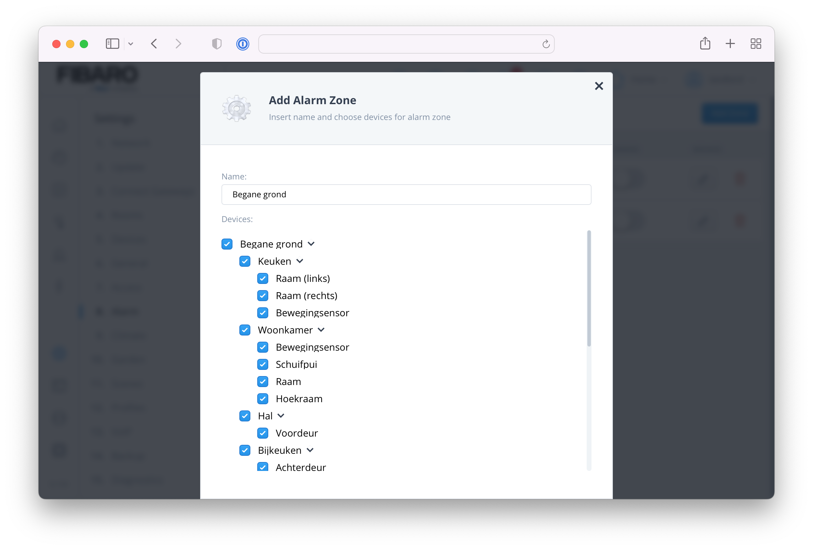
It is as easy as that. When you want to exclude specific sensors or create a zone without the motion sensors as I mentioned earlier you can just **deselect** the specific sensors in the **Add Zone** window:

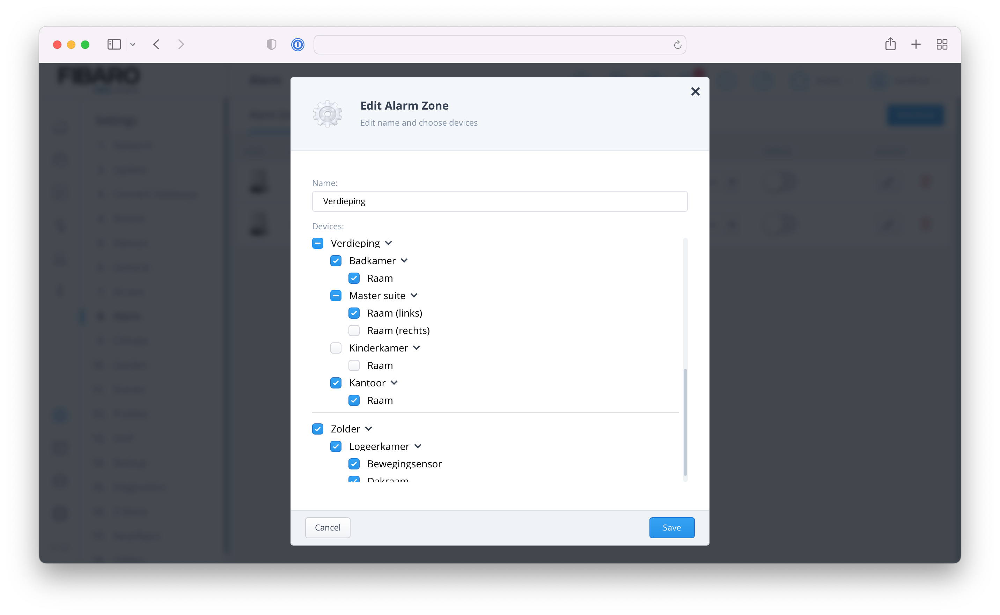

### Build an alarm scene

Now you have configured the zones, you can start creating alarm scenes. These allow you to define push messages to warn you when the alarm is triggered. You can also configure actions to turn lights on, sound a siren or whatever you can think of.

1. Go to **Settings** and **8. Alarm**;
2. **Select** the **Alarm Scenes** tab;
3. **Click** the blue **Add Alarm Scene** button to add a new scene;
4. Give your scene a **name** in the **New Block Scene** window;

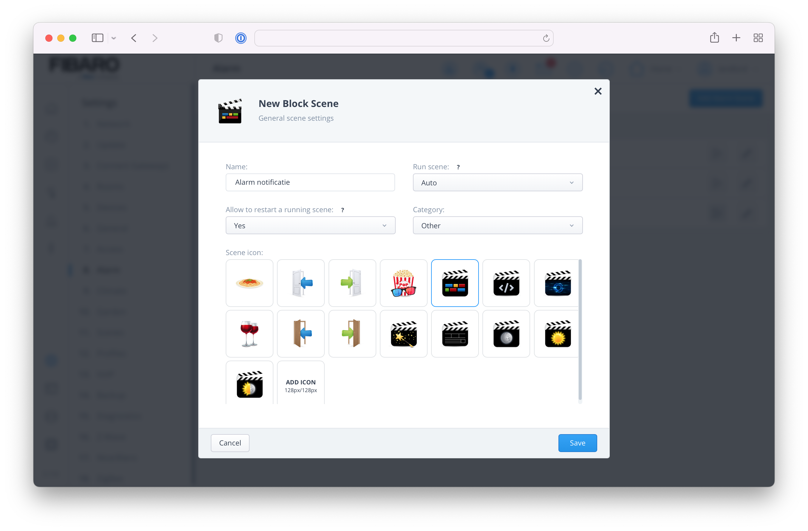

Leave the other options as **default** and click the **Save** button to open the *block scene editor.*

### Example 1: Send a push message

In this example I want to **send a push message** to my phone when the alarm in the **living room** is **breached**. This is easily done with a block scene like this:

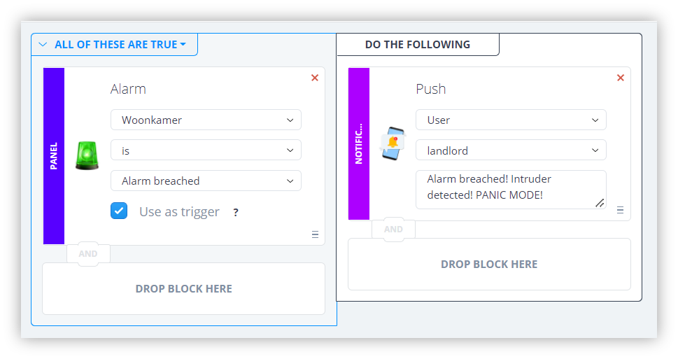

With this method you can program different actions when the alarm is triggered in a specific zone or the whole house. 

> When you select **Whole house** from the list of zones the action is triggered when the alarm is triggered by a sensor that is active from **any** zone. *This does not mean any configured sensor to the HC3! If a sensor is not added to a zone it will not trigger the alarm!*

### Example 2: Turn the lights on

Not only can you send a message when the alarm is triggered, but you can also run automations. For example, turning on a group of lights when the alarm triggers:

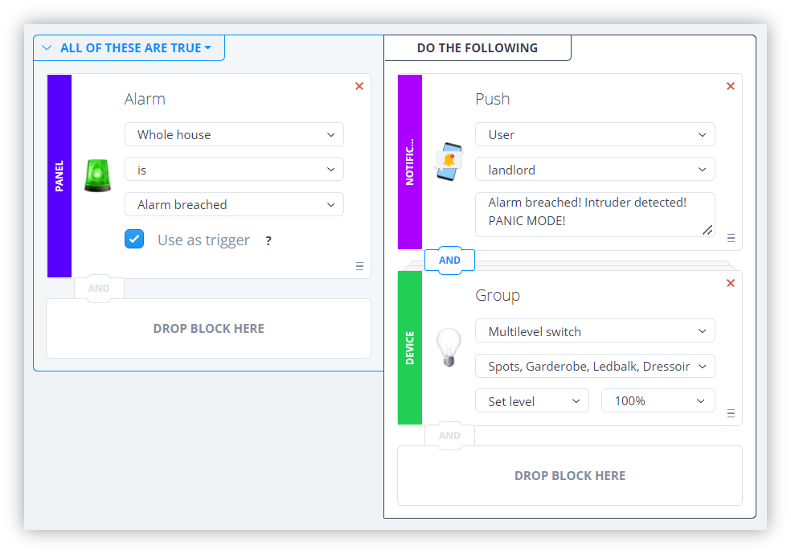

### Example 3: Sound a siren

You can also turn on a siren when the alarm is triggered. I don’t own one, but I’ve been told that the [Aeotec Siren 6](https://aeotec.com/z-wave-siren) works good. It can sound up to 15 pre-configured tones at 105 decibels to scare burglars away. You can set it up like the examples above.

## Change alarm pin in options

The default pin to disarm the alarm on a HC3 is `1111`. I strongly recommend changing this in in the access settings as soon as possible.

1. Go to **Settings** and **7. Access**;
2. **Select** the **account** you want to change the pin for;
3. On the *right side* change the code in the **Alarm settings** box;
4. **Click** the **Save** button to save the new pin.

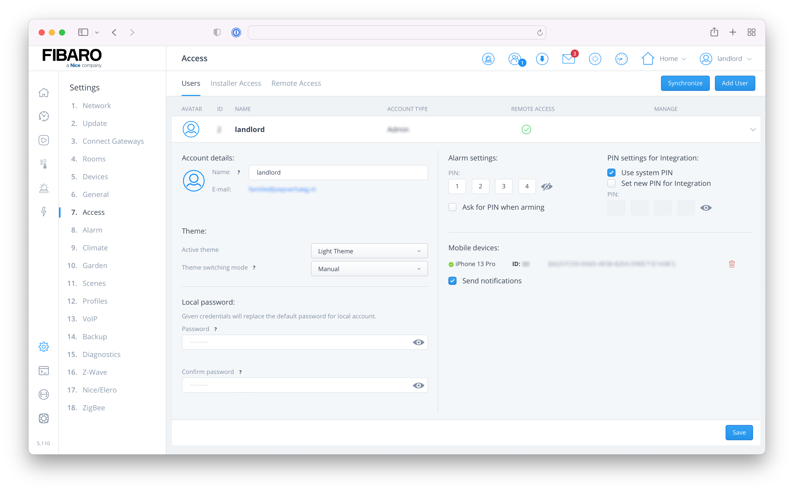

## Exit and entry delay

When you want to **arm** the alarm when you are still indoors you have to configure an **exit delay**. This setting gives you a short period of time to leave your home. With the HC3 it is very easy to configure this per zone. I've only configured an exit delay in the hallway so that no one can sneak into the house while I'm still at the front door.

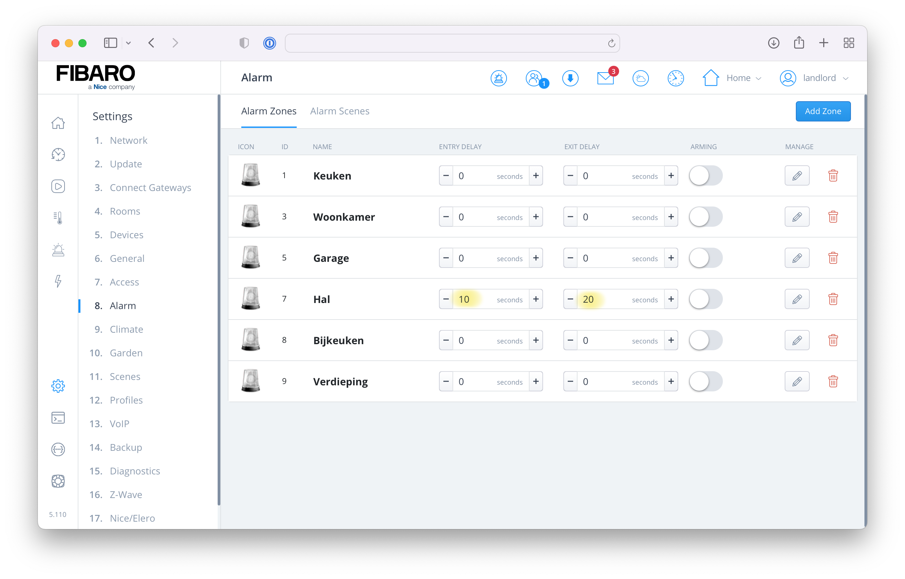

You can also configure an **entry delay** to give the first family member that comes home time to **disarm** the alarm with a code on a keypad that is installed in the hallway. I use the [FIBARO Keyfob](https://www.fibaro.com/en/products/keyfob/) to disarm our alarm, but I think it’s worth mentioning.

## How to arm and disarm your alarm system

There are several options to arm and disarm your freshly installed alarm system. With the Home Center 3 the possibilities are endless, like geofencing, keypads, keyfobs, use of the Yubii app and much more.

> A quick note regarding geofencing. It has a minimum radius of 50 to 100 meters around your house GPS location. I don’t use it for the alarm because when we are visiting the neighbors, or when we slide down slides with our daughter in the nearest playground the alarm does not get activated.

The [Yubii app](https://www.fibaro.com/en/smart-home-app/) has built-in alarm controls and is very easy to use. When you **tap** the **alarm** icon in the **Summary** bar within the app you go easily to the screen with the alarm zones and status of the house. You can also show the alarm zones in the general favorites view to quickly arm and disarm certain zones.

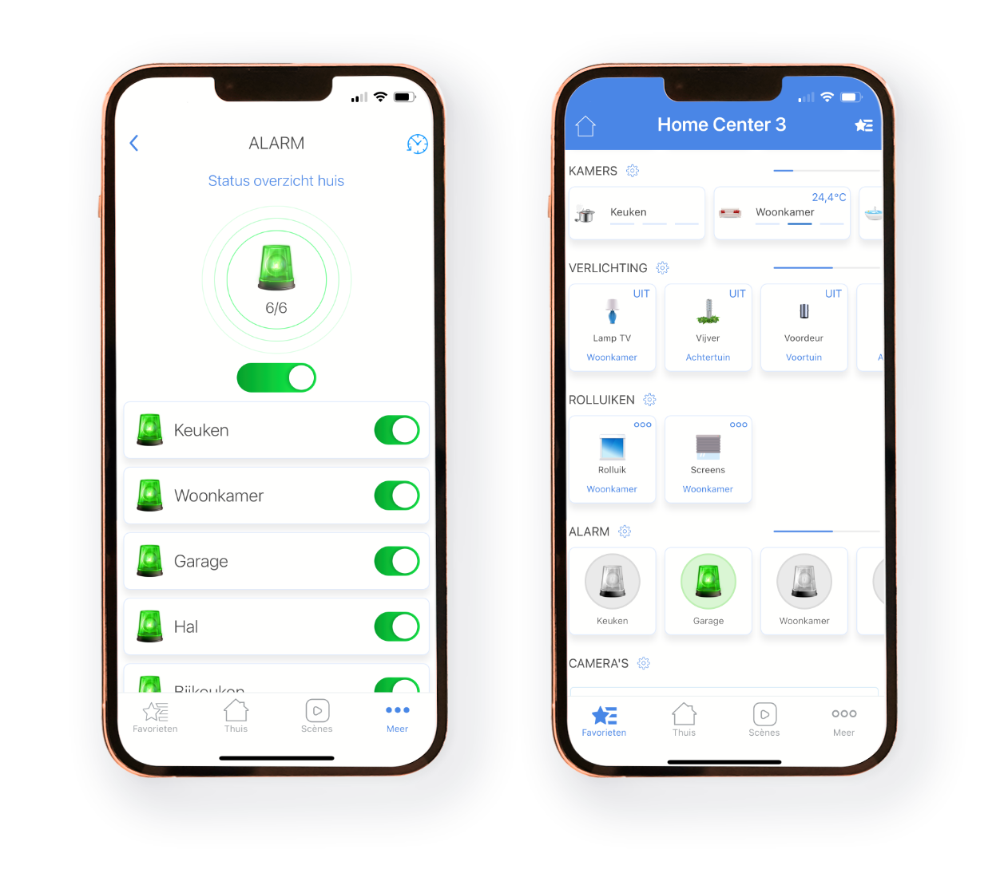

### Keyfob

I use the awesome [FIBARO Keyfob](https://www.fibaro.com/en/products/keyfob/) because I don’t want to unlock my phone every time I need to arm or disarm the alarm. With a block scene the keyfob is very easy to program for this use:

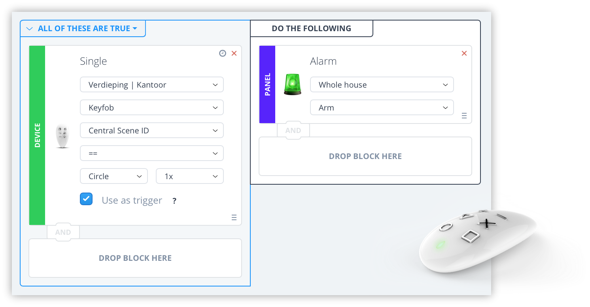

## Thank you note

I would like to thank [FIBARO Benelux](https://fibarobenelux.com/) for taking the time to answer some of my questions about the FIBARO system although I’m not an certified FIBARO installer, but a hobbyist with a hobby that got out of hand.

## Notice of Non-Affiliation

I’m not affiliated, associated, authorized, endorsed by, or in any way officially connected with [FIBARO](https://www.fibaro.com) nor [FIBARO Benelux](https://fibarobenelux.com/), or any of its subsidiaries or its affiliates. All product and company names as well as related images are registered trademarks of their respective owners.