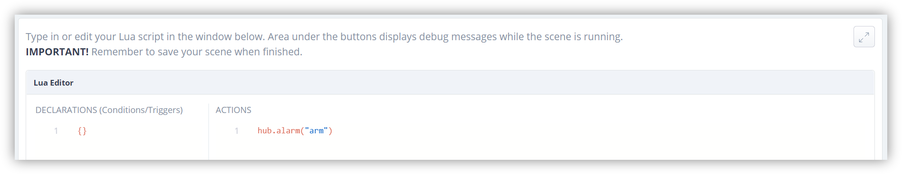
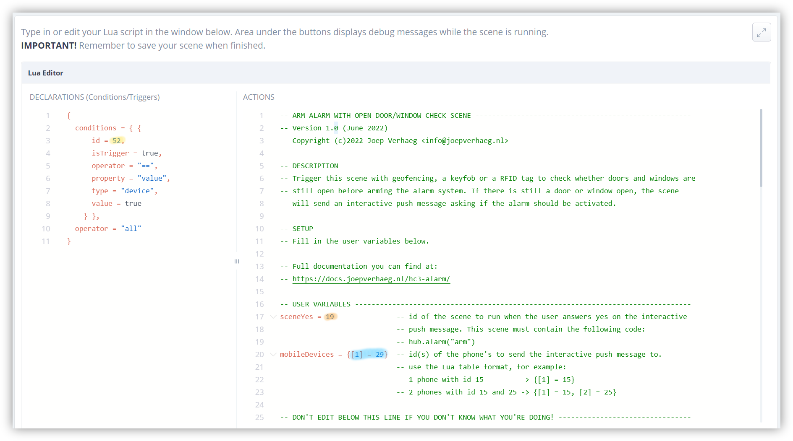

In addition to my [previous blog about installing a HC3 alarm system](https://docs.joepverhaeg.nl/hc3-alarm/) I wrote a **smart alarm activation scene** to arm the HC3 alarm with a RFID reader, keyfob or geofencing.

**Before** arming the alarm the scene **checks** if there are door or window sensors in **open** state and notifies you about it with an **interactive** push message. You can answer the message with a *yes* or *no* command to to arm the alarm even though a window or door is still open.


## Prerequisites

The implementation consists of the following parts:

1. A **trigger** to activate the alarm;
2. My [smart alarm activation scene](https://docs.joepverhaeg.nl/downloads/smart-alarm-activation-scene.Lua) that is started by the trigger;
3. A simple scene that started when the user answered **yes** from the interactive push message that is sent when there are doors or windows still open;

## Scene 1 installation

1. **Start** your favorite browser and open your Home Center 3 dashboard by typing the correct URL for your HC3;
2. Go to **Settings** -> **11. Scenes**;
3. **Click** the blue **Add scene** button to add a new scene;
4. Choose the option **Lua scene**;
5. Give the scene a **name** and **click** the **Save** button;
6. In the **ACTIONS** block of the Lua scene, enter the code: `hub.alarm(“arm”)`:
    
7. **Click** on the **Save** button;
8. Now you can go back to the scene list by clicking on **scene list** button.


## Scene 2 installation

1. **Click** on the blue **Add scene** button to add a second scene;
2. Choose the option **Lua scene**;
3. Give the scene a **name** and **click** the **Save** button;
4. **Copy** the **Lua code** from my [smart alarm activation scene](https://docs.joepverhaeg.nl/downloads/smart-alarm-activation-scene.Lua) and **paste** it in the **ACTIONS** block;
5. In the **Declarations (Conditions/Triggers)** block enter the trigger code that you want to use to activate the alarm.
6. The screen then looks like this:
    
1. **Change** the **variable** `sceneYes` to the *id* of the first scene you have just created to activate the alarm (orange marked);
2. **Change** the **variable** `mobileDevices` in a **Lua list** with the **mobile phone id's** from the people who want to receive the interactive push message if there are still doors or windows open (blue marked);
3. **Click** on the **Save** button.

### Trigger configuration

In the example above, the alarm is activated by a RFID reader which is connected to a [FIBARO Smart Implant](https://www.fibaro.com/en/products/smart-implant/). If a user holds his personal RFID card in front of the reader the smart implant sends a signal to the Home Center 3. You can capture this signal with the following condition in the **Declarations (Conditions/Triggers)** block:

 ```json
 {
 conditions = { {
     id = 52,
     isTrigger = true,
     operator = "==",
     property = "value",
     type = "device",
     value = true
     } },
 operator = "all"
 }
 ```

This trigger is free to configure. You can configure a [FIBARO Keyfob](https://www.fibaro.com/en/products/keyfob/) button or set up geofencing.

## Notice of Non-Affiliation

I’m not affiliated, associated, authorized, endorsed by, or in any way officially connected with [FIBARO](https://www.fibaro.com) nor [FIBARO Benelux](https://fibarobenelux.com/), or any of its subsidiaries or its affiliates. All product and company names as well as related images are registered trademarks of their respective owners.