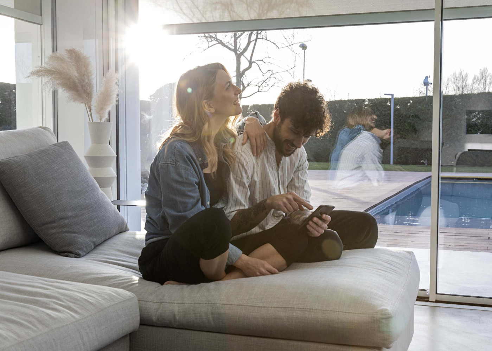

Did you know that burglars usually avoid homes where someone is present? Because the chance of being discovered is of course very high. A smart home equipped with presence simulation enables you to create the impression that someone is home, which is not the case.

Most presence simulators I know have to be programmed with random times. How cool would it be if your presence simulation follows your daily pattern? That you don't have to program routines in Lua code with those random times and have to take into account light, sunrise, sunset and season parameters?

> With my presence simulator, a different pattern is visible every vacation because the presence simulation scene automatically adapts to your living pattern of that moment. You can download my presence simulator from the [FIBARO Marketplace](https://marketplace.fibaro.com/items/advanced-presence-simulation).

With the Home Center 3 (HC3) it is possible to read your light and roller shutter switching pattern from the logging (history). With this information you can dynamically make an outsider believe that someone is at home by simulating exactly the switching of shutters and lighting as you performed it a week before you went on vacation. This shows a different pattern every time you're on holiday. [My presence simulation scene](https://marketplace.fibaro.com/items/advanced-presence-simulation) automatically adapts to your living pattern at that moment. How cool is that!

  

## Temporary stop automated routines with profiles

Not only is presence simulation important when you are on vacation. By using profiles in the HC3 you can easily stop automated routines that else are activated by the system during the holidays. For example, our vacuum cleaner runs a final round through the house when we left on vacation and then it stays in the dock until we get home. The cleaner isn't started after that because the routine looks at which profile is active.

By using the following function you can easily include this in your code:

```
function getActiveProfileName()
    local profiles = api.get("/profiles")
    for _, profile in ipairs(profiles.profiles) do
        if (profile.id == profiles.activeProfile) then
            return profile.name
        end
    end
end
```

As an example I check with the code below if the holiday profile is **not** active. That is the trigger to start the [robot vacuum](https://docs.joepverhaeg.nl/hc3-roborock/) when everybody left the house:

```
local activeProfile = getActiveProfileName()
if (activeProfile ~= "Vacation") then
    fibaro.call(251, "clean") -- Start the vacuum
end
```

## Absence and when to start simulation?

Absence is detected at our home with the existing presence detection (geofencing). The system automatically activates the *away* profile in the HC3 if the last person has left the house. There are more options to register absence, for example by reading the status of the alarm system and let this state set the *away* profile. I made a [comprehensive guide](https://docs.joepverhaeg.nl/hc3-alarm/) on installing an alarm system with the HC3 in a previous blog.

 

My presence simulation scene is **automatically** started when activating the *away* profile. The actual simulation becomes active if the *away* profile remains active for **longer than 8 hours**. After this time, the scene automatically switches the Home Center 3 to the *vacation* profile, so that certain automated routines stop. The scene sends a message to your phone to let you know the simulation is active.

The simulation is performed until the first person arrives back at home and and (automatically) activates the *home* profile. If you use [my presence simulation scene](https://marketplace.fibaro.com/items/advanced-presence-simulation) from the [FIBARO Marketplace](https://marketplace.fibaro.com) you can easily adjust this time in the code:

```
if (awayTime == 480) then -- Set vacation profile automatically after 8 hours (480 minutes) away!
	hub.profile(3, "activateProfile") -- Set vacation profile to active.
  runSimulation()
  else
...
```

## Take ambient light into account

If the **primary** light sensor is set in the HC3, the simulation takes the ambient lightinto account. If you have switched on a light in the past because it was darker during the day, the simulator will not switch it on if there is enough ambient light.

You can configure the primary light sensor at **Settings** → **6. General** → **Main** tab.

## Exceptions

If you have motion sensors installed for your garden lights, you don't want to have them included in the presence simulation. Often this type of lighting is applied to keep burglars away, because there is a chance that thieves will be startled if a lamp suddenly turns on.

I took this into account in my scene. If you create a Global Variable `PresenceSimExclusions` with the rooms you want to **exclude** (separated by a comma), then devices are not included in the simulation the indicated spaces:


## Power user talk! How does the LUA code work?

The Home Center 3 keeps a log of all actions with regard to devices with the type of lighting, blinds and shutters. You can view and filter these events in the *history* menu of the web interface:

 

The API of the Home Center 3 supports the definition `events/history` which makes it possible to retrieve this data externally. Fibaro uses *[Swagger](https://swagger.io/docs/specification/2-0/what-is-swagger/)* to describe the structure of the API. From the *swagger* menu option in the web interface you can open the **interactive** API documentation and test all available definition parameters:

 

In Lua scenes and Quick Apps you can easily access the internal API with the `api.get('')` function. By calculating a **date** in the **past** and by setting this date and filters as parameter to the API definition, the HC3 returns a table object with the exact time when you switched lights and rollershutters in the past:

 

By cleverly dealing with the data in this table, I can simulate presence with the pattern that took place in the past.

## In summary

- The presence simulation scene is activated by the *away* profile in the HC3;
- After 8 hours, the scene automatically activates the *vacation* profile and starts the simulation;
- Light and roller shutter actions from last week are automatically performed;
- You can exclude rooms with the `PresenceSimExclusion` Global Variable;
- When the first person returns home, the simulation automatically stops when the *home* profile is activated.

## Download

You can download my presence simulation scene and documentation from the [FIBARO Marketplace](https://marketplace.fibaro.com/items/advanced-presence-simulation).

## Thank you note

I would like to thank [JDK Benelux](https://jdkbenelux.com/about-us/) for taking the time to answer some of my questions about the FIBARO system although I’m not an certified FIBARO installer, but a hobbyist with a hobby that got out of hand.

## Notice of Non-Affiliation

I’m not affiliated, associated, authorized, endorsed by, or in any way officially connected with [FIBARO](https://www.fibaro.com) nor [FIBARO Benelux](https://fibarobenelux.com/), or any of its subsidiaries or its affiliates. All product and company names as well as related images are registered trademarks of their respective owners.