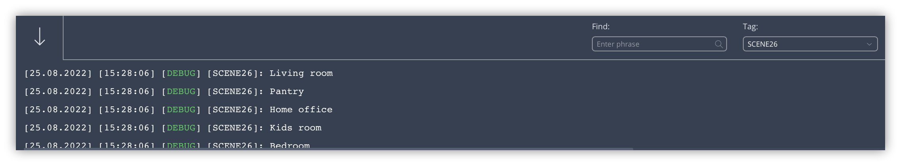

Many automations can be programmed much more flexibly and efficiently in Lua instead of block scenes.

In this blog I’ll guide you how to:

1. Properly set up the HC3 for lighting;
2. How to easily identify your lights;
3. Turn off all lights at once;
4. Switch lights on a specific floor;
5. Turn off all lights in a room in one go.

> The method in this blog can also be used with roller shutters by defining the correct device roles in the Home Center 3.

## Block vs Lua scenes

If you are a beginner you probably use block scenes to switch off your lighting in a controlled manner:


The downside of this method is that, if you add a new lightbulb or led strip to your home, you have to edit the scene.

If you program the same scene in Lua as follows, you still have to edit the scene when a new lightbulb is added:

```lua
local design = 100
local spots  = 101
local leds   = 102

hub.call(design, "turnOff")
hub.call(spots, "turnOff")
hub.call(leds, "turnOff")
```

## How do you correctly set up all devices connected to your HC3?

First you need to do some housekeeping on your HC3 if you haven't already done so. To identify your lights with Lua code you have to set the correct **basic parameters** for the devices. For *lights* set the **role** to **Light** and **category** to **Lights** (plus the other categories you want):


The Home Center 3 saves these parameters in a local database to identify the devices you’ve added. For example, you can connect a fan or a light to a [FIBARO Wall Plug](https://www.fibaro.com/en/products/wall-plug/). When you set the *role* of the device the HC3 knows which type of device is connected and you can use this information in Lua code to easily retrieve all lights and put them in a table. 

> If you add a new light switch, dimmer or wall plug in the future, it will be automatically included in your home automation because you don’t specify individual lights in your scene anymore, but identify them on floor and room level. Neat!

## How do you retrieve all connected lights with a single line of code?

To retrieve all lights and put them in a Lua table you can use the following line of code:

```lua
local lights = api.get("/devices?interface=light") or {}
```

It’s as simple as that, but this returns also the *disabled* lights from your HC3. We don’t want that, because we only want to control the *enabled* ones. You can just add `&enabled=true` to the relative url to only return the *enabled* lights. The full line of code then looks like:

```lua
local enabled_lights = api.get("/devices?interface=light&enabled=true") or {}
```

### Peek what is in the Lua table

If you want to view the contents of the Lua table you can use the following code to loop though the table:

```lua
for _,light in ipairs(enabled_lights) do
	hub.debug("Scene26", light.name)
end
```

The output shows the *names* of the devices in the HC3 log console:


## How do you turn off all the lights in the house at once?

With all *enabled* lights in a Lua table you can easily loop though all these lights and turn them off:

```lua
for _,light in ipairs(api.get("/devices?interface=light&enabled=true") or {}) do
	hub.call(light.id, "turnOff")
end
```

If you look closely at my Lua code above you see that I didn't create the `enabled_lights` variable before the `for .. do .. end` loop. If you don't want to use the *lights* table *outside of this loop* then this is cleaner Lua code. Basically it doesn't matter if you declare it or not, but this is cleaner Lua code.

## How do you retrieve the sections (floors) of your house?

If we want to create a Lua scene that **automatically turns off all lights on a certain floor** you first have to understand how to get the configured *sections* (floors) in your HC3. The following code retrieves all section information into a table:

```lua
local sections = api.get("/sections") or {}
```

If we loop though the table we see the *section* (floor) names and their id:

```lua
for _,section in ipairs(sections) or {}) do
   hub.debug("Scene26", string.format("%s (id %s)", section.name, section.id))
end
```


## How do you retrieve the rooms in your house?

There is no *light* or *room* information in the *section* table. **To find out which light is installed on which floor**, you must first retrieve all room information from your HC3 using the same principle as before:

```lua
for _,room in ipairs(api.get("/rooms") or {}) do
	hub.debug("Scene26", room.name)
end
```



## How do you turn a light off on a specific floor?

With all this information it is now possible to determine which light is installed in which room on which floor.

The data retrieval flow is:

1. Light;
2. Room;
3. Floor.

The *light* table has the `roomID` and the *room* table has the `sectionID`.

To easily parse this information in a Lua scene, first create two lookup tables:

```lua
-- Create section lookup table...
local map_section = {}
for _,section in ipairs(api.get("/sections") or {}) do
   map_section[section.id]=section
end

-- Create room lookup table...
local map_room = {}
for _,room in ipairs(api.get("/rooms") or {}) do
   map_room[room.id]=room
end
```

This makes it possible to switch off all your lights on the *first floor* by using the *name* of the *section* in the code:

```lua
for _,light in ipairs(api.get("/devices?interface=light&enabled=true") or {}) do
	if map_section[map_room[light.roomID].sectionID].name == "First floor" then
		hub.call(light.id, "turnOff")
	end
end
```

## How do you turn a light off in a specific room?

With the lookup tables in place it is also easy to switch off all your lights in a *room* such as the living room:

```lua
for _,light in ipairs(api.get("/devices?interface=light&enabled=true") or {}) do
	if map_room[light.roomID].name == "Living room" then
		hub.call(light.id, "turnOff")
	end
end
```

As you can see it is also possible use the *name of the room* in the Lua scene!

## To sum it up

I have merged all the code that I have used in this blog into the code block below, so you can easily copy and paste the pieces of code you want to test on your own HC3:

```lua
-- Create section lookup table...
local map_section = {}
for _,section in ipairs(api.get("/sections") or {}) do
   map_section[section.id]=section
end

-- Create room lookup table...
local map_room = {}
for _,room in ipairs(api.get("/rooms") or {}) do
   map_room[room.id]=room
end

-- Turn off all lights (in the whole house)...
for _,light in ipairs(api.get("/devices?interface=light&enabled=true") or {}) do
	hub.call(light.id, "turnOff")
end

-- Turn off all lights on the first floor...
for _,light in ipairs(api.get("/devices?interface=light&enabled=true") or {}) do
	if map_section[map_room[light.roomID].sectionID].name == "First floor" then
		hub.call(light.id, "turnOff")
	end
end

-- Turn off all light in the living room...
for _,light in ipairs(api.get("/devices?interface=light&enabled=true") or {}) do
	if map_room[light.roomID].name == "Living room" then
		hub.call(light.id, "turnOff")
	end
end
```

## Thank you note

I would like to thank [JDK Benelux](https://jdkbenelux.com/about-us/) and [FIBARO](https://www.fibaro.com) for promoting my Quick Apps and scenes through their social network.

## Notice of Non-Affiliation

I’m not affiliated, associated, authorized, endorsed by, or in any way officially connected with [FIBARO](https://www.fibaro.com) nor [FIBARO Benelux](https://fibarobenelux.com/), or any of its subsidiaries or its affiliates. All product and company names as well as related images are registered trademarks of their respective owners.