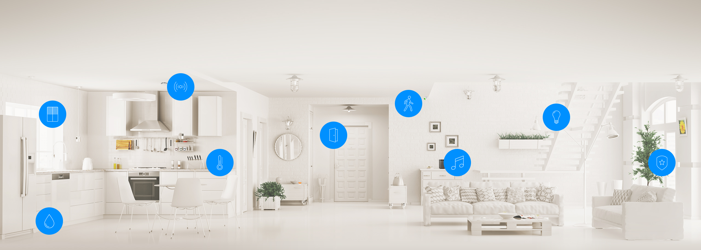
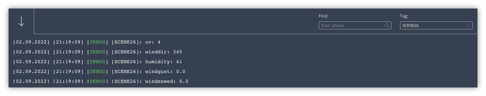
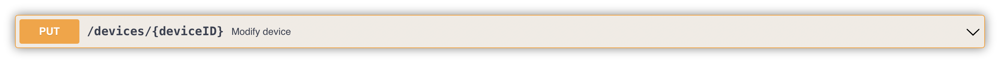
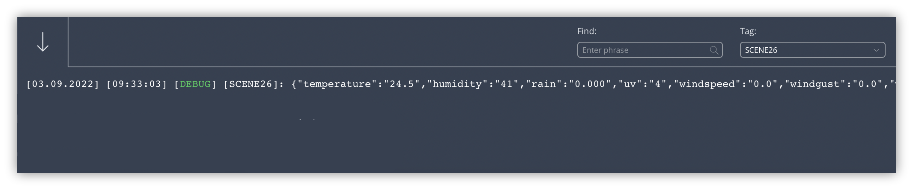

There are several smart home hubs and devices on the market and you can often connect them via an REST API. This API communication works via the HTTP (Internet) protocol and in this manual I'll learn you to you how to use this in a Home Center 3 (HC3) scene or Quick App.

Before you start programming a HC3 Lua scene you have to understand what an API exactly is and how the data is send and received on most smart home hubs.

## What is a RESTful API?

An application programming interface (API) is a collection of definitions based on which two home automation hubs or devices can talk to each other. It defines the data format that you must use to communicate with each other to retrieve information or perform a function on the device.

With a REST API (also known as RESTful API) communication takes place via the (secure) HTTP protocol and in a standard form. The request and response data is mostly send and received in the JSON format.



In other words, if you want to interact with another smart home controller to retrieve information or perform an action, an API enables you to communicate with that controller so it can execute the request.

## First to know: what is JSON?

JSON (JavaScript Object Notation) is a readable, lightweight format for sharing and storing data. It is often used when data is sent or received via a REST API because the definition is easy to understand. For example take a reply from a Wi-Fi weather station that has a REST API:

```json
{
  "temperature": "24.5",
  "humidity": "41",
  "rain": "0.000",
  "uv": "4",
  "windspeed": "0.0",
  "windgust": "0.0",
  "winddir": "345"
}
```

As you can see, the received data structure is easy to read. Even for non-technical people.

### How do you work with Lua tables and JSON?

The Lua environment on the Home Center 3 has the JSON library implemented and it’s very easy to use. With the library you can:

1. **Decode** JSON: converting a JSON string to a Lua table, 
2. **Encode** JSON: converting a Lua table to a JSON string.

### How do you decode a JSON string into a Lua table?

To **decode** data received in the JSON format and convert it into a Lua table you can use the following code:

```lua
local data_table = json.decode(payload)
```

The JSON data received from the weather station is in the `payload` variable. The code to receive the data I will show later in this blog.

### Peek what is in the Lua table

If you want to view the contents of the Lua table you can use the following code to loop though the table:

```lua
for key,value in pairs(data_table) do
	hub.debug("Scene26", key .. ": " .. value)
end
```

The output shows the *names* of the devices in the HC3 log console:



### How do you encode a Lua table into a JSON string?

You can also **encode** the data in a Lua table into a JSON string to send the data to another system:

```lua
local json_string = json.encode(data_table)
```

## What is the difference between GET, POST and PUT?

The HTTP protocol defines a set of request methods to define the desired action to be performed on the resource you want to control with the REST API. Let me explain the most used ones:

### HTTP POST request


You can use a **POST** request to **send data** to another smart hub or device. A POST request requires a **body** in which you **define** the **data** you want to **send**.

The data to set the dim level and color of a light bulb could look like:

```lua
{"brightness": 50, "color": "ff8000"}
```

Usually you’ll send the parameters of the device you want to control in the POST body to another smart home hub or device. In the next chapter I’ll show you how to actually control a light via a HTTP POST request.

### HTTP GET request


You have to use a **GET** request to **retrieve data** from another smart hub or device or control a device that doesn’t need a request body in the HTTP request.

To get the weather data in my example above, I send a GET request and the weather station returns a response containing the weather data in JSON format.

### HTTP PUT request



Some home automation hubs support the use of a **PUT** request to **modify a device** or **scene**. A PUT request updates the entire resource with the data that is passed in the body of the request.

## How do you receive data and control devices with HTTP in a HC3 scene?

Now that you know what types of request you can use, I'm going to show you how to receive weather data from the weather station API with the HC3.

In this example the IP address of your weather station is `192.168.1.10` and the API url is `/weather`. To receive the data you use a GET request:

```lua
local url = "http://192.168.1.10/weather"

net.HTTPClient():request(url, {
    options={
        method = 'GET',
        headers = {
            ["Content-Type"] = "application/json"
        },
        timeout = 5000
    },
    success = function(response)
        hub.debug("Scene26", response.data)
    end,
    error = function(errorMessage)
        hub.debug("Scene26", "HTTPClient error" .. errorMessage)
    end
})
```



### How do you turn on a Tasmota device via a HTTP request with a HC3 Quick App?

You can also send a command to turn on a light. For example you can turn on a [Tasmota](https://tasmota.github.io/docs/) light from a HC3 Quick App.

From the [Tasmota API documentation](https://tasmota.github.io/docs/Commands/), the URL to turn on a light is: `http://<ip>/cm?cmnd=Power%20On`. So lets assume the IP address of your Tasmota light is `192.168.1.20` then the Lua code in your HC3 Quick App looks like:

```lua
function QuickApp:onInit()
    self:debug("Joep's demo QuickApp initialisation")
    self.url = "http://192.168.1.20/cm?cmnd=Power%20On"

		self.http = net.HTTPClient({ timeout = 5000 })
		self.http:request(self.url, {
		    options = {
		        headers = {
		          ["Content-Type"] = "application/x-www-form-urlencoded"
		        },
		        method = 'GET',
		    },
		    success = function(response)
		        self:debug(response.data)
		    end,
		    error = function(message)
		        self:debug("error:", message)
		    end 
		})
end
```

## How do you send data and control devices with HTTP in a HC3 scene?

In this example I’ll show you how to set the color of a RGBW device connected to [Home Assistant](https://www.home-assistant.io) (HASS) from a HC3 scene. To set the correct RGB value of the led strip you have to **send** the **value** in the **data** field in a **POST** request.


### What are HTTP headers?

To control devices in HASS via the API you first have to authenticate yourself to the Home Assistant server. When using an API you can’t type in your username and password. That’s why a token can be sent via the header of the HTTP request to control a device via an API.

> An HTTP header is a field of an HTTP request (or response) that passes additional metadata with your request (or response). For example, a request message can use headers to indicate it's preferred media formats, while a response can use header to indicate the media format of the returned body. — mozilla.org

### How do you define the payload JSON string?

To create the data payload to send to the Home Assistant API you define a JSON string with the information about the device you want to control and the RGB color you want to set:

```json
{"entity_id": "light.ledstrip_1", "rgb_color": [227, 159, 23]}
```

The API endpoint (URL) to turn a light on in HASS is `/api/services/light/turn_on`. If you send the JSON payload you defined above, the led strip will turn on with an orange color. For example, the HC3 Lua scene that sends the request can look like this:

```lua
local url = "http://192.168.1.11:8123/api/services/light/turn_on"
local payload = '{"entity_id": "light.ledstrip_1", "rgb_color": [227, 159, 23]}'

net.HTTPClient():request(url, {
    options={
        method = 'POST',
        headers = {
						["Authorization"] = "Bearer " .. token
            ["Content-Type"] = "application/json"
        },
				data = payload
        timeout = 5000
    },
    success = function(response)
        hub.debug("Scene26", response.data)
    end,
    error = function(errorMessage)
        hub.debug("Scene26", "HTTPClient error" .. errorMessage)
    end
})
```

## Notice of Non-Affiliation

I’m not affiliated, associated, authorized, endorsed by, or in any way officially connected with [FIBARO](https://www.fibaro.com) nor [FIBARO Benelux](https://fibarobenelux.com/), or any of its subsidiaries or its affiliates. All product and company names as well as related images are registered trademarks of their respective owners.