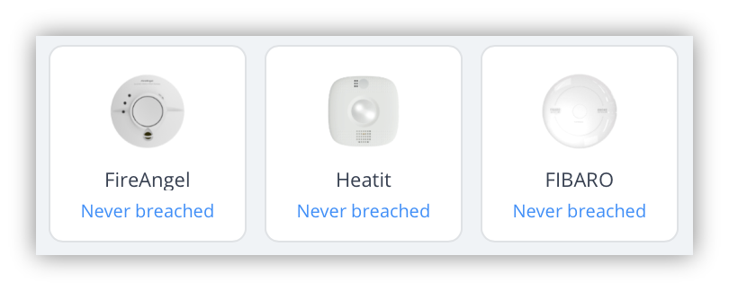
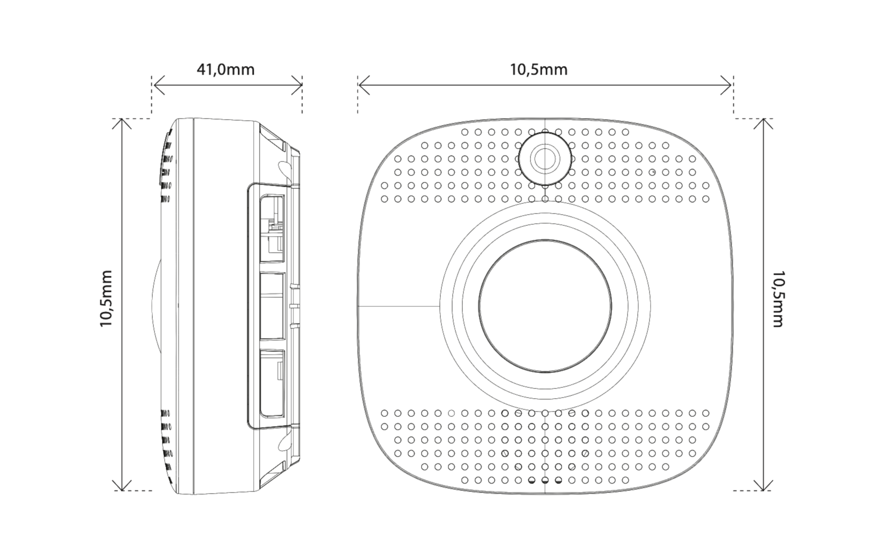
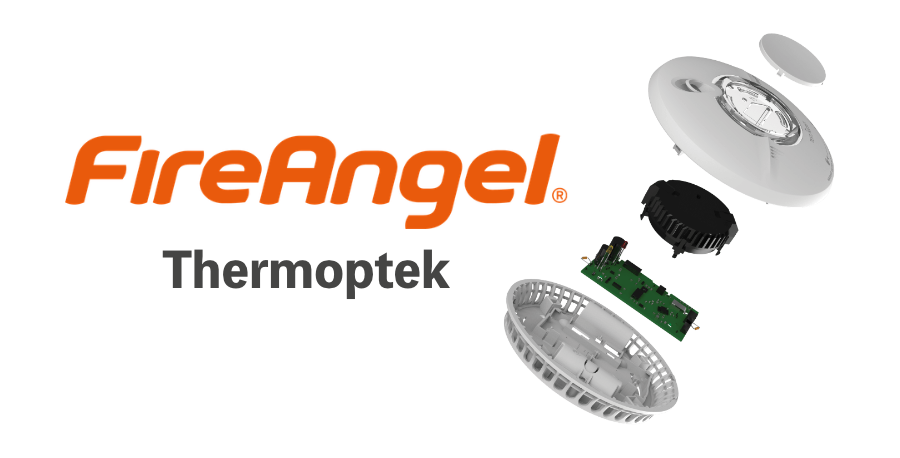
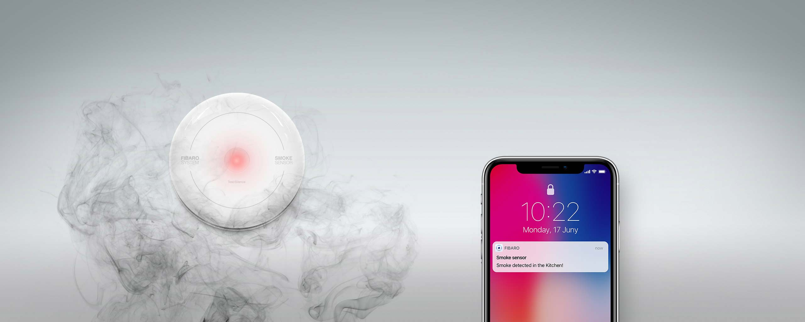
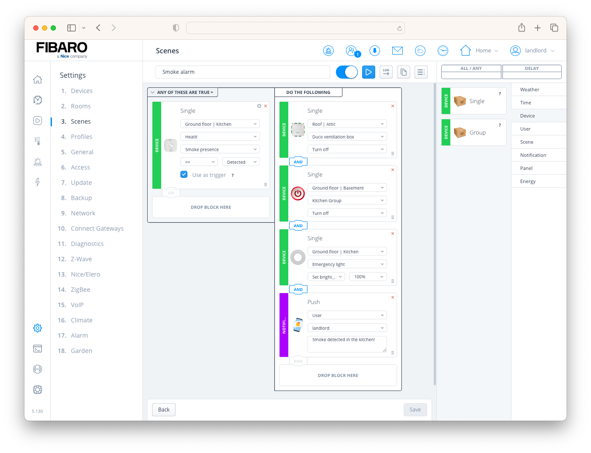
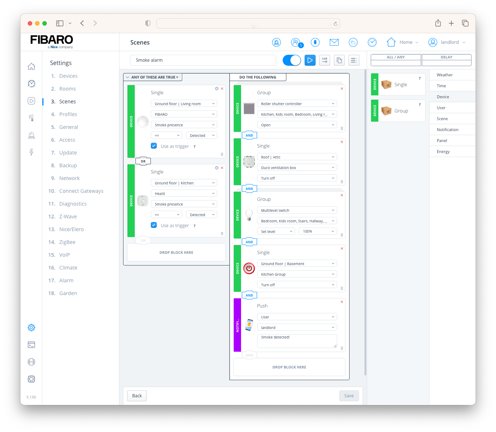

By installing a smart smoke detector, you can integrate it with your other smart devices in your home. In the event of a fire you can automatically open the shutters or switch off your HVAC system. This prevents smoke from being spread in your home through your ventilation ducts.

> In [Belgium](https://www.vlaanderen.be/woningkwaliteitsnormen/rookmelders) and [the Netherlands](https://www.rijksoverheid.nl/onderwerpen/gezond-en-veilig-wonen/vraag-en-antwoord/hoeveel-rookmelders-moet-ik-in-mijn-huis-hebben), it is legally required that you have installed a smoke detector on every floor that has a kitchen, living room and/or bedroom. These laws make no difference between new and existing buildings.

## Which type of z-wave smoke detectors are the best?

There are two types of detectors on the market, a smoke and a heat detector. Most detectors do both like the [FIBARO](https://www.fibaro.com/en/products/smoke-sensor/), [HeatIt](https://heatit.com/product/9436/heatit-z-smoke-detector-230v) and [FireAngel](https://www.fireangel.co.uk/home/products/) smoke detectors. FireAngel also has a separate dedicated heat detector in their product portfolio. The FIBARO smoke detector uses a temperature sensor to detect heat. Note that this sensor is disabled by default.



### How does an optical smoke detector work?

Most smoke detectors have an optical sensor. This is a reflective photoelectric sensor that perceive a change in light intensity. The sensor sends out light and when smoke particles disturb this light beam, the detector will go into alarm.

### How does a heat detector work?

Dedicated heat detectors are designed for areas where dust, steam and fumes frequent trigger false alarms by optical smoke detectors. Think about your kitchen, batchroom or garage. The smoke detectors from FIBARO, HeatIt and FireAngel detect abnormal temperature changes besides their optical sensor technology. Note that dedicated heat detectors react less quickly in case of fire than smoke detectors.

## What is a Z-Wave CO (carbon monoxide) detector?

A CO detector sounds an alarm when there are too many carbon monoxide particles in the air. Carbon monoxide prevents oxygen from being transported in your body. A high CO value in the air is deadly. Carbon monoxide (CO) is a colorless, tasteless, odorless and poisonous gas that is created when fuels are not completely burned.


If your living room has a wood-burning stove I do recommend placing a CO detector above the unit or on the ceiling nearby. It is also wise to place a detector in your boiler room. Carbon monoxide will rise due to the warm air and will therefore be the first to go to the ceiling. If you place a CO detector there, you will be warned in time.

## Which Z-Wave smoke detector to use in your smart home?

I have found the three products below that work well with the [FIBARO Home Center 3](https://www.fibaro.com/en/products/home-center-3/). To save you time I have summarized the most important properties for you:

### Fibaro Smoke Sensor 2

1. Works up to 2 years on a single battery;
2. Has a Home Center 3 Z-Wave template;
3. Detects smoke, but also sudden temperature rises in your home;
4. Uses optical technology.

The FIBARO Smoke Sensor allows for the associations of five groups but I don't advise to use such a configuration. You don't have any control over the alarm frames send by the devices when using associations. You're better off sounding a siren like the [Aeotec Siren 6](https://aeotec.com/products/aeotec-siren-6/) with a [HC3 scene](https://docs.joepverhaeg.nl/tags#Scene).

### Heatit Z-Smoke Multisensor (230V or battery)

1. Battery and 230V version available;
2. Has no Home Center 3 Z-Wave template;
3. Detects smoke, but also sudden temperature rises in your home (by using a scene);
4. Uses optical technology;
5. Serial connection possible with other Heatit 230V Z-Smoke devices (max 6 pcs);
6. Built-in PIR motion sensor and emergency lighting;
7. Supports encryption modes S0, S2 Authenticated Class, S2 Unauthenticated Class.



The Heatit Z-Smoke battery powered devices can be associated with the Heatit Z-Smoke 230V powered devices (as a listening node). A **serial connection** between two Heatit Z-Smoke Detector **battery** powered devices is **not** possible! To use this functionality, it is necessary to assign associations on the battery powered device with all installed 230V detectors. The **battery** version **can only be associated with** the **230V** version!

> To detect sudden temperature rises with the Heatit Z-Smoke Multisensor, you have to configure a scene in your HC3 that detects the rise in temperature. The Fibaro Smoke Sensor 2 has this function build-in by default.

### FireAngel (230V or battery) with Z-Wave module

1. Battery and 230V version available;
2. Has no Home Center 3 Z-Wave template;
3. Detects smoke, but also sudden temperature rises in your home;
4. Uses optical technology;
5. Serial connection possible with other FireAngel 230V devices (max 30 pcs);
6. Needs a separate Z-Wave module to communicate with your Z-Wave controller.

A **serial connection** is possible with multiple FireAngel **230V powered** devices. If you want to connect a 230V powered FireAngel with a battery powered device, you have to install a seperate [FireAngel Z-Wave module](https://shop.jdkbenelux.com/en/FireAngel-Z-Wave-module/ZW-MODULE) into one 230V powered FireAngel and use a [Home Center 3 scene](https://docs.joepverhaeg.nl/tags#Scene) to notify the other battery powered Z-Wave enabled smoke detectors. Note that with this configuration you cannot determine in which room the fire has started!



The FireAngel smoke detectors don't use a temperature sensor to detect a sudden temperature rise in a room. FireAngel uses **[Thermoptek multi‑sensor technology](https://www.fireangel.co.uk/what-is-multi-sensor-technology/)** which is made of two separate sensing elements to constantly monitor for smoke and temperature increase. If a rapid rate of temperature rise is detected the sensitivity of the smoke alarm sensor is increased. This provides a quicker response time to fast‑flaming and slow‑burning fire types.

> The Heatit Z-Smoke Multisensor and FireAngel sensors have no Home Center 3 templates, but they work flawlessly with the default template assigned.

## 2 tips to create lifesaving smoke detector scenes with the Home Center 3

Now that I've told you all the ins and outs about the best Z-Wave smoke detectors, you can start using them to make smart automations with your Home Center 3. I'll show you two examples of how you can create HC3 scenes. This may inspire you to make your own home a little bit safer.



### Kitchen fire safety

If a fire is detected in your kitchen, the first thing you want to do is turn off your electrical appliances and central ventilation. This prevents the smoke from spreading around the house. You can also turn on certain lights. Before you start you have to define which lights to use as emergency lighting.

For extra safety you can install an [Aeotec Heavy Duty Smart Switch](https://aeotec.com/products/aeoteo-heavy-duty-switch/) behind your fuse that powers the kitchen group. This switch can handle devices that draw up to 40 amps of power and is able to turn of the electricity in case of fire.

You can easily program all of these safety measures in a Home Center 3 block scene. For example, you want to:

1. **Turn off** your **HVAC** or **central ventilation system**;
2. **Turn off** the **electricity** from the whole **kitchen group**;
3. **Turn on** your **emergency lights** at 100%;
4. **Send** a **push message** to your phone.

 After adding these steps to a block scene, the scene looks like the following screenshot:



When you want to program a more complex scene in Lua you can use the following trigger code in the **DECLARATIONS (Conditions/Triggers)** block:

```lua
{
  conditions = { {
      id = 130,
      isTrigger = true,
      operator = "==",
      property = "value",
      type = "device",
      value = true
    } },
  operator = "all"
}
```

To create the above block scene exactly the same in Lua, the **ACTIONS** block looks like:

```lua
hub.call(140, 'turnOff')
hub.call(139, 'turnOff')
hub.call(138, 'setValue', 100)
hub.alert('push', {[1] = 2, }, 'Smoke detected in the kitchen!', false, '')
```

*Please note that you need to change the ids in the Lua code to the ones for your devices!*

### Fire safety during sleep

There are several things you can do to protect yourself and your family from fire when everybody is sleeping. The number one thing you can do to increase safety while sleeping is to close the bedroom doors. Closing the doors prevents oxygen from feeding the fire. To add more safety install Z-Wave smoke detectors and configure your HC3 to:

1. **Open** the **shutters** so that you can escape through the window if necessary;
2. **Turn off** your **HVAC** or **central ventilation system**;
3. **Turn on** the lights at 100% that you defined as **emergency lights**;
4. **Turn off** the **electricity** from **specific groups**, but wait until the shutters are open!
5. **Send** a **push message** to your phone.

The above list looks like you need a lot of knowledge and programming but the following HC3 block scene does it all without writing a single line of code:



## Thank you note

I would like to thank [JDK Benelux](https://jdkbenelux.com/about-us/) for providing in-depth information about the various smoke detectors I have described in this article. Also I want to thank [Peertje Projecten](https://peertjeprojecten.nl) for for giving me temporary access to a test HC3 with the [FireAngel](https://www.fireangel.nl) and [Heatit](http://heatit.com) smoke detectors connected to it. This allowed me to test the differences between the devices I don't own.

## Notice of Non-Affiliation

I'm not affiliated, associated, authorized, endorsed by, or in any way officially connected with [FIBARO](https://www.fibaro.com) nor [FIBARO Benelux](https://fibarobenelux.com/), or any of its subsidiaries or its affiliates. All product and company names as well as related images are registered trademarks of their respective owners.