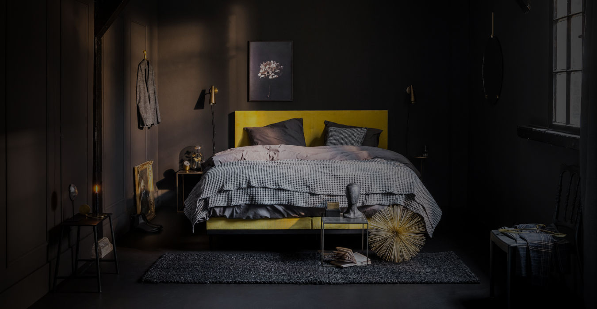
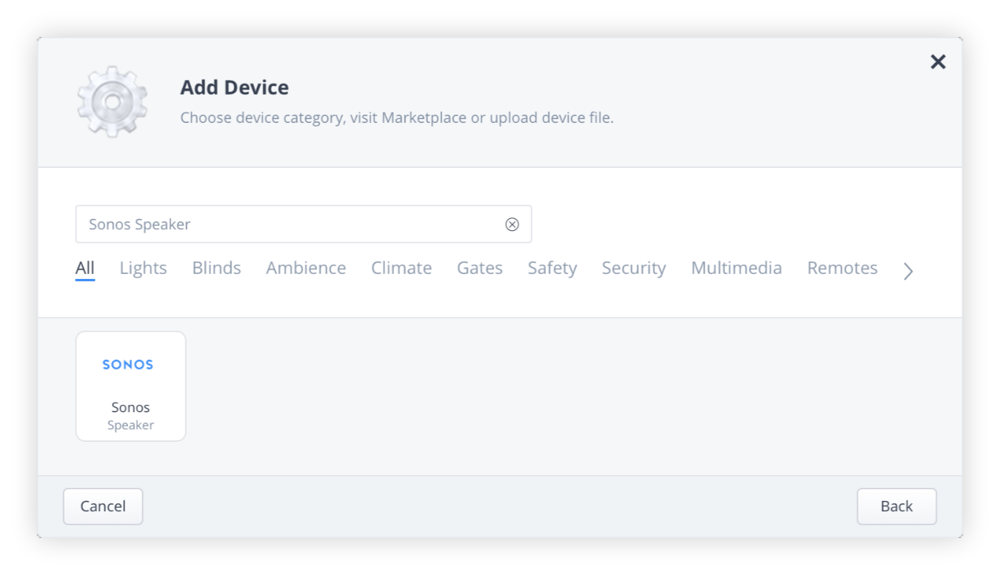
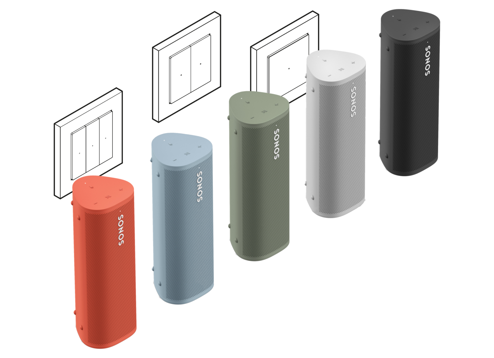
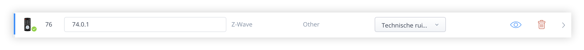
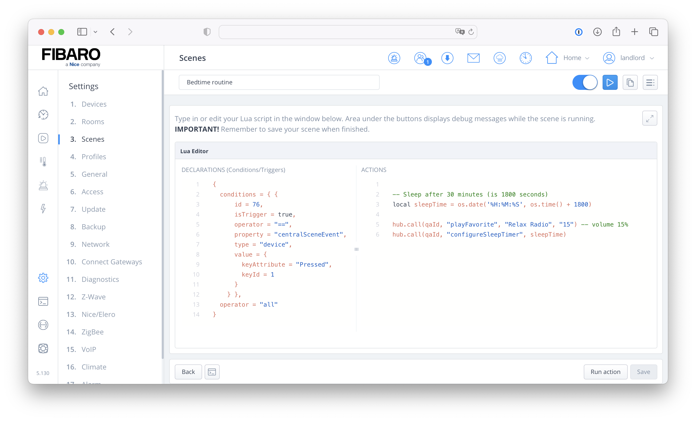

To make sure you don't have to use your smartphone before going to bed I’ll show you how to use the power of your Home Center 3 and Sonos system to start playing music and automatically set a sleep timer by pressing a button on a wall switch.



Listening to music before bed can help you relax. But you don’t want to wake up in the middle of the night with your favorite bedtime music still playing. To select your favorite artist and configure a sleep timer on the Sonos App you have to use your smartphone. We all know that the blue light emitted by your smartphone screen can disturb your sleep.

> Did you know that if you play songs with 60 to 80 beats per minute they match your resting heart rate and therefore is soothing on a biological level?

I'll show you everything what you need to configure to stop having to use your phone to set a sleep timer on your bedroom Sonos player.

## Prerequisites

- A Sonos player in your bedroom;
- A FIBARO Home Center 3;
- A Z-Wave controller wall switch or module;
- My [Sonos Group Controller Quick App](https://marketplace.fibaro.com/items/sonos-group-controller).

## Goals

- Select some relaxing music to fall asleep;
- Configure your HC3 to run a scene when a button is pressed;
- Control a Sonos speaker from your Home Center 3;
- Sleep well.

## Which integration do you need to control Sonos with your HC3?

The Home Center 3 has native Sonos integration, but the functionally is very limited. There are a lot of Sonos Quick Apps on the [FIBARO Marketplace](https://marketplace.fibaro.com/items?q=sonos), but past year [I decided to write my own QA](https://docs.joepverhaeg.nl/sonos-group-controller/) because I wanted a very lightweight integration and I wanted functionality that didn’t exist; controlling groups. Now, a year later, I updated my Sonos QA with sleep timer functionality.



## Which Z-Wave (wall) controller works best with the HC3?

The FIBARO [Single/Double Switch 2](https://manuals.fibaro.com/switch-2/) or the  [Dimmer 2](https://manuals.fibaro.com/dimmer-2/) can be [configured to run a scene](https://docs.joepverhaeg.nl/hc3-sceneactivation/) when you press momentary switch (multiple times).

For this project I use the [Heatit Z-Push Wall Controller](https://shop.jdkbenelux.com/Heatit-Z-Push-Wall-Controller-White-RAL-9010-Glossy/4512646) to assign a button to control my Sonos system. This is a wireless battery-operated wall switch that can control everything from lights to blinds and more. When you connect this wall controller to the Home Center 3 you can assign a scene to a button and control whatever comes to your imagination.



## How to control Sonos with an HC3 scene?

I assume you have installed my [Sonos Group Controller Quick App](https://marketplace.fibaro.com/items/sonos-group-controller) and configured a Sonos player in your bedroom.

> The sleep timer function also works with speakers in other rooms, you don’t have to go to bed to use this routine. 😀

### Before you start

Before you create a new Lua scene you have to pick some nice relaxing music and set it as a favorite in your Sonos App. With the favorite and Sonos player set up in your HC3 get the `id` of the player via **Settings** → **1. Devices,** by searching for your player in the devices list.

### Create the Lua scene

My example code will *pause* the playback on your Sonos *half an hour* after pressing the switch. To calculate the time when your Sonos speaker needs to sleep I use the Lua time function. With this function you have to calculate in seconds. To calculate the future time you have to add *1800 seconds* to the *current* time: `os.date('%H:%M:%S', os.time() + 1800)`. With this in mind you can add a new Lua scene: 

1. Go to **Settings** -> **11. Scenes**;
2. **Click** the blue **Add scene** button to add a new scene;
3. Choose the option **Lua scene**;
4. Give the scene a **name** and **click** the **Save** button;
5. In the **ACTIONS** block of the Lua scene, enter the code:

```lua
-- Sleep after 30 minutes (is 1800 seconds)
local sleepTime = os.date('%H:%M:%S', os.time() + 1800)

hub.call(qaId, "playFavorite", "Relax Radio", "15") -- volume 15%
hub.call(qaId, "configureSleepTimer", sleepTime)
```

Let's say you start this scene at `22:10` then your Sonos speaker will start playing *Relax Radio* at *volume level 15* and go to sleep at `22:40`.

*In this example the variable `qaId` is the `id` of your Quick App.*

## How to trigger a HC3 scene with the Heatit Z-Push Wall Controller?

Your next step is to start the scene by pressing a button a wall switch. In this example I use the *first button* from the Heatit Z-Push Wall Controller. As I wrote earlier, you can also use other modules that support [scene activation](https://docs.joepverhaeg.nl/hc3-sceneactivation/).

To start the Lua scene with the correct trigger you have to get the `id` from the Heatit Z-Push Wall **Controller** device in the HC3 devices list. This is the device with the black remote icon:



Now you have to add the following trigger code to the **Declarations (Conditions/Triggers)** block of the Lua scene you created earlier on:

```lua
{
  conditions = { {
      id = 76,
      isTrigger = true,
      operator = "==",
      property = "centralSceneEvent",
      type = "device",
      value = {
        keyAttribute = "Pressed",
        keyId = 1
      }
    } },
  operator = "all"
}
```

*In this example you have to replace the id `76` with the `id` of your Heatit Z-Push Wall Controller.*

## The complete Lua scene to control your Sonos speaker with a Heatit Z-Push Wall Controller

If you did all above steps correct you can press the first button on the wall switch and your Sonos speaker will start playing *Relax Radio* at *volume level 15* and go to sleep half an hour later. You’re complete scene configuration looks like:



## Notice of Non-Affiliation

I’m not affiliated, associated, authorized, endorsed by, or in any way officially connected with [FIBARO](https://www.fibaro.com/) nor [FIBARO Benelux](https://fibarobenelux.com/), or any of its subsidiaries or its affiliates. All product and company names as well as related images are registered trademarks of their respective owners.