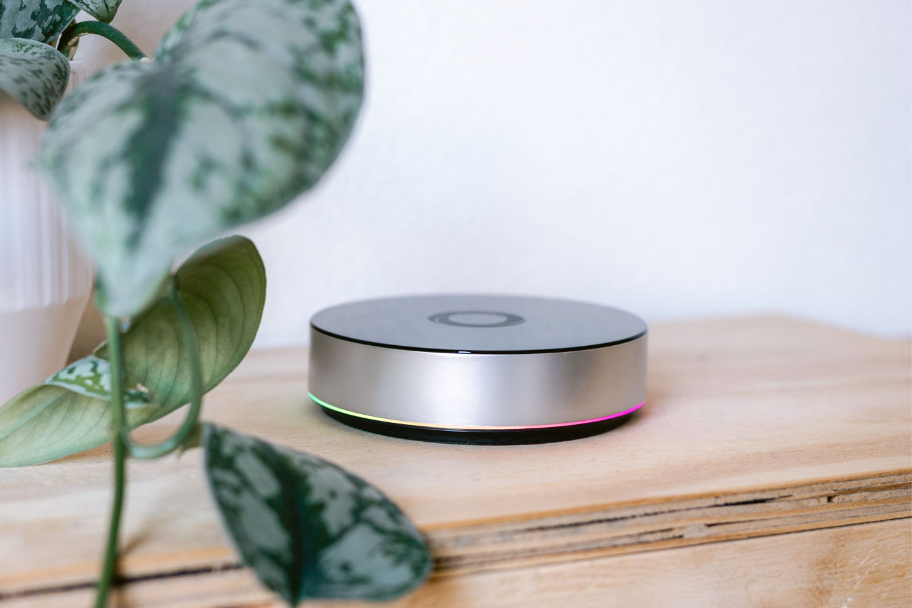
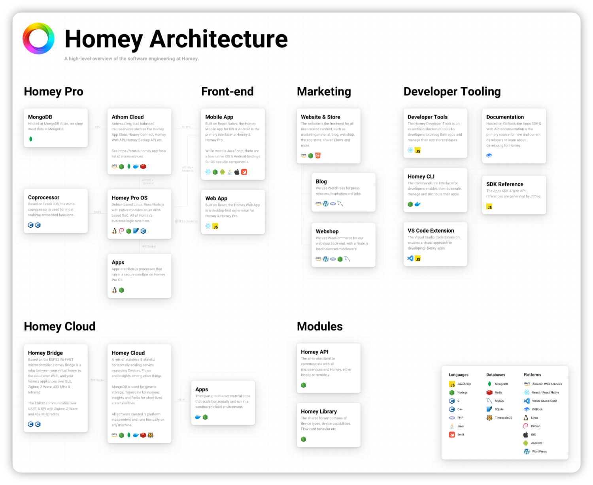
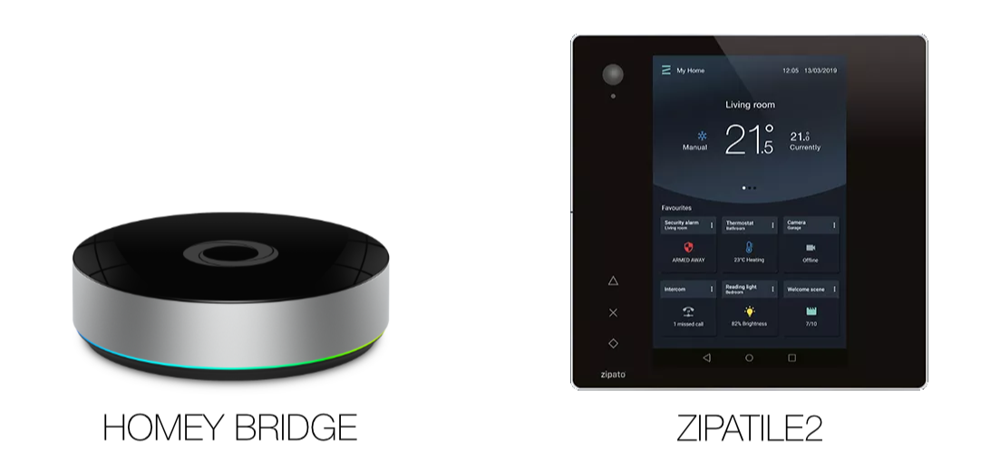
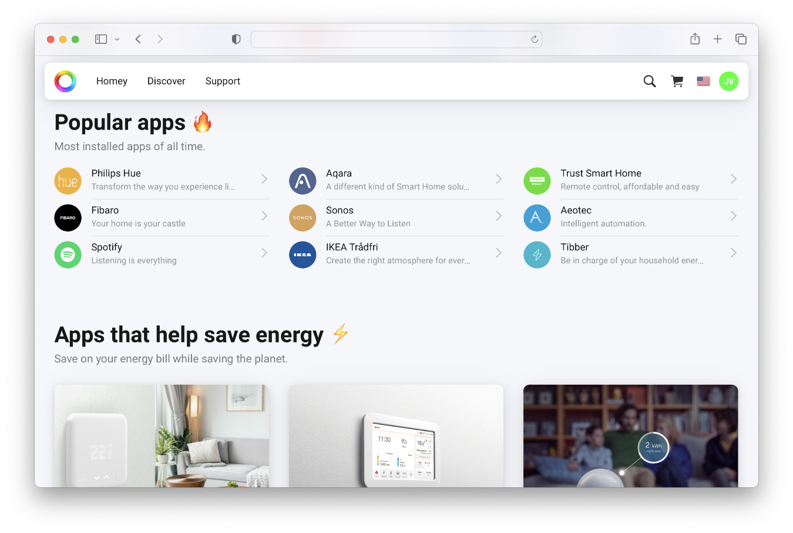
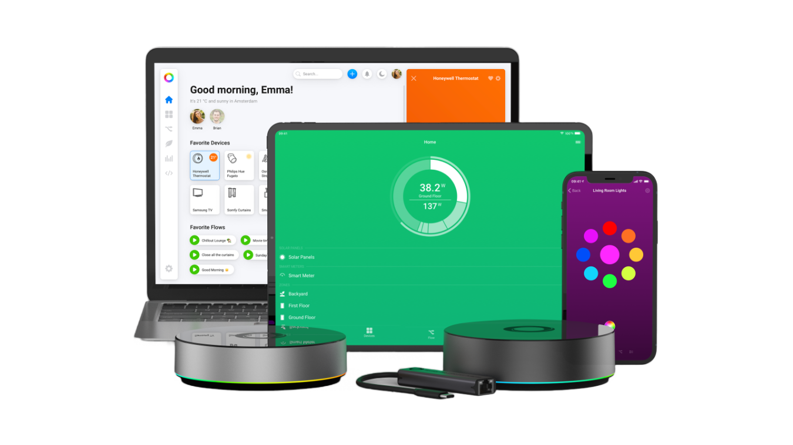
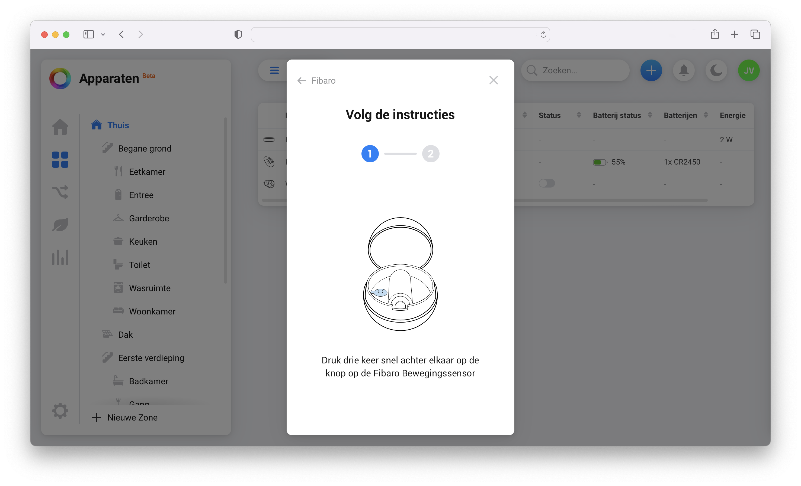
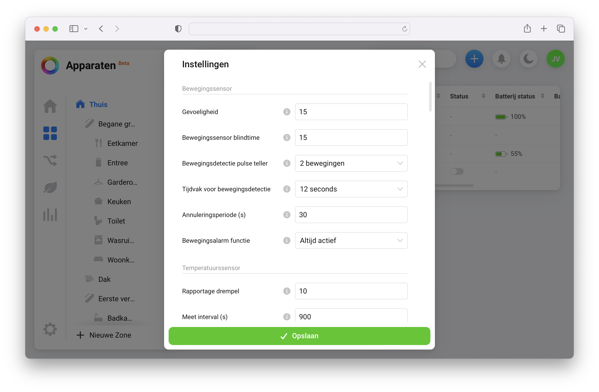
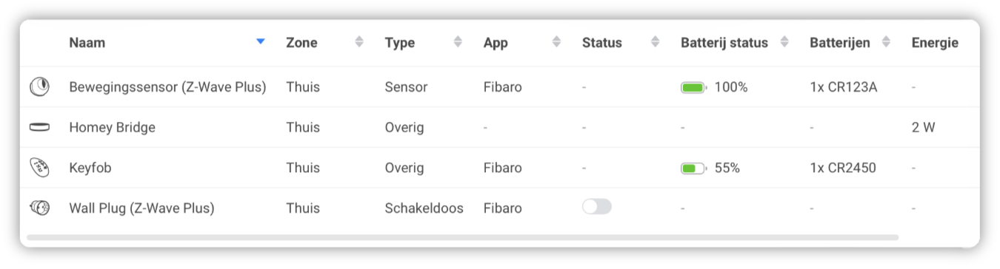
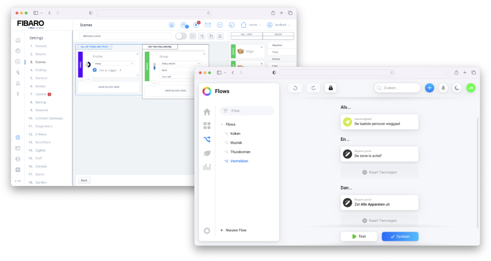

As a [FIBARO](https://docs.joepverhaeg.nl/categories#Home-Center-3) user and enthusiast I follow [Homey](https://homey.app/) on the side-line because they make awesome products and their interfaces are gorgeous. I was eager to try their new Homey Bridge to test their cloud based home automation controller.

**If you can’t wait and want to dive right into the Homey Bridge hands-on test, then [click here](#how-to-initial-setup-your-homey-bridge).**

## How secure is the Homey Bridge?

Before I show you my Home Bridge experience, I want you to think about the following question: “*Do you think that connecting your home to a cloud service is safe?”*

I had a great interview with [Emile Nijssen](https://www.linkedin.com/in/emilenijssen/), creative director and founder of Athom about this topic and I got an exclusive insight into the Homey cloud environment. To reassure you, all your data that lives in the Homey Cloud is saved in an encrypted database at their cloud provider. All traffic from and to your Homey Bridge is TLS encrypted. It’s like using HTTPS in your browser. All data that transfers over the line is encrypted and can’t be read by a man in the middle.

> Homey Cloud resources are isolated in a virtual private cloud. You can see this as a private Homey network within the Amazon cloud network, with the benefits of using the scalable infrastructure from Amazon.

A huge security advantage with such a cloud infrastructure is segmentation of services. This network security technique divides a network into smaller, distinct sub-networks, to deliver security controls and services to each sub-network. In short; if someone hacks into the app, they can't immediately access the infrastructure of the database.

And if you're not convinced, according to Emile, Athom has a bounty program for security researchers and their entire infrastructure was audited by security professionals. If you won’t take the risk? There is always the [Homey Pro](https://homey.app/en-us/) you can place in your living room!

## Does Athom respect my privacy?

It’s important to think about your privacy. Unnoticed, you send a lot of information to all sorts of cloud servers. Not only smart home products, but also your smartphone and computer sends a lot of information back to their homebase. For example, Google collects your data about how you use your Google devices, apps and services. They track your browsing behaviour, location history, searches and a lot more. Basically, anything that’s connected to a Google service is likely collecting your data. That is their business model. You get their services for free and you accept their privacy policy to allow them to use your data.

Selling user data or leveraging user data to do profiling and advertising is something [Emile](https://www.linkedin.com/in/emilenijssen/) and [Stefan](https://www.linkedin.com/in/stefanwitkamp/) from Athom don’t want. They believe in offering good products at fair prices without infringing on your privacy. Homey Bridge is a cloud based system and to maintain such a high-end system costs a lot of money. That's why they came up with the subscription, because the Homey Bridge only costs € 69,00 and doesn’t cover those costs. Your privacy seems to be in good hands when you connect your home to the Homey Cloud.

## Everything about the Homey Bridge

Homey Cloud and Homey Bridge where introduced at the end of 2021 to make good home automation more affordable. The Homey Pro and FIBARO hubs cost around € 400,00. The Homey Bridge hub costs €69,00 and works with Homey Cloud.

The concept of a *dump* box with the management interface in the cloud is already known from [ZIPATO](https://www.zipato.com), who started with Home Automation via the cloud in 2010. The best known product they sell is the ZipaTile that supports the Z-wave and Zigbee protocols. Compared to the ZipaTile, the Homey Bridge can communicate with Wi-Fi, BLE, Zigbee, Z-Wave Plus, Infrared and 433MHz protocols.

### Do I need a subscription to use the Homey Bridge?

To use the Homey Bridge at it’s full potential you have to get a € 2,99 p/m Homey Premium subscription. You can use the hub without subscription up to 5 connected devices, but you aren’t enable to use the more advanced flows and insights then. Starters can try all functionality for 3 months and after that decide if the subscription is worth it. Besides controlling more devices in your home with a subscription, you get access to Homey Logic. This enables you to create more advanced flows and  allows you to use [Homey Insights](https://support.homey.app/hc/en-us/articles/360015370454-Viewing-charts-with-Homey-Insights) for historical insights into everything your Homey Bridge measures. From temperature and energy consumption to humidity, light intensity and ppm CO2 (if you have connected these meters to Homey).

Personally I don’t like subscriptions, but for € 35,88 per year and an initial buy of € 69,00 you have a full featured controller for half the price of a Homey Pro of FIBARO Home Center 3 for the next 5 years. Technology improvement is going fast, so it can save you some money in the end. When you do some math, the subscription concept can make you think whether this is an option, because cloud based software is developed rapidly and now also embraced by vendors like Athom.

### Are all Homey Apps compatible with the Homey Bridge?

With the Homey Pro, enthusiastic hobbyist community members can create apps, but for the cloud-based Homey Bridge only apps developed by official, verified partners, are allowed. This gives you the guarantee that the quality and user experience of the integrations with the Homey Bridge is stable and very good.

> The cloud-based Homey Bridge works with an open app-model like apps on your smartphone. The apps are the interface between your devices and the Bridge. You can compare it with Quick Apps on a FIBARO Home Center 3.

From my experience with the FIBARO and Homey Pro systems this is a good thing. A lot of integrations are made by enthusiastic community members, but sometimes these integrations make the controllers unstable or the community member stops the development and the integration breaks when a third party vendor changes their API specifications.

## Homey Cloud vs Homey Bridge

If you get an Homey Cloud account only, you can use the Homey App to control devices with an Internet API. Local network control and wireless protocols are not supported. This is where the Homey Bridge comes in. The Homey Bridge is the extender to connect your local devices in your home to the cloud service. With the Homey Bridge you can control your Wi-Fi, BLE, Zigbee, Z-Wave Plus, Infrared and 433MHz devices.

## How does Homey Bridge compare to a Home Center 3?

The FIBARO Home Center 3 is mainly for full Z-Wave based on-premises home automation installations (by certified installers) where the Homey Bridge is a cloud extender and more aimed at the home user that wants to automate their homes very easily and with lots of different device protocols. The HC3 is synonymous with the Z-Wave protocol, and today still the most stable Z-Wave controller that you can find. The Homey Bridge shines with numerous protocols supported and the Zigbee protocol is far better than on the HC3. The HC3 operates without cloud, whereas the Homey Bridge depends on it. I think it’s a more fair comparison between the HC3 and the new Homey Pro that also runs on-premises. The Homey Pro will be released in early 2023.

## How to initially setup your Homey Bridge?

When you plug in the Homey Bridge a beautiful led ring welcomes you at full color spectrum. The hub has a very premium look. You can turn this led off in the device configuration when the led starts to annoy you. The Homey Bridge setup is very easy. Just install the Homey App on your smartphone, create an account, plug the Homey Bridge in and open the Homey App:

1. **Navigate** to the **Devices** tab and **tap** the **+** symbol in the **top right** corner.
2. Ensure **Bluetooth** is **turned on**, and the Homey App has permission for your location. This is needed to find Homey Bridge automatically.
3. Homey Bridge will be found automatically. Press **Connect** to start the set-up and follow the on-screen instructions.

### How to add devices to your Homey Bridge?

When the initial setup of the Homey Bridge is completed you can start adding devices. Being a FIBARO user I own mostly Z-Wave devices, so I added some FIBARO products to the Homey Bridge. The inclusion process is very simple with help screens and beautiful graphics. Because of this graphical explanation, you basically don't even need the manual of the device:

### Can you set Z-Wave parameters with your Homey Bridge?

Setting parameters is especially important with Z-Wave motion sensors. You especially want to be able to set the sensitivity of the sensor. With Homey Bridge you can do this easily via the settings screen of the device:

You can tell they put a lot of work into the user experience of both the Mobile and Web App. Not only all Z-Wave parameters can be set for FIBARO devices, even the type of battery installed in the [FIBARO Keyfob](https://www.fibaro.com/en/products/keyfob/) and motion sensor is shown in the device list:

## Mobile App vs Web App speed

The Web App is very snappy and the connection to the Z-Wave devices connected to the Homey Bridge have some lag at first click, but after that it’s very fast. If you don’t use the Web App for a while the lag kicks in again with the first device you operate. I tested this on the Mobile App and this connection is very good every time. How they made this hybrid setup so fast is very impressive.

## Does the Homey Bridge still work when there is no Internet connection?

One simple question everybody wants to know: *Does the Homey Bridge work without Internet connection?* 

I tested the following two scenarios:

1. Could you control your devices connected to your Homey Bridge with the Homey App when there is no Internet, but only local network access?
2. Do the Homey Flows run when the Homey Bridge is online, but has no Internet access?

To answer both questions at once… no! The Homey App on my smartphone didn’t connect to my Homey Bridge and the test flows I had setup didn’t work. I certainly would have thought that the flows would be cached in the memory of the Homey Bridge. I’ll hope they create this caching function in the future.

## Homey flows vs HC3 block scenes

Because the Homey Bridge doesn’t support HomeyScript I will only make a comparison between automation with Homey Flows and Home Center 3 block scenes.

Homey Flows are very limited when you don’t have a Homey Premium subscription. Basically you just can create flows like; *if motion is detected, then turn a light on*. Logic to set and read variables is very useful and [you can even configure webhooks](https://support.homey.app/hc/en-us/articles/4410240765586-Using-Homey-Logic-in-Flows) when you have the premium subscription. Using variables in flows is very powerful and an advantage over HC3 block scenes.

As a HC3 user you have to let go of your HC3 way of working and embrace the principle of flow. Then you get a fair amount of home automation by using Homey Flows. For example [my advanced Sonos automation](https://docs.joepverhaeg.nl/sonos-group-controller/), which saves the current player state when everybody left the house, is manageable to create with the Homey Bridge. But you have to make a flow per Sonos player and nest them in another flow. This can become a messy to manage, but it is possible.

With the upcoming [Homey Pro](https://homey.app/nl-nl/homey-pro/) you can use HomeyScript and this gives you possibilities like the powerful HC3 Lua scenes. If you are a home automation starter, or a non technical person I think the Homey Bridge suits you very well. To create advanced home automation routines I still recommend the amazing Home Center 3. The Homey Pro looks promising, so I’m very curious about the hub when it enters the market this year.

## Notice of Non-Affiliation

I’m not affiliated, associated, authorized, endorsed by, or in any way officially connected with [Athom B.V.](https://homey.app/), [FIBARO](https://www.fibaro.com/) nor [FIBARO Benelux](https://fibarobenelux.com/), or any of its subsidiaries or its affiliates. All product and company names as well as related images are registered trademarks of their respective owners.