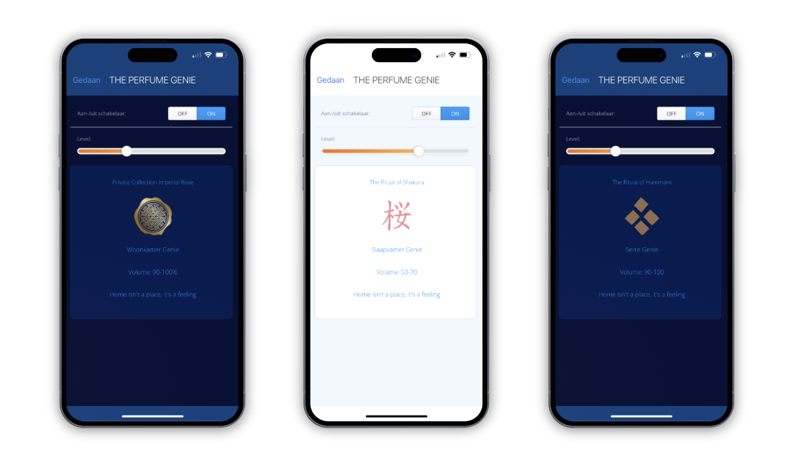

You can use home fragrances to enrich the atmosphere at home to achieve a personal atmosphere, but these aren’t smart and this blog is about smart homes. Therefore [I created an integration](https://marketplace.fibaro.com/items/rituals-the-perfume-genie) between the FIBARO Home Center 3 and [The Perfume Genie](https://www.rituals.com/en-nl/collection-story-perfumegenie.html) from [RITUALS](https://www.rituals.com).



Home fragrances smell great and soothe your mind, but an aroma diffuser not only ensures that your house gets a nice scent, it also increases the humidity, provides relaxation and is good for your immune system. 

> Children and animals have a much stronger sense of smell than humans. Keep this in mind using the strength slider on the The Perfume Genie.

Integrating the RITUALS Perfume Genie with your HC3 gives you the possibility to create relaxing scenes that give you a very luxury calm feeling. For example you can:

1. Automatically play Lo-fi tunes on your Sonos system;
2. Reduce stress by automatically set calming colors on your RGB or Philips Hue lights;
3. Set the strenght of The Perfume Genie based on weekdays or weekends;
4. Integrate The Perfume Genie `on` and `off` state with your bedtime and home presence;

## How do you install The Perfume Genie Quick App on your HC3

1. **Start** your favorite browser and open your Home Center 3 dashboard by typing the correct URL for your HC3;
2. Go to **Settings** and **Devices;**
3. **Click** the blue **+** icon to add a new device;
4. In the **Add Device** dialog click on **Other Device;**
5. Choose **Upload File** and upload the `.fqa` file downloaded from the [FIBARO Marketplace](https://marketplace.fibaro.com/items/rituals-the-perfume-genie);
6. **Expand** the new **The Perfume Genie** device;
7. **Select** the **Variables** tab,
8. Fill in the **userId** and **userPassword** fields with the credentials you use to login the RITUALS app on your phone;
9. If you press the blue **Save** button the Quick App will be initialised.

*If you use The Perfume Genie in your HC3 scenes, then I recommend disabling the time schedules in the RITUALS app to avoid conflicts! 💡*

## How to create an HC3 scene to play music on your Sonos and use the RITUALS Perfume Genie

If you use my [Sonos Group Controller](https://docs.joepverhaeg.nl/sonos-group-controller/) Quick App to control your Sonos speakers you can use an easy block scene to automatically play your favorite Lo-Fi playlist and create a relaxing atmosphere with The Perfume Genie:


1. **Add** your Lo-fi **playlist** to your **Sonos favorites** with the official Sonos App on your phone;
2. **Select** one of the first 4 **favorites** in the list in a block scene.;
3. **Set** the **strength** of The Perfume Genie;
4. **Turn** The Perfume Genie **on**.

With a Lua scene you can play *all* the favorites from *My Sonos* by using their name and the volume at which you want the music to play. The above block scene example in Lua looks like:

```lua
hub.call(sonosQaId, "playFavorite", "Lofi Flow State", "15")
hub.call(*genieQaId*, 'setValue', 33)
hub.call(*genieQaId*, 'turnOn')
```

As you see you can choose every favorite *by name* when you use a Lua scene.

*In this example the variable `sonosQaId` and `genieQaId` are the `id’s` of your Sonos Group Controller and The Perfume Genie Quick App and the volume is set to `15`.*

## Reduce stress by adding a colored light to your Lua scene

Several studies have shown that some colors have a calming effect on your body. The following 4 colors are know for the best calming effect:

1. **Blue** light enhances performance when you need to get work done;
2. **Red** light has the longest wavelength of the rainbow’s colors and your your eyes are less sensitive to higher-wavelength light. So your body doesn’t respond as much to red light and causes a calming effect;
3. **Pink**, or Baker-Miller pink, better known as Barbie Pink is commonly used in hospitals, institutions, and jail *drunk tanks* to calm people;
4. **Green** light may promote sleep and has a potential calming effects in hospitals.


<sub>Photo by <a href="https://unsplash.com/es/@benblenner?utm_source=unsplash&utm_medium=referral&utm_content=creditCopyText">Ben Blennerhassett</a> on <a href="https://unsplash.com/photos/_u1uSwk3bCQ?utm_source=unsplash&utm_medium=referral&utm_content=creditCopyText">Unsplash</a></sub>

With this in mind you can make your home atmosphere scene more advanced by adding ambiance with a calming light by controlling your [FIBARO RGB controller](https://www.fibaro.com/en/products/rgbw-controller/) or [Philips Hue](https://www.philips-hue.com) lights.

To control a FIBARO RGB controller from a Lua scene you can use the following code:

```lua
hub(lightId, "setColor", 255, 51, 0 ,0) -- #ff3300 (red/orange)
```

## The RITUALS Perfume Genie Quick App download

With the possibility to control the RITUALS Perfume Genie with your FIBARO Home Center 3 you now can configure advanced scenes for spreading a wonderful scent in your home to relax after a busy day at work. You can [download](https://marketplace.fibaro.com/items/rituals-the-perfume-genie) my Quick App from the [FIBARO Marketplace](https://marketplace.fibaro.com/items/rituals-the-perfume-genie).

## Notice of Non-Affiliation

I’m not affiliated, associated, authorized, endorsed by, or in any way officially connected with [RITUALS](https://www.rituals.com/), [FIBARO](https://www.fibaro.com/) nor [FIBARO Benelux](https://fibarobenelux.com/), or any of its subsidiaries or its affiliates. All product and company names as well as related images are registered trademarks of their respective owners.