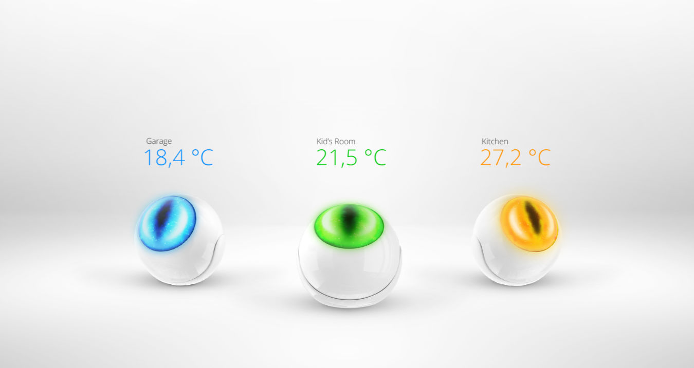

How Lua conditions work is very well documented on the [FIBARO manuals](https://manuals.fibaro.com/home-center-3-lua-scenes/) website. But despite that I still get a lot of questions about this topic in writing Lua scenes.

## How triggers and conditions work in Lua scenes?

Lua scenes can be triggered automatically after a condition is met or an event occurs in the Home Center 3. This can be a device that is turned on or a temperature sensor that reaches a certain value. 

This example shows what a condition looks like:

```lua
{
    type = "device",
    id = 201,
    property = "value",
    operator = "==",
    value = true,
    duration = 30,
    isTrigger = true
}
```

### Fields

In the following steps I will explain how the HC3 Lua scene conditions are constructed. You interpret the fields of a condition in the following way:

| Field       | Description                                                                                                           |
| ----------- | --------------------------------------------------------------------------------------------------------------------- |
| `type`      | The `type` of the event. See the table below.                                                                         |
| `id`        | The `id` of the device if the type has an `id`, like a device (optional).                                             |
| `property`  | The `property` the scene is waiting to be changed. A `value` for example.                                             |
| `operator`  | A logical operator to check if a condition is `true`.                                                                 |
| `value`     | The `value` that the scene expects for the logical operator to be `true`                                              |
| `duration`  | Time in `seconds` of how long the value must be set to match the `condition` or `trigger` the scene. (default is `0`) |
| `isTrigger` | Indicates if the scene must be started when the condition is `true`.                                                  |

### Types

The `type` field can contain the following values to trigger a scene:

| Type           | Description                                   |
| -------------- | --------------------------------------------- |
| `device`       | Device property change.                       |
| `date`         | Based on time and date.                       |
| `weather`      | Based on Weather conditions.                  |
| `location`     | User location.                                |
| `custom-event` | Custom events (out of scope of this blog)     |
| `alarm`        | HC3 based alarm.                              |
| `se-start`     | HC3 start trigger (out of scope of this blog) |
| `profile`      | Profile change                                |
| `manual`       | Manual start of a scene.                      |

### Logical operators

The HC3 uses logical operators to check if a condition is `true` and then runs the Lua code in the **ACTION** block that defines your scene:

| Operator   | Description                                                                                                                          |
| ---------- | ------------------------------------------------------------------------------------------------------------------------------------ |
| `==`       | Checks if the values of two operands are equal or not. If yes, then the condition becomes true.                                      |
| `!=`       | Checks if the values of two operands are equal or not. If the values are not equal, then the condition becomes true.                 |
| `>`        | Checks if the value of left operand is greater than the value of right operand. If yes, then the condition becomes true.             |
| `>=`       | Checks if the value of left operand is greater than or equal to the value of right operand. If yes, then the condition becomes true. |
| `<`        | Checks if the value of left operand is less than the value of right operand. If yes, then the condition becomes true.                |
| `<=`       | Checks if the value of left operand is less than or equal to the value of right operand. If yes, then the condition becomes true.    |
| `anyValue` | Match any value                                                                                                                      |

## Lua condition device example



This condition triggers the scene when your temperature sensor with `id 332` indicates exactly 15 degrees:

```lua
{
  conditions = {
	{
      id = 332,
      isTrigger = true,
      operator = "==",
      property = "value",
      type = "device",
      value = 15
    }
},
  operator = "any"
}
```

Imagine that you want to start the scene to close the window when it's open and the temperature drops below the 15 degrees. So in this example you want to run the scene when:

1. The temperature is exact `15` degrees;
2. The window is open (with id `225`).

To create this condition we add the window sensor to the condition:

```lua
{
  conditions = {
    {
      id = 332,
      isTrigger = true,
      operator = "==",
      property = "value",
      type = "device",
      value = 15
    },
    {
      id = 225,
      isTrigger = false,
      operator = "==",
      property = "value",
      type = "device",
      value = true
    },
  },
    operator = "all"
  }
```

## How the isTrigger parameter works

What you might notice is that the parameter `isTrigger` on the window sensor is set to `false`. The `isTrigger` parameter determines whether the scene is started based on this parameter, or whether only the condition must be met.

You can also see that the `operator` parameter in this example is set to `all`. The `operator` parameter determines whether **all** conditions must be fulfilled, or whether only 1 of the conditions must be fulfilled to start the scene.

The `operator` is often overlooked when people ask me for help when a Lua scene is not working properly. Let me explain it to you with a table:

| Operator | Description                                          |
| -------- | ---------------------------------------------------- |
| `any`      | At least one of the triggers/conditions must be met. |
| `all`      | All of the triggers/conditions must be met.          |

For example a condition with the `any` operator for a scene triggered at `sunset` **and** at `7:30` looks like:

```lua
{
   conditions = {
      {
        type = "date",
        property = "sunset",
        operator = "==",
        value = 0,
        isTrigger = true
      },
      {
        type = "date",
        property = "cron",
        operator = "match",
        value = {"30", "7", "*", "*", "*", "*"},
        isTrigger = true
      }
   },
   operator = "any"
}
```

Because the `operator` is set to `any` the scene is started at `sunset` and at `07:30`. This is useful when you want to turn a outdoor light on at sunset, turn it off at bedtime and want it to automatically turn it on again at `07:30`.

## How time and date conditions work in Lua scenes


<sub>Photo by <a href="https://unsplash.com/@lukechesser?utm_source=unsplash&utm_medium=referral&utm_content=creditCopyText">Luke Chesser</a> on <a href="https://unsplash.com/photos/rCOWMC8qf8A?utm_source=unsplash&utm_medium=referral&utm_content=creditCopyText">Unsplash</a></sub>
  

Time and date conditions look complex, but are actually very easy. It is derived from the UNIX cron format, familiar to many system administrators and programmers.

The cron expressions can be as simple as this (to run every day at `10:00`):

```lua
value = {"0", "10", "*", "*", "*","*"}
```

Or more complex like this (to run every Monday, Wednesday and Friday):

```lua
value = {"*", "*", "*", "*", "1,3,5", "*"}
```

The expression is a string comprised of 6 fields separated by a comma. The fields can contain any numeric values, along with comma separated values for that field. The value is constructed with the following fields:

```lua
value = {"minutes", "hours", "day of the month", "month", "day of the week", "year"}
```

To help you on your way, I have worked out some examples in the following table:

| Expression example                  | Description                                       |
| ----------------------------------- | ------------------------------------------------- |
| `{"30", "8", "1", "1", "*","*"}`    | Run scene at `08:30` on new years day.            |
| `{"30", "14", "*", "*", "1,3","*"}` | Run scene at `14:30` every Monday and Wednesday.  |
| `{"*", "*", "28", "*", "*","*"}`    | Run scene every 28th day of the month.            |
| `{"0", "19", "*", "*", "7","2024"}` | Run scene at `19:00` at the first Sunday of 2024. |

Now that you understand how to construct the time and date condition, let zoom in on the `operator` notation part in the condition. The `operator` is used to check if the current date matches a condition with the date in the value field:

| Operator  | Description                                                                                                                         |
| --------- | ----------------------------------------------------------------------------------------------------------------------------------- |
| `match`   | Checks if the current date and the date in the condition are equal or not. In this operator we can use `"*"` which means any match. |
| `match==` | Checks if the current date and the date in the condition are equal or not. If yes, then the condition becomes true.                 |
| `match!=` | Checks if the current date and the date in the condition are equal or not. If they are not equal, then the condition becomes true.  |
| `match>`  | Checks if the current date is later then the date in the condition. If yes, then the condition becomes true.                        |
| `match>=` | Checks if the current date is later or equal then the date in the condition. If yes, then the condition becomes true.               |
| `match<`  | Checks if the current date is earlier then the date in the condition. If yes, then the condition becomes true.                      |
| `match<=` | Checks if the current date is earlier or equal then the date in the condition. If yes, then the condition becomes true.             |

The following condition runs the Lua scene every day between `12:00` and `13:00`:

```lua
{
	conditions = {
	{
		type = "date",
		property = "cron",
		operator = "match>=",
		value = {"0", "12", "*", "*", "*","*"}
	},
	{
		type = "date",
	property = "cron",
	operator = "match<",
	value = {"0", "13", "*", "*", "*","*"}
	}
},
	operator = "all",
}
```

Because the `operator` is set to `all` **both** time conditions must be met to run the scene.

## How to run a Lua scene at a specific interval

Sometimes you want to run a scene every 5 minutes. To achieve this you have to create a condition with a start time like explained in the previous chapter and use the operator `matchInterval`. In the `value` field you define an interval in seconds. So to start a scene every 5 minutes (300 seconds) from `May 1, 2023` at `12:00` you enter the following condition:

```lua
{
    type = "date",
    property = "cron",
    operator = "matchInterval",
    value = {
        date = { "0", "12", "1", "5", "*", "2023" },
        interval = 300
    },
    isTrigger = true
}
```

## Lua condition alarm example


You can use the `alarm` type to trigger a Lua scene when an alarm zone is breached. Conditions for the HC3 alarm (zones) use a `property` parameter besides the `operators`, `values` and `isTrigger` as described above. The properties that you can use are:

| Property       | Description                               |
| -------------- | ----------------------------------------- |
| `armed`        | Checks if a zone with given id is armed.  |
| `breached`     | Checks if zone with given id is breached. |
| `homeArmed`    | Check if alarm for whole house is armed.  |
| `homeBreached` | Check if alarm in house is breached.      |

To start a Lua scene when the whole house is armed you can write the following condition:

```lua
{
	conditions = {
	{
    type = "alarm",
    property = "homeArmed",
    operator = "==",
    value = true,
    isTrigger = true
	}
},
	operator = "all",
}
```

Or if you want to run a Lua scene when the alarm in your house is breached:

```lua
{
	conditions = {
	{
    type = "alarm",
    property = "homeBreached",
    operator = "==",
    value = true,
    isTrigger = true
	}
},
	operator = "all",
}
```

I wrote an example for an [interactive alarm activation scene](https://docs.joepverhaeg.nl/alarm-activation-scene/) that you can use or learn from. If you want to build an alarm system with the Z-Wave door- and motion sensors in your house,  I recommend my article that shows you in depth [how to build an alarm system with the Home Center 3](https://docs.joepverhaeg.nl/hc3-alarm/).

## Learn more about creating Lua scenes with the HC3

I gave you some common used examples to create conditions, but there is more possible with the HC3 condition engine. The following manuals I recommend to read when you start building Lua scenes with your Home Center 3 or if you want to get more advanced at it:

- [Home Center 3 / Yubii Home – Lua Scenes Manual](https://manuals.fibaro.com/home-center-3-lua-scenes/)
- [Convert Home Center 3 block scenes to Lua](https://manuals.fibaro.com/home-center-3-block-scenes/)
- [Scenes and Interface FIBARO forum](https://forum.fibaro.com/forum/553-scenes-and-interface/)

## Notice of Non-Affiliation

I’m not affiliated, associated, authorized, endorsed by, or in any way officially connected with [FIBARO](https://www.fibaro.com/) nor [FIBARO Benelux](https://fibarobenelux.com/), or any of its subsidiaries or its affiliates. All product and company names as well as related images are registered trademarks of their respective owners.