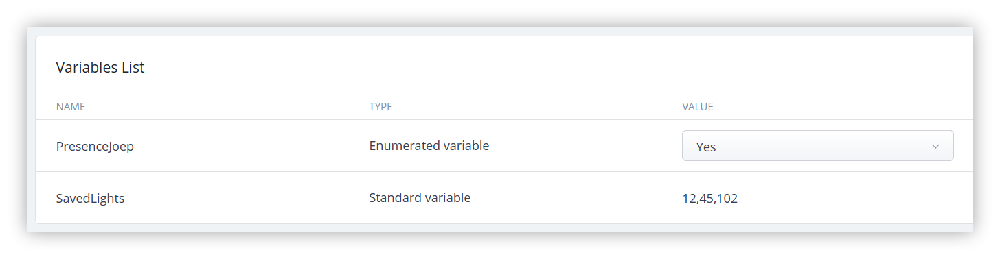
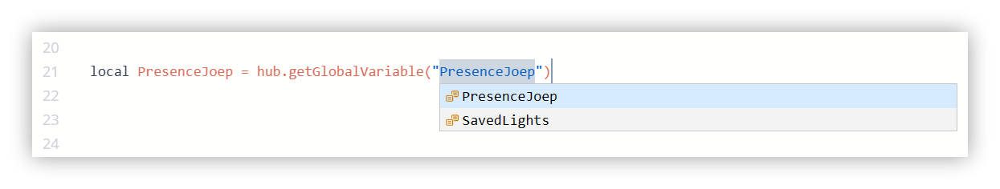
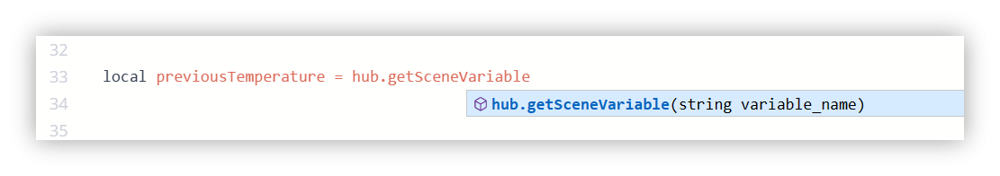
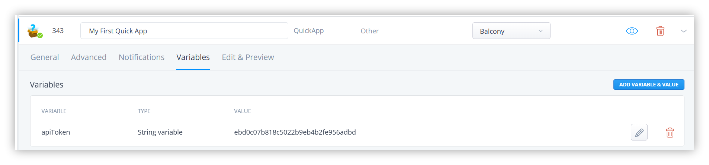

Variables are very powerful when programming Lua scenes and building Quick Apps with the Home Center 3. In this blog I explain the different types of variables that are available in the HC3 and how you use these variables in Lua scenes or in a Quick App.

## Home Center 3: Global Variables

With Global Variables you can expand the functionality of Lua scenes and Quick Apps. You create a Global Variable in the General settings of the HC3.

You can configure two types of Global Variables: 

- **Standard:** takes one predefined value that can be used and changed in a Lua scene;
- **Enumerated:** takes one value from a set of values defined during the creation of a given variable.

Global Variables can be used from anywhere in your Lua scenes or Quick Apps. They are useful for storing values that need to be accessed by multiple scenes.

### How to define a Global Variable?

Before you can use a Global Variable you have to define it in the HC3 settings. To set this up go to **Settings** → 5. **General** → **Variables**:



### How to get the value of a Global Variable?

Now that you have created the Global Variable you can retrieve the value in a Lua scene with the function: `hub.getGlobalVariable()`:



### How to update the value of a Global Variable?

You can update a Global Variable value with the function: `hub.setGlobalVariable()`. For example you can save the id’s of all lights that are turned on with the following code:

```lua
local savedLights = {}
local enabled_lights = api.get("/devices?interface=light&enabled=true") or {}
for _, light in ipairs(enabled_lights) do
    if (light.properties.state == true or light.properties.on == true) then
        table.insert(lightsOn, light.id)
    end
end
hub.setGlobalVariable("savedLights", table.concat(savedLights, ","))
```

How to make awesome light scenes with minimal code you can read in my [intelligent light scenes](https://docs.joepverhaeg.nl/hc3-lualightscene/) article. In short the codeblock above does the following:

- Get’s all enabled lights;
- Loop though these lights to check if the light is turned on;
- If yes, write the id to a table with the Lua function: `table.insert()`;
- Combine all table items together into one string, separated by a comma with the Lua function: `table.concat()` and update the Global Variable with the HC3 function: `hub.setGlobalVariable()`

## Home Center 3: Scene Variables

Scene variables are variables that you can use within the scope of a scene. A scene variable is not accessible outside the scene where it is defined. Scene variables are very useful for storing temporary values, such as the current state of a device

Scene variables are very useful if you want to store a value after the scene has run. For example a temperature value that you want to remember to use in a comparison the next time the scene is started. 

### How to create or update a Scene Variable?

You can set a scene variable with the function: `hub.setSceneVariable()`. If the scene variable doesn’t exists it will be created automatically:

```lua
local currentTemperature = hub.getValue(15, "value")
hub.setSceneVariable("temperature", currentTemperature)
```

### How to get the value of a Scene Variable?

Now that you have created the Scene Variable you can retrieve the value in the same Lua scene with the function:



To stay in the use case of the temperature measurement you can use the following example to determine if the temperature has decreased every time the scene runs:

```lua
local previousTemperature = hub.getSceneVariable("previousTemperature")
local currentTemperature = hub.getValue(15, "value")
if (currentTemperature < previousTemperature) then
	hub.debug("Scene25", "The temperature is lower then before...")
end
```

## When to use a Global Variable or a Scene Variable?

I recommend to use scene variables whenever possible. Scene variables help you avoid cluttering the Global Variables list with unnecessary names. Use Global Variables if you want to use the values between multiple scenes or Quick Apps.

## Home Center 3: Quick App Variables

Building Quick Apps is out of the scope of this *Lua scenes explained* blog series, but this blog is about variables so I want to briefly name Quick App variables.

Quick App variables are great for storing a login name or password, a token that a oAuth API returns or your own Quick App settings.

### How to create or update a Quick App Variable?

You can set a Quick App variable in the HC3 web GUI or with the function: `self:setVariable()`

If you create the variable with Lua code and the Quick App variable doesn’t exists it will be created automatically:

```lua
local apiToken = reponse.data["x-token"]
self:setVariable("apiToken ", apiToken)
```



### How to get the value of a Quick App Variable?

When you have created a Quick App variable with the HC3 web GUI or with code, you can retrieve the value in the corresponding Quick App with the function: `self:getVariable()`:

```lua
local apiToken = self:getVariable("apiToken")
self:debug(apiToken)
```

## Previous part: Conditions explained

[In the previous module](https://docs.joepverhaeg.nl/hc3-scenes-part1/), I'll learn you about writing conditions that are available in the HC3 and how you use these conditions to trigger Lua scenes.