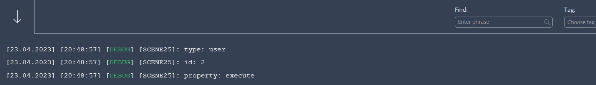
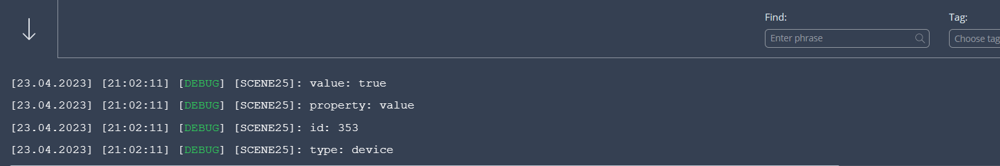
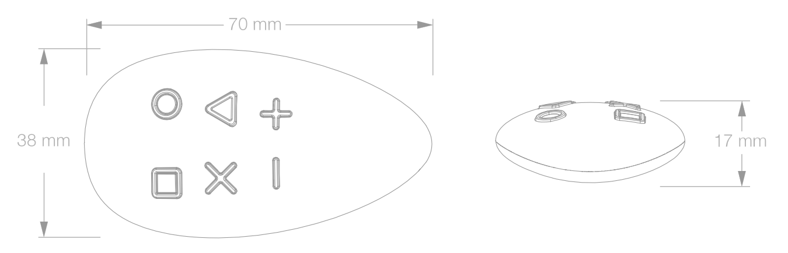

The Home Center 3 Lua engine comes with a special variable called `sourceTrigger`. You can use the `sourceTrigger` variable to make your scenes react differently based on different trigger parameters.

## How does the sourceTrigger variable work?

The `sourceTrigger` variable is a Lua table that stores the trigger object that started the scene. The `type` property in the `sourceTrigger` variable is defined by one of the conditions I explained in [Lua part 1](https://docs.joepverhaeg.nl/lua-part1/) and is extended by a *manual* start of the scene.

The type property in the `sourceTrigger` table can have one of the following values:

- alarm
- climate
- custom-event
- date
- device
- global-variable
- location
- manual
- panic
- profile
- se-start
- user
- weather

### How to view the contents of the sourceTrigger variable?

You can view the content of the `sourceTrigger` variable with the following code in your Lua scene:

```lua
for k,v in pairs(sourceTrigger) do
    hub.debug("Scene25", k .. ": " .. v)
end
```

I manually started the Lua scene with the example above and the output looks like:



The debug output shows you the following:

- The scene is started by the user (`type`);
- The `id` of the user is `2`;
- The `property` is `execute`.

If you program a condition to trigger the Lua scene when you turn on a light then the content of the `sourceTrigger` variable looks like:



This debug output is a little bit different and shows you the following:

- The scene is started by a device (`type`);
- The `id` of the device is `353`;
- The `property` which is used to check if the scene must be triggered is `value`;
- The `value` that triggered the scene is `true` (light turned on).

## How to use the sourceTrigger variable?

Now that you know the function of the `sourceTrigger` variable, I'll show you how use it 2 real world examples:

1. Check if a scene is started by sunrise;
2. Check which key is pressed on a FIBARO Keyfob.


<sub>Photo by <a href="https://unsplash.com/@portuguesegravity?utm_source=unsplash&utm_medium=referral&utm_content=creditCopyText">Portuguese Gravity</a> on <a href="https://unsplash.com/photos/6nm7gYakoqU?utm_source=unsplash&utm_medium=referral&utm_content=creditCopyText">Unsplash</a></sub>

### Check if a scene is triggered before sunrise

In this example you are going to create a single Lua scene that turns on the outdoor light at 75% dim level, 30 minutes before sunrise and turns the same light off exactly at sunrise.

First you have to create the condition to trigger the scene 30 minutes before sunrise and exactly at the time when the sun is up:

```lua
{
  conditions = { {
      isTrigger = true,
      operator = "==",
      property = "sunrise",
      type = "date",
      value = 0
    },
    {
      isTrigger = true,
      operator = "==",
      property = "sunrise",
      type = "date",
      value = -30
    }, },
  operator = "any"
}
```

In the actions section of the scene editor you can check if the scene is triggered by the `sunrise` property and then check if `value` of the `sourceTrigger` to determine if the scene was triggered 30 minutes before or exact at sunrise:

```lua
if sourceTrigger.property == "sunrise" then
	if sourceTrigger.value == -30 then
		-- 30 minutes before sunrise
		hub.call(353, "setValue", 75)
	elseif sourceTrigger.value == 0 then
	  -- at sunrise
		hub.call(353, "turnOff")
	end
end
```

*Note: the check if the scene is triggered by the `sunrise` property is optional in this example. Because you added the `sunrise` property as the only condition to trigger the scene. I added this check to show you the possibilities of using it.*



### Detect which Keyfob button is pressed in a Lua scene

Another common example is to check which button is pressed on a FIBARO Keyfob in a single Lua scene. The `value` property in the `sourceTrigger` object is a bit different while using the Keyfob or The Button:

```lua
{
  type = "device",
  value = {
    keyId = 1,
    keyAttribute = "Pressed"
  },
  id = 354,
  property = "centralSceneEvent"
}
```

The `value` property stores the `keyId` from the key you pressed on the Keyfob and the `keyAttribute` stores how you pressed the button, like: pressed once, twice or held down.

In the actions section of the scene editor you can read the `keyId` and `keyAttribute` properties and use an `if` statement to start different actions based on how you pressed one of the buttons on the Keyfob:

```lua
local keyPressed = sourceTrigger.value.keyId
local pressCount = sourceTrigger.value.keyAttribute

if keyPressed == 1 then
    hub.debug("Scene26", "Pressed key 1")
elseif keyPressed == 2 then
	if pressCount == "Released" then
		hub.debug("Scene26", "Long pressed key 2")
	end
end
```

## How to detect an HC3 automatic or manual scene trigger?

What I use the `sourceTrigger` variable a lot for is detecting whether the scene was started automatically or manually. For example my *good morning* scene can be started by my motion sensor, or I start it with the Yubii app. When the scene is started by the motion sensor it checks first if the wake-up alarm has gone off. With a manual start I don’t want that and just turn some lights on. An excerpt from my Lua code looks like:

```lua
if sourceTrigger.type == "device" then
	local wakeupYesNo = tonumber(getQaVariable(43, "wakeupYesNo"))
	if wakeupYesNo == "yes" then
		hub.call(25, "turnOn")
	end
else
	hub.call(25, "turnOn")
end
```

If above scene code is triggered by the motion device it first checks if my virtual alarm set the Quick App variable `wakeupYesNo` to `yes`and then turn on the light. When I run the scene with the Yubii app the `sourceTrigger.type` has the value `user` that causes the code to skip the virtual alarm check.

## Previous part: Variables explained

[In the previous module](https://docs.joepverhaeg.nl/hc3-scenes-part2/), I'll learn you about the different types of variables that are available in the HC3 and how you use these variables in Lua scenes or in a Quick App.

## Next part: setTimeOut vs Sleep explained explained

[In the next module](https://docs.joepverhaeg.nl/hc3-scenes-part4/), I'll learn you about the difference of the setTimeOut and Sleep functions that you can use in Lua scenes.