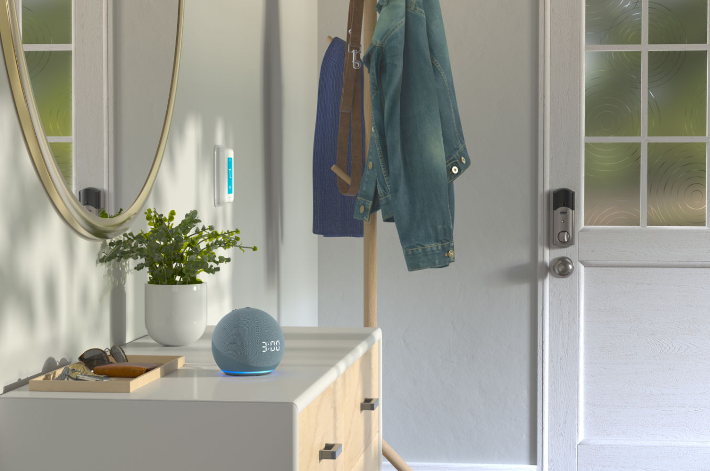

Sometimes you want to do a simple HTTP request from a Lua scene on your Home Center 3 to interact with a local device (like an Raspberry or Arduino project) or a cloud service like Voice Monkey.

## How to do a Lua HTTP request on the HC3

A basic HTTP request in a Lua scene looks like below:

```lua
local url = "http://192.168.1.10"

net.HTTPClient():request(url, {
    options={
        method = 'GET',
        headers = {
            ["Content-Type"] = "application/json"
        },
        timeout = 5000
    },
    success = function(response)
        hub.debug("Scene26", response.data)
    end,
    error = function(errorMessage)
        hub.debug("Scene26", "HTTPClient error" .. errorMessage)
    end
})
```

This code returns the data in the property `response.data` and shows it in the HC3 logging.

The HTTP request is setup with the following parameters:

| Property | Description                                                                                  |
| -------- | -------------------------------------------------------------------------------------------- |
| url      | The URL you want to connect to.                                                              |
| method   | The request method as described in [this article](https://docs.joepverhaeg.nl/hc3-restapi/). |
| headers  | The HTTP headers as described in [this article](https://docs.joepverhaeg.nl/hc3-restapi/).   |
| timeout  | The request timeout. When to stop trying to connect to the server described in the url.      |
| success  | The function to run when data is retrieved.                                                  |
| error    | The function to run when an error occured.                                                   |



## Add Alexa voice capabilities to your HC3

As an example, I'll show you how a Lua scene to have Alexa speak a text using the [Voice Monkey](https://voicemonkey.io/) Alex skill looks like. This can be controlled with an HTTP POST request in an HC3 scene:

```lua
-- SAMPLE VOICEMONKEY SCENE ---------------------------------------------------
-- Version 1.0 (April 2023)
-- Copyright (c)2023 Joep Verhaeg <info@joepverhaeg.nl>
-- https://docs.joepverhaeg.nl

net.HTTPClient():request("https://api.voicemonkey.io/trigger", {
    options = {
        method = 'POST',
        timeout = 5000,
        headers= {['Content-Type'] = 'application/json'},
        data = '{"access_token":"INSERT HERE","secret_token":"INSERT HERE","monkey":"monkey1","announcement":"Hello%20FIBARO%20User"}'
    },
    success = function(response)
        hub.debug ("Scene1", response.status .. " " .. response.data)
    end,
    error = function(message)
        hub.debug("Scene1", "HTTPClient error: " .. message)
    end
})
```

> You have to set up Voice Monkey first for this scene to work. You need an `access token` and `secret_token` to communicate with their servers. This is out of scope of this blog.

If you set a condition (trigger) so that the scene starts when the door sensor is breached when arriving at home, you can let Alexs greet you with a nice warm welcome home message! How neat is that!

This is the basis for making an HTTP request from a Lua scene on the HC3. I explain in depth how HTTP requests and APIs work in my [*How do I send an HTTP request from a Lua scene with the Home Center 3*](https://docs.joepverhaeg.nl/hc3-restapi/) article.

## Writing Lua scene’s on the Home Center 3

This was the last blog in my series where I learned you to master Lua scenes with the HC3. The whole series of training material consists of the following modules:

1. [HC3 Lua **conditions** explained with real world examples](https://docs.joepverhaeg.nl/hc3-scenes-part1/);
2. [Different types of **variables** you can use in scenes explained](https://docs.joepverhaeg.nl/hc3-scenes-part2/);
3. [How you can use the **sourceTrigger** variable](https://docs.joepverhaeg.nl/hc3-scenes-part3/)?
4. [What is the **difference** between **hub.setTimeout()** and **hub.sleep()**](https://docs.joepverhaeg.nl/hc3-scenes-part4/)?
5. [How to do a simple **HTTP call** from a scene](https://docs.joepverhaeg.nl/hc3-scenes-part5/)?