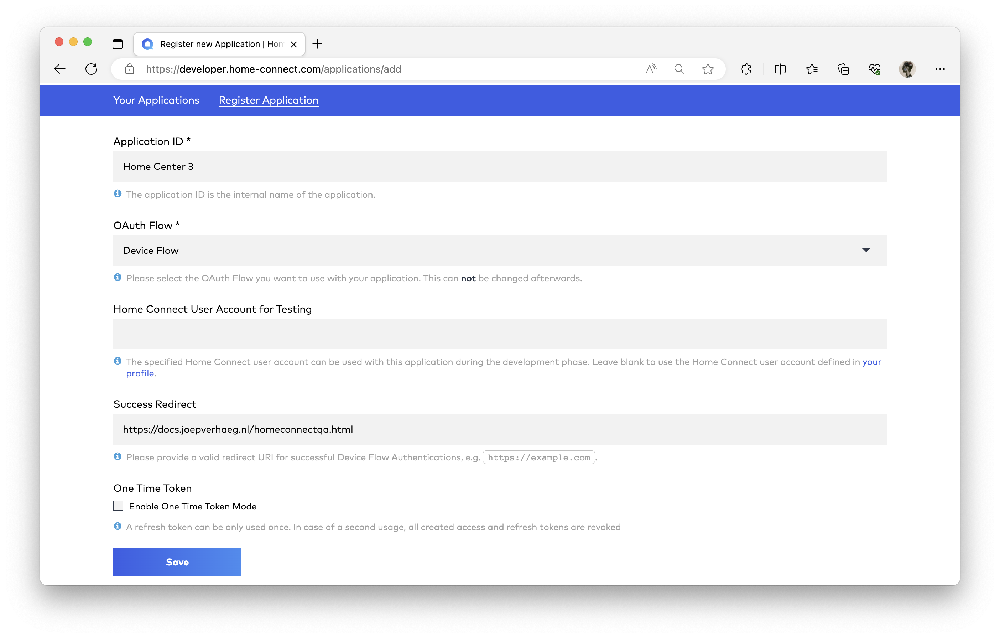
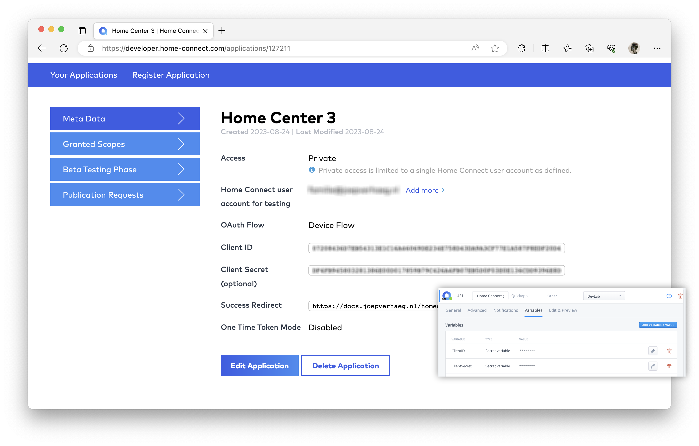
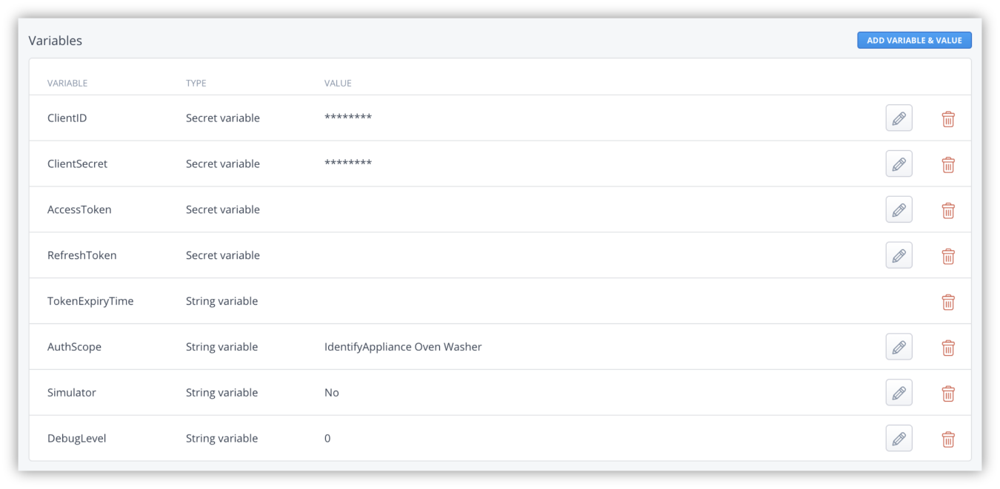
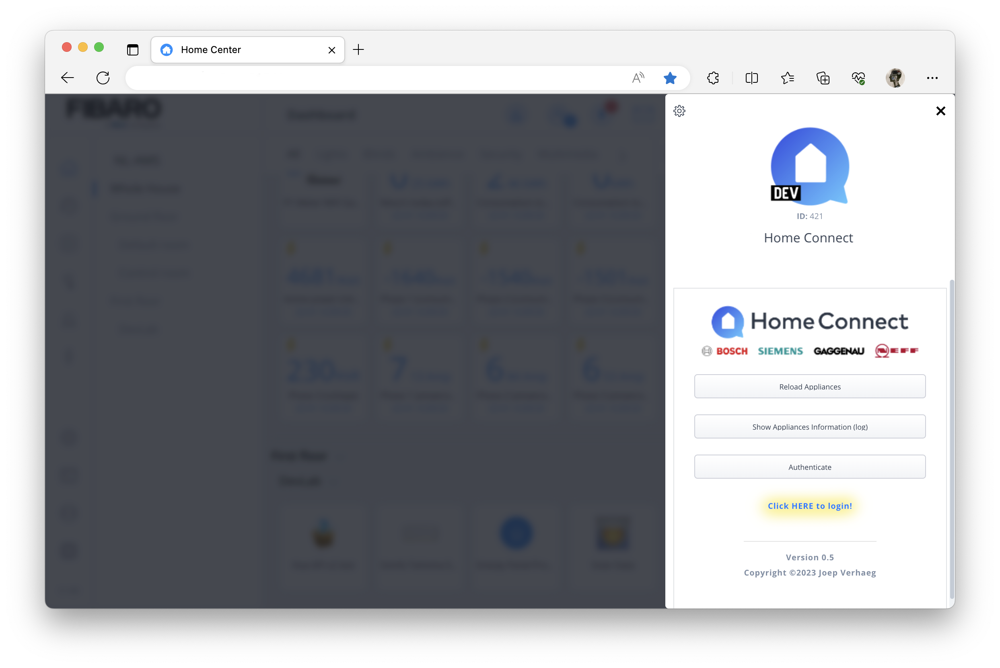
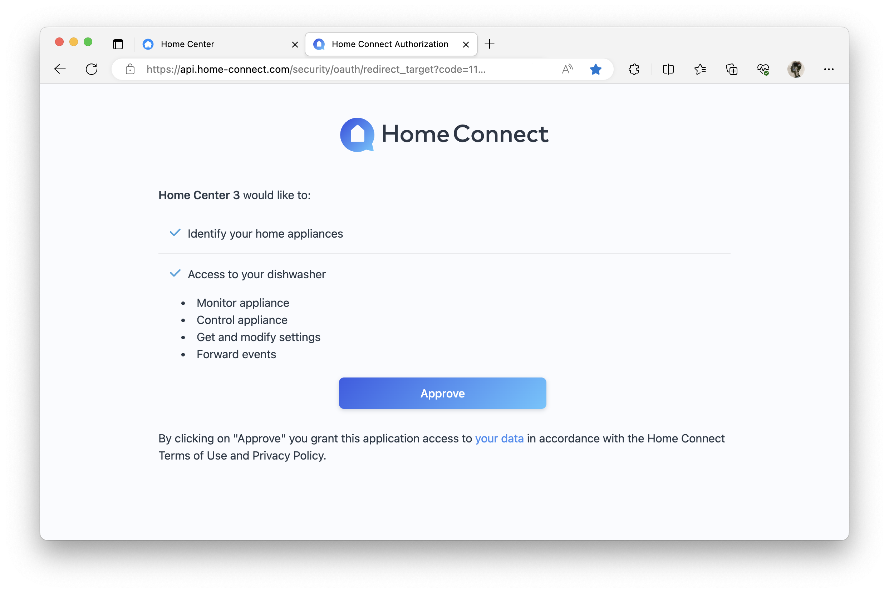
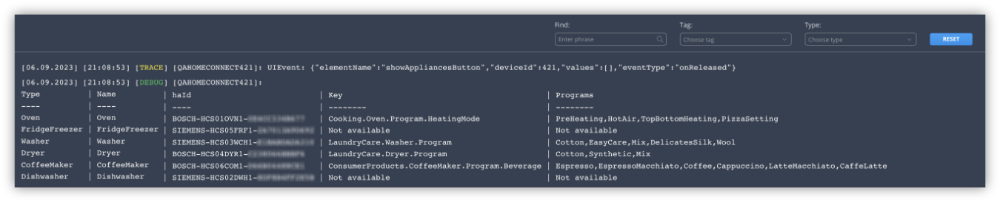
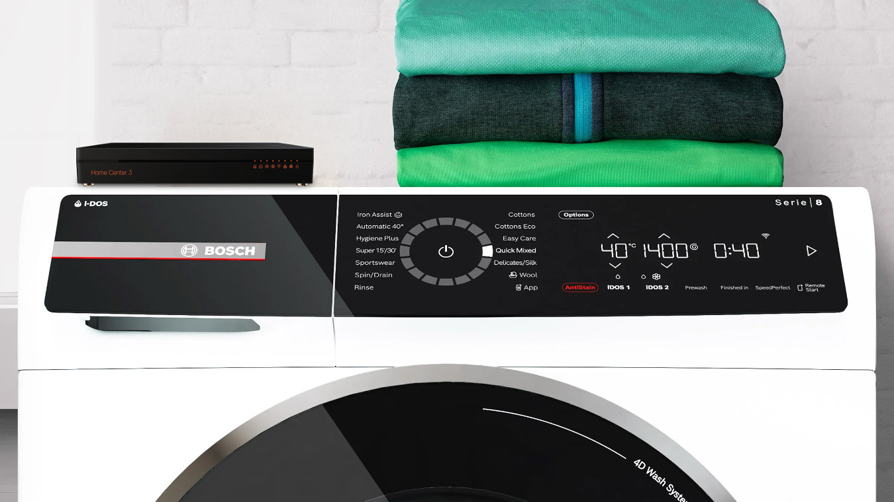
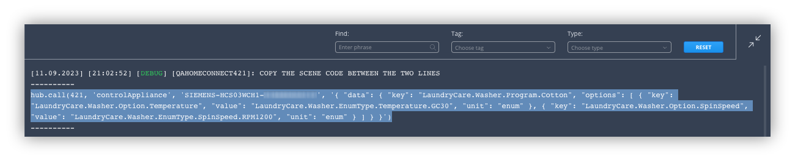
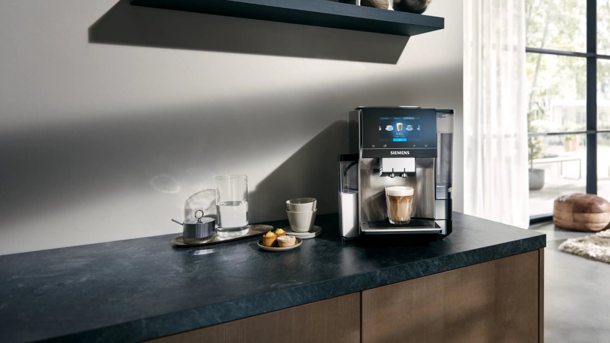

Preheat your oven when you arrive at home. Or save energy by automatically start your washing machine when your solar panels produce enough energy.

These are just two examples of how you can use and save energy smartly in your home by using my newly developed Quick App to integrate Bosch/Siemens Home Connect with the Home Center 3.


## Preface

There is a variety of Home Connect enabled appliances for sale at Bosch/Siemens. It is a lot of work to program all these appliances and options in a Quick App. That is why I made the Home Connect Quick App in such a way that you can read the appliance information into your HC3 and then use these programs and options within Lua scenes.

> An intermediate skill level is needed to use this integration within HC3 scenes. You need to have basic understanding of Lua scenes. I've done my best to make the examples in this blog as clear as possible for everyone to follow.

## Prerequisites

1. **Download** the Home Connect Quick App from the [FIBARO Marketplace](https://marketplace.fibaro.com/);
2. Visit [https://developer.home-connect.com](https://developer.home-connect.com/) and **sign up** for a **developer account**.
3. Enter your **e-mail address** of your login that you use with the **Home Connect App** on your phone/tablet under *Default Home Connect User Account for Testing* in the sign up process.
4. Under [Applications](https://developer.home-connect.com/applications), **register** a new App:
- Application ID: `Home Center 3`
- OAuth Flow: `Device Flow`
- Success Redirect: `https://docs.joepverhaeg.nl/homeconnectqa.html`



## How to install the Home Connect Quick App on your HC3

1. **Power on all your appliances** during the configuration process; otherwise appliance programs list will be empty!
2. **Start** your favorite browser and open your Home Center 3 dashboard by typing the correct URL for your HC3;
3. Go to **Settings** and **Devices;**
4. **Click** the blue **+** icon to add a new device;
5. In the **Add Device** dialog click on **Other Device;**
6. Choose **Upload File** and upload the `.fqa` file downloaded from **here**;

## How to configure the Home Connect Quick App

1. After you added the Quick App, **expand** the new **Home Connect** device;
2. **Select** the **Variables** tab;

### Step 1: Enter the correct credentials

1. Fill in the **ClientID** and **ClientSecret** fields with the id’s you created within the Home Connect Developer Portal.



### Step 2: Set the correct Authorization Scope

In addition to a **ClientID** and **ClientSecret**, you also need to define an **authorization scope** to gain access to your Bosch/Siemens appliances. More information about this is described on [this page](https://api-docs.home-connect.com/authorization/?#authorization-scopes) from the Home Connect Developer documentation.

For example, if you own a Siemens oven and Bosch washing machine, enter the following authorization scope in the **AuthScope Quick App variable** field:

```lua
IdentifyAppliance Oven Washer
```

If you only own a coffee machine, like the Siemens EQ.9, you enter the following authorization scope in the **AuthScope** Quick App variable field:

```lua
IdentifyAppliance CoffeeMaker
```

> For all requests on the Home Connect API at least the scope `IdentifyAppliance` is required. You separate all appliance types with a space.

If you entered the variables as described above, the Quick App variables tab will look like this:



Now press the blue **Save** button the Quick App will be initialised!

### Step 3: Authenticate to obtain an access token

After you have entered all the variables, you can connect the HC3 to the Home Connect platform by authenticating to the API:

1. **Click** on the **authenticate** button in the Quick App device;
2. A **Click HERE to login** link appears;
3. **Click** on the **link** to open your **browser** window:
    

    
4. **Log in** with your **e-mail address** that you use with the **Home Connect App** on your phone/tablet;
5. **Give consent** to access and control the appliances you defined in the authorization scope:
    

    
6. If everything goes well, you will see the following screen and the HC3 will load all appliances.

## How to show the connected appliances?

If you want to control an appliance with the HC3 you need the unique `haId` of your Bosch / Siemens appliance. To retrieve information about the connected appliances:

1. Click the **Show Appliances Information button** in the Quick App;
2. The **HC3 log** will now **show a table** with information about your connected devices:
    

    
3. The table shows not only the appliance name and `haId`, but also the programs it supports;
4. If you have not given an appliance any rights in the authorisation scope, the `key` and `programs` column will show a `Not available` value;
5. To improve the readability on the screen I have split the program identifier into a prefix and a suffix. 

## How to get the available programs for an appliance?

Every appliance program the Home Connect API supports is described in the [Home Connect API documentation](https://api-docs.home-connect.com/programs-and-options/). Not all programs are supported for a all Bosch/Siemens models. Therefore the Quick App uses the available program interface to check the program availability. **All supported programs are listed in the last column of the table.**

An advanced user can quickly construct the program identifier from this table by combining the information in the last two rows. For example, to start the washer with program *EasyCare* set the `key` to: `LaundryCare.Washer.Program.EasyCare`

### Which program options can be used?

To control an appliance you not only have to specify the correct program, but also the options you want to use with the program. For example, when making a cup of coffee, you must indicate what type of coffee you want to make, but also the strength of the coffee and maybe other options. All options that you can use with this Quick App are described in the [Home Connect API documentation](https://api-docs.home-connect.com/programs-and-options/).



## How to control a Bosch / Siemens appliance with the HC3?

Using the [Home Connect API documentation](https://api-docs.home-connect.com/programs-and-options/) you can set the correct parameters to control an appliance. For example:

```lua
local haId    = 'SIEMENS-HCS03WCH1-A0AAAAAAA000'
local program = [[
{
  "data": {
    "key": "LaundryCare.Washer.Program.EasyCare",
    "options": [
      {
        "key": "LaundryCare.Washer.Option.Temperature",
        "value": "LaundryCare.Washer.EnumType.Temperature.GC30",
        "unit": "enum"
      },
      {
        "key": "LaundryCare.Washer.Option.SpinSpeed",
        "value": "LaundryCare.Washer.EnumType.SpinSpeed.RPM1000",
        "unit": "enum"
      }
    ]
  }
}
]]

-- Call the Home Control Quick App to start the configured program...
hub.call(qaId, "controlAppliance", haId, program)
```

### How to import the selected program automatically?

I can imagine that for non-technical users the documentation may seem overwhelming and difficult to use. Therefore I wrote a helper function in the Quick App. With this you can get the scene code to start a specific program with the correct options.

To output the Lua code that you can use in a scene:

1. Set the **program** with the corresponding **options** on the physical device;
2. Run the **following code** in a Lua scene:

```lua
hub.call(qaId, "getSelectedApplianceProgram", "SIEMENS-HCS03WCH1-A0AAAAAAA000")
```

1. In the HC3 log you now see the scene code to use in a Lua scene:



1. **Copy** and **paste** this code **in a scene** and you are good to go! 
*Note, that you have to enable Remote Control on the appliance for the scene to work!*

## How to save the latest appliance status to a Global Variable and use it in a scene?

The Home Connect API uses Server Sent Events to get a stream of events for all appliances. **The Server Sent Events push technology is not supported by the HC3! As a result, it is not possible to receive live status updates from your devices!**

You can manually request the status of a device via a Lua scene. In theory you can schedule a refresh, but then you will quickly hit the API limits! As a result, it is possible that you will be blocked on the Home Connect API servers! I therefore recommend that you only retrieve the status when you need it.

If you respect the Home Connect API rate limits (5000 request per day and 10 requests per second) you can retrieve a status update for an appliance and save the response in a Global Variable. This allows you to read the latest appliance status and use it in scenes.

The following code retrieves the status of your appliance and saves it in a Global Variable called: `MyApplianceStatus`

```lua
hub.call(qaId, "getCurrentStatus", "SIEMENS-HCS03WCH1-A0AAAAAAA000", "MyApplianceStatus")
```

The status is saved in JSON format like: 

```json
{"RemoteControlActive":true,"RemoteControlStartAllowed":false,"DoorState":"Closed","OperationState":"Run"}
```

### Example: check if your dishwasher door is opened when your bedtime scene runs

Sometimes you forget to close the dishwasher door when you go to bed. To prevent this I will show you how to get  the dishwasher door status and then send you a push message when the door is still open.

The scene is triggered by double pressing on a wall switch. This starts your bedtime scene, which includes the dishwasher control. In this example I only show you the trigger that is activated using [scene activation](https://docs.joepverhaeg.nl/hc3-sceneactivation/) and the dishwasher part.

First add the following code in the `conditions` part of a Lua scene:

```lua
{
  conditions = { {
      id = 52,
      isTrigger = true,
      operator = "==",
      property = "sceneActivationEvent",
      type = "device",
      value = 14
    } },
  operator = "any"
}
```

Now you have to get the status of your Bosch dishwasher and save it in a Global Variable called: `DishWasherStatus`

```lua
hub.call(qaId, "getCurrentStatus", "BOSCH-HCS04DYR1-A0AAAAAAA000", "DishWasherStatus")
```

The status is saved in JSON format. To use it convert it to a Lua table and write your check:

```lua
-- Update the current dishwasher status...
hub.call(qaId, "getCurrentStatus", "BOSCH-HCS04DYR1-A0AAAAAAA000", "DishWasherStatus")
hub.sleep(2000) -- wait 2 seconds to refresh the Global Variable with the new state...

-- Read the Global Variable and convert the JSON string to a Lua table...
local washerStatus = json.decode(hub.getGlobalVariable("DishWasherStatus"))

-- Check if the dishwasher  door is open...
if washerStatus.DoorState == "Open" then
	-- Alert user with id 2, the dishwasher door is open!
	hub.alert("push", {2}, "Alert! The dishwasher door is still open!")
end
```

## Bosch/Siemens and HC3 automation use cases

To help you get started, I have worked out a number of examples for you. **Remember to replace the `qaId` and `haId` in each example with the correct ones of your setup.**

> You have to enable Remote Control on the appliance for the scenes to work!

### Turn off an running appliance

If you want to stop a running program on a Bosch / Siemens appliance, you can use the following scene code:

```lua
local qaId = 123
local haId = "BOSCH-HCS03WCH1-A0AAAAAAA000"

hub.call(qaId, 'stopActiveProgram', hadId)
```

This immediately stops the running program.

### Turn on your Bosch washing machine with your HC3

The example below turns on your washing machine with a fine cotton program and the following options:

1. **Program**: Cotton;
2. **Temperature**: 30 °C;
3. **Spin speed**: 1200 RPM.

```lua
local qaId = 123
local haId = "BOSCH-HCS03WCH1-A0AAAAAAA000"

hub.call(qaId, 'controlAppliance', hadId, '{ "data": { "key": "LaundryCare.Washer.Program.Cotton", "options": [ { "key": "LaundryCare.Washer.Option.Temperature", "value": "LaundryCare.Washer.EnumType.Temperature.GC30", "unit": "enum" }, { "key": "LaundryCare.Washer.Option.SpinSpeed", "value": "LaundryCare.Washer.EnumType.SpinSpeed.RPM1200", "unit": "enum" } ] } }')
```



### Automatically make a morning cappuccino with your Siemens coffee maker and the HC3?

In this example, the Home Center 3 automatically makes a cup of delicious cappuccino every morning at 7:30.

First you create a condition to trigger the scene to start every morning at 07:30. If you need help creating conditions you can read [this tutorial](https://docs.joepverhaeg.nl/hc3-scenes-part1/) I wrote about writing conditions for the HC3.

```lua
{
   conditions = {
      {
        type = "date",
        property = "cron",
        operator = "match",
        value = {"30", "7", "*", "*", "*", "*"},
        isTrigger = true
      }
   },
   operator = "any"
}
```

Then you add the actions the HC3 must perform to trigger your Siemens coffee maker to make a cup of coffee with the following options:

1. **Beverage**: Cappuccino;
2. **Temperature**: 94 °C (high);
3. **Bean Amount**: Normal;
4. **Fill Quantity**: 180 ml.

```lua
local qaId = 123
local haId = "BOSCH-HCS06COM1-A0AAAAAAA000"

hub.call(qaId, 'controlAppliance', haId, '{ "data": { "key": "ConsumerProducts.CoffeeMaker.Program.Beverage.Cappuccino", "options": [ { "key": "ConsumerProducts.CoffeeMaker.Option.CoffeeTemperature", "value": "ConsumerProducts.CoffeeMaker.EnumType.CoffeeTemperature.94C", "unit": "enum" }, { "key": "ConsumerProducts.CoffeeMaker.Option.BeanAmount", "value": "ConsumerProducts.CoffeeMaker.EnumType.BeanAmount.Normal", "unit": "enum" }, { "key": "ConsumerProducts.CoffeeMaker.Option.FillQuantity", "value": 180, "unit": "ml" } ] } }')
```

## Disclaimer

You may ***not*** rent, lease, lend, ***sell***, redistribute or sublicense this Home Connect Quick App without explicit permission from Joep Verhaeg. FIBARO installers and professionals may install this Quick App at a customers HC3 but don’t ask money for the Quick App itself. You may add the Quick App to your online store to showcase the HC3 integration capabilities if you add a link to my website in the description.

## Support

**I cannot provide any professional support or advice of any kind when you use this Home Connect Quick App**. I made this Quick App in my spare time for personal use and I’m publishing the Quick App for others to enjoy the integration in their smart homes too. If you need support you can ask the community in the Home Connect topic on the official FIBARO forum.