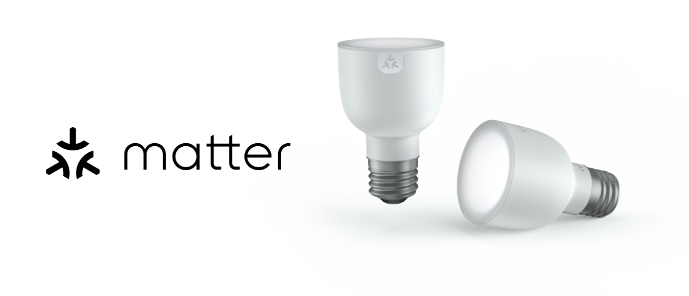

After my experiences with the Homey Bridge, I became curious about the Homey Pro (Early 2023). So I installed the Homey Pro besides my Home Center 3 and recreated parts of my home automation scenes that are running on the HC3 to Homey (advanced) flows.

## Homey Pro vs FIBARO HC3

Is the Homey Pro better then the HC3? That is the first question I ask myself as a FIBARO user. Can you actually compare the two systems? The HC3 is a rock solid Z-Wave based system. FIBARO enabled Zigbee on the HC3, but in it's still beta and clearly in its early stages.

In addition to Z-Wave and Zigbee, the Homey Pro also supports 433 MHz, Bluetooth, infrared and even the Matter protocol. Both hubs support Wi-Fi devices through installable *Apps*. As the specification differences show, the two hubs are positioned in completely different markets.

People who regularly read this blog know that I'm pro FIBARO. Despite that, I would like to highlight a few advantages that are in favor of the Homey Pro (Early 2023).

### Zigbee support

While Zigbee support is still in its infancy stage with the HC3, you can add almost all devices from well-known brands to the Homey hub. This will make a huge difference to your wallet as a smart home enthusiast. The only question is whether Zigbee remains stable as your network expands? I can't tell you that because my smart home consists of 95% Z-Wave devices.

### User interface

Hello FIBARO! You still have some work to do! The GUI of the Homey App is amazing! You can create basic flows (scenes) from the comfort of your chair on your phone or tablet.

For example, you can automatically switch on your dishwasher when you return enough energy to the public net to wash your dishes with your own solar generated power.

To illustrate how easily you can create such a flow, I assume that your Bosch Home Connect dishwasher is connected to your Homey Pro and it consumes 800 Watts on the program *Auto 45-65 °C*:

1. Go to the **more** tab;
2. Go to **Variables**;
3. Click the blue **+** button;
4. Add a **Yes/No** variable named: `DishwasherDoneToday`;
5. Go to the **flows** tab;
6. Click the **+** button and select **New Flow**;
7. Add the following flow:
    1. **When**: *Smart Meter → Current usage phase becomes less then -800 W*;
    2. **And**: Logic: `DishwasherDoneToday` is equal to `no`;
    3. **Then**: *Start program Auto 45-65 **°**C*;
    4. Logic: Set `DishwasherDoneToday`  to **Yes**

The variable `DishwasherDoneToday` ensures that the dishwasher program is only started once. Otherwise, any change in wattage on phase 2 would restart the program. To start the dishwasher automatically again the next day, reset the variable at midnight with a new flow:

1. Go to the **flows** tab;
2. Click the + button and select **New Flow**;
3. Add the following flow:
    1. **When**: *Date & Time* → *The Time is* `23:59`
    2. **Then**: Logic: Set `DishwasherDoneToday` to **No**

## How good is the device support on a Homey Pro?

To recreate scenes from my HC3 in the Homey ecosystem, I paired a number of Z-Wave and Zigbee devices to the hub. To create a mini smart home within my existing intelligent home, I have linked the following types of devices to the Homey Pro:

1. **FIBARO** Wall Plugs, motion sensors and Dimmer 2 modules (Z-Wave);
2. **Aqara** motion and door/window sensors (Zigbee);
3. **Shelly 1** Wi-Fi modules;
4. **Sonos** speakers;
5. Bose **SoundTouch** speaker;
6. Google **Chromecast**;
7. **Philips Hue** bridge;
8. IKEA **TRÅDFRI** lights (Zigbee);
9. **Android TV** box (KPN TV+);
10. Bosch **Home Connect** devices;
11. HomeWizard **P1 meter** (to read my smart meter)

Because I was curious about the 433 Mhz possibilities, I connected some *KlikAanKlikUit* wall plugs. This is a throwback to the days when I automated my old house with 1-way communication devices. If you're on a budget this works surprisingly well.

> I had some problems connecting two Aqara (Zigbee) devices. After removing and adding the battery from the device it worked immediately. I cannot say whether this is due to the Homey or Aqara. I have not noticed any problems with these sensors in use.

Adding most devices was very easy with the Homey App or the web interface. Most non Z-wave and Zigbee devices where automatically detected via my Wi-Fi network. They all work together seamlessly. It's almost too good to be true.

## Homey Advanced flows

As I have already shown you, creating flows is very easy with the Homey App. To create more advanced automations you can use [Advanced Flows](https://homey.app/en-us/advanced-flow/). This feature is free for Homey Pro (2023) users and available in [Homey Premium](https://homey.app/en-us/homey-premium/) if you own another Homey hub.

> If you have already worked with Node-RED, the interface and working method will be familiar to you.

An advantage of an Advanced Flow is that you can have multiple *When* cards on the same canvas. This makes grouping flows with similar functionality very easy! You can also see clearly if error messages are generated by devices or integrations:

Advanced Flow comes with a variety of new blocks in addition to the normal flows. These blocks unlock useful behaviour:

- The **Start-block** is the entry point for a **manual start**, from a voice assistant, or from another Flow.
- The **Delay-block** continues when a set **time has elapsed**.
- The **Any-block** continues when **any of the preceding cards** are done.
- The **All-block** continues when **all of the preceding cards** are done.
- The **Note** can be placed anywhere on the canvas for your own **comments**.

## HomeyScript language

For the HC3 I developed many [Quick Apps and advanced Lua scenes](https://marketplace.fibaro.com/profiles/fibaro-user-unnamed-78a51d7b-088d-4247-9e91-e2f42082e817?sort=-created_at). At first, the Homey system seems too simplistic for me, but after I deep dived into the system I can see that it is very powerful. Both a  non-tech savvy person and an advanced expert can work with the system.

If you want complete freedom, like on the HC3, you can always write your own code with Inline HomeyScript. HomeyScript is a JavaScript-based scripting language that interacts with the Homey Web API and various Homey Apps SDK functions.

> To use Inline HomeyScript you have to install it from the Homey AppStore!

When you create an Advanced Flow you can create Homey Scripts on the canvas without the need of creating an external script. This is very similar to the *functions node* that I use in my Node-RED workflow and it is ideal for scripting more complex tasks. Ultimately, my Homey Advanced flows will make my Node-RED installation unnecessary. Who ever thought I would say this!

## Homey Flows vs HC3 block scenes

Homey flows are graphically a bit more visual appealing than the GUI for creating block scenes on my HC3. In terms of functionality they do not differ much from each other.

If you look at Advanced Flows, it is not actually comparable, because FIBARO does not support visual programming. The power of low-code in combination with inline scripting makes the Homey Pro unique.

## Satellite Mode with Homey Bridge

If you want to extend the wireless coverage throughout your home you can you can use a [Homey Bridge in Satellite Mode](https://support.homey.app/hc/en-us/articles/7263667137052-Setting-up-Satellite-Mode) to expand the wireless coverage. This is the same principle as the master slave function in the HC3.

The connected Homey Bridge will automatically join Homey Pro's Zigbee and Z-Wave network as powered repeater, strengthening your mesh network of both wireless technologies. Also the Homey Bridge acts as a transmitter for your infrared and 433 MHz devices.

## Matter support

Homey Pro supports Matter, but there are some limitations to what you can do with Matter devices at the time of writing this article. You might encounter some issues while using Matter and not all features are currently supported on Homey Pro (2023). 

The current beta (september 2023) allows you to pair and control the device types listed below:

- Lights
- Sockets
- Sensors

You can include all supported Matter enabled devices in your flows like Zigbee and Z-Wave devices and use the system as you are used to.

> Homey Apps do not support Matter yet (september 2023). Therefore it is not necessary to install any app before a Matter device is paired. Athom states that Homey Apps with support for Matter will be available in the future.

### Thread

Thread support for Homey Pro (2023) is expected to be released in Q3 of 2023. For now, in order to pair Matter devices that use Thread, it is required to have another Thread Border Router on your Wi-Fi network (e.g. Apple HomePod Mini, Google Nest Hub 2, etc…).

## Homey Insights vs FIBARO HC3 energy panel

The HC3 Energy Panel offers you the opportunity to analyse the energy consumption in your home. Choosing the right [Energy Panel configuration](https://docs.joepverhaeg.nl/energypanel/) may seem complex, but if you finally configure the power metering devices properly, it gives a clear picture of your energy production and consumption.

At first glance, [Homey Insights](https://support.homey.app/hc/en-us/articles/360015370454-Viewing-charts-with-Homey-Insights) seems superior to the Energy Panel, the GUI looks amazing. But for analysing energy production and consumption it can be a little bit disappointing.

As far as user experience, I repeat myself. You can create your own graphs in the Insights tab with an easy to use GUI. On the HC3 you cannot create and mix your own graphs, so Homey has an advantage here. Unfortunately graphs are not saved if you switch to another Homey tab or close the browser, but they are recreated very fast.

Graphs to measure energy consumption are clear to read, but the advantage with FIBARO is that they also show the top consumers as a standard feature. If you want to show other metrics of your smart home devices in a graph, the Homey again has an advantage. You can bring the information from all devices together in 1 tab and on the HC3 you have to view the metrics per device.

## Verdict

Is the Homey Pro (Early 2023) the ultimate smart home solution? Can the hub replace my FIBARO Home Center 3? I can't answer this question, as I don't see it as a replacement, but a hub for a whole other market as the HC3 is positioned.

I think it's the ultimate hub for beginners and advanced users who want to make their home smart and do not want to face the steep learning curve of Home Assistant. If you have existing devices like Philips Hue and IKEA lights, then you can get started right away with the Homey Pro and create very complex smart solutions with Advanced Flows.

Athom has stolen my heart because they offer the possibility to [set up a sandbox environment](https://support.homey.app/hc/en-us/articles/6673376100508-Getting-started-with-the-SSH-Experiment) with a Debian Linux container. I have never seen a commercial vendor allow this kind of functionality.

I will see whether the Homey Pro remains stable in the coming months. But I think the stability mainly depends on the Zigbee and/or Z-Wave devices used. Just like with the Home Center 3. In my house they now run side by side as good friends.

## Notice of Non-Affiliation

I'm not affiliated, associated, authorized, endorsed by, or in any way officially connected with [Athom B.V.](https://homey.app/) nor [FIBARO](https://www.fibaro.com/), or any of its subsidiaries or its affiliates. All product and company names as well as related images are registered trademarks of their respective owners.