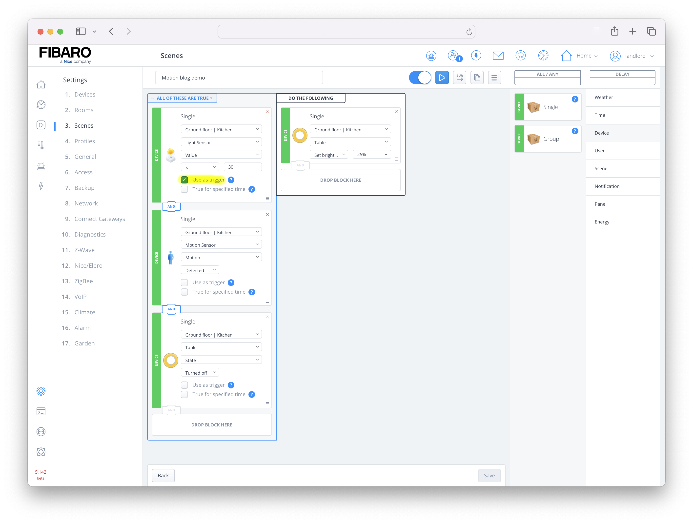
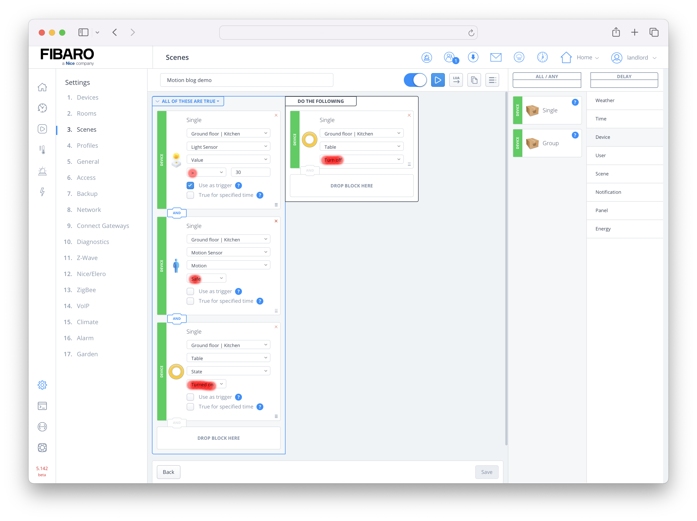
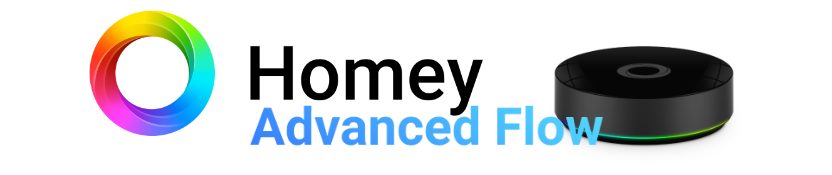
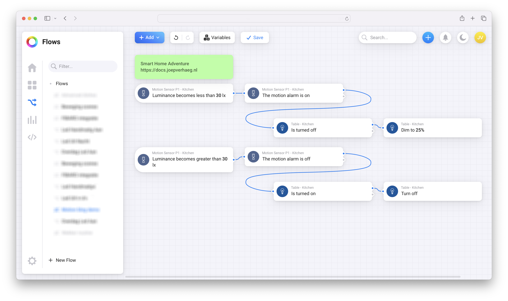

The standard behavior of motion sensors is that they only trigger an event when somebody is entering the room. In this blog I show you how to turn on the lights when the room is already occupied and the light conditions change. 

To achieve this you can trigger a scene based on the change in light intensity instead of motion like:

1. Trigger based on the amount of light (Lux);
2. When the amount of light reaches a certain value you check if there is movement in the room.

With this way of working, it is important to check whether the lights are already turned on by hand. For example, you are reading a book and switched the lights on at 100%. If you're scene doesn't check if the light is already turned on the scene you have created dims the intensivity back to the value you programmed.


<sub>Photo by <a href="https://unsplash.com/@encal22?utm_content=creditCopyText&utm_medium=referral&utm_source=unsplash">Encal Media</a> on <a href="https://unsplash.com/photos/a-woman-in-a-red-dress-sitting-on-a-couch-8Pu6jVaZMXc?utm_content=creditCopyText&utm_medium=referral&utm_source=unsplash">Unsplash</a></sub>

To easily create this scenario with the **Home Center 3**, I'll show you a simple block scene that you can use. If you own a **Homey Pro** I also show you how to make an Advanced Flow!

## Goals

1. Switch on the lights on a certain dim level when it gets dark;
2. Only dim the lighs when they are turned off when the scene is triggered;
3. Run the scene only when there is already motion detected in the room;
4. Leave the lights on as long as the room is occupied;
5. Switch the lights off if the ambient light is 10% above the ambient light value that is set for switching on the lights.

To create these scenes you need a motion sensor that also measures the light intensity (Lux). You are lucky because most Z-Wave and Zigbee sensors support this!

## What is the best Z-wave or Zigbee motion sensor for HC3 or Homey Pro?

For the Home Center 3, a Z-Wave motion sensor works best. For example, the **[FIBARO Motion Sensor](https://www.fibaro.com/en/products/motion-sensor/)** (FGMS-001) is a great choice. In this blog I also show you how to create the scene with a Homey Advanced Flow. With the Homey I use a Zigbee motion sensor, such as the **[Aqara FP1](https://www.aqara.com/en/product/motion-sensor-p1/)** (This sensor also works on the HC3 from firmware `5.150`).

## Home Center 3 scene example

With the FIBARO Home Center 3 you can make a block scene like the example below:



This scene does the following:

- The light sensor with id `101` triggers the scene if the value becomes less then `30` Lux;
- This happens only when the motion sensor with id `102` registers movement;
- And the table bulb with id `110` is not **turned on** at that moment.

*Note the **Use as trigger** check mark! This is only checked on the light sensor block. As a result, the scene is triggered by the change in Lux value instead of whether someone is walking into the room.*

If you want to make this scene in Lua, it looks like this:

### DECLARATIONS (Conditions/Triggers)

```lua
{
  conditions = { {
      id = 101,
      isTrigger = true,
      operator = "<",
      property = "value",
      type = "device",
      value = 30
    }, {
      id = 102,
      isTrigger = false,
      operator = "==",
      property = "value",
      type = "device",
      value = true
    }, {
      id = 110,
      isTrigger = false,
      operator = "==",
      property = "state",
      type = "device",
      value = false
    } },
  operator = "all"
}
```

### ACTIONS

```lua
hub.call(110, 'setValue', 25)
```

To turn off the lights when the light sensor detects enough ambient light, you make the same scene, but with inverted values:



Make sure that you now check that the motion sensor must be in **safe** mode and the light above the table is **turned on**.

## Homey Pro scene example

If you own a Homey Pro (or Bridge with a premium subscription), you can also create this scene with a simple Advanced Flow. If you don't have access to Advanced Flows, you can also make this scene with two normal *Flows* such as the two HC3 block scenes above.



In this example with the Homey Pro I use one **[Aqara FP1](https://www.aqara.com/en/product/human-motion-sensor/)** motion sensor and an **[IKEA TRÅDFRI](https://www.ikea.com/nl/nl/cat/slimme-verlichting-36812/)** dimmable light bulb. This is a Zigbee bulb with an E27 fitting that fits in the usual luminaires.

The Advanced Flow I created looks like this:



You can easily use multiple *When* triggers. As a result, the flows for both switching the lights on and off can be programmed into one Homey Advanced Flow.

<sub>Credits: Title Photo by <a href="https://unsplash.com/@spacejoy?utm_content=creditCopyText&utm_medium=referral&utm_source=unsplash">Spacejoy</a> on <a href="https://unsplash.com/photos/black-and-white-wall-mounted-painting-PyeXkOVmG1Y?utm_content=creditCopyText&utm_medium=referral&utm_source=unsplash">Unsplash</a></sub>