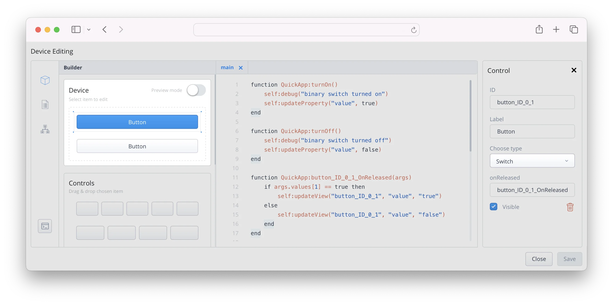
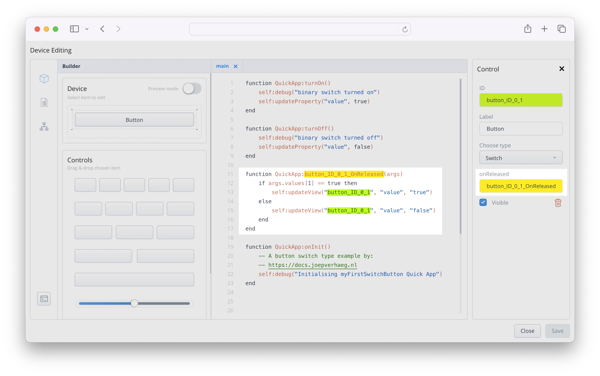
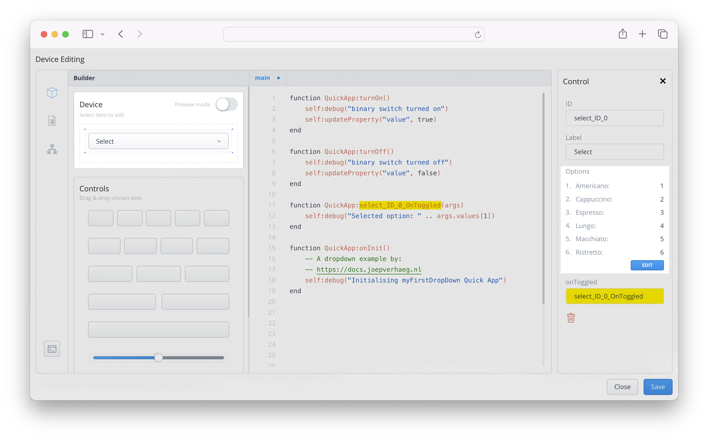
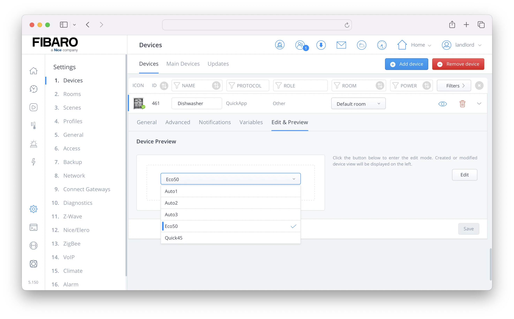

With system update 5.1.50 FIBARO introduced some new GUI elements for Quick Apps in the HC3. In this blog I’ll show you how they work and how you can control the GUI elements with Lua code examples when you want to write your own Quick Apps.

## TL;DR
<!-- no toc -->
- [Why is my visual Quick App button state not working?](#button-switch-type-explained)
- [How to read the button switch on/off status?](#a-practical-quick-app-button-example)
- [How to read the selected item from a Quick App dropdown list?](#how-the-ontoggled-function-handler-works)
- [How to add values to a dropdown list with Quick App Lua code?](#how-to-add-dropdown-values-with-lua-code)

## Which new GUI elements are added in HC3 firmware 5.1.60?

With system update 5.150 FIBARO introduced the following new GUI elements for Quick Apps;

- *Improved auto-naming of QuickApp elements and labels.*
- *Added switch support.*
- *Added dropdown list support.*
- *Changes for control identifiers.*

The full changelog for firmware 5.1.50 you can read at the [FIBARO forum firmware topic](https://forum.fibaro.com/topic/69382-fibaro-system-update-5150-for-home-center-3/).

## Button switch type explained

If you add a button to the builder section of the Quick App editor, you can now select the type of button you want to use:



For now I focus on the new *switch* type. This type creates a button that you can turn on and off. If the button is in *on* state, it has a blue color (in light mode). In *off* state it has a grey color, like a normal button.

> Only in the Quick App edit preview mode the button switches on and off. You have to program the actual on/off GUI state by yourself!

To update the view when clicking on the button you have to read the current state of the button with a `onReleased` handler function. The following Lua code snippet does the bare minimum when clicking the button you added to the Quick App. It just turns the **visual state** *on* and *off*:

```lua
function QuickApp:button_ID_0_1_OnReleased(args)
    if args.values[1] == true then
        self:updateView("button_ID_0_1", "value", "true")
    else
        self:updateView("button_ID_0_1", "value", "false")
    end
end
```

### How the onReleased function handler works

You pass the `args` argument to the function you defined in the `onReleased` control box. In this argument the following *UI event* is generated:

```json
UIEvent: {"values":[true],"eventType":"onReleased","deviceId":24,"elementName":"button_ID_0_1"}
```

The `values` parameter is a *list* object with 1 value (don’t ask me why). It holds a `true` or `false` value. To get the first value from the `values` list object you use the code: `args.values[1]`. In the end you wrap it in a `if` condition to update the view in the GUI.

To show you the full picture, I included a screenshot below, showing the Quick App editor with the button, the `onReleased` handler and the Lua code in the HC3:



### A practical Quick App button example

The above example only switches the button visual element to an *on* or *off* state. You can write your own logic within the `if` condition to make your Quick App functional, but to make your code more readable I advise to add two functions:

```lua
function QuickApp:button_ID_0_1_turnOn()
    self:debug("button_ID_0_1 switch turned on")
		-- Insert your button turn on logic here...
end 

function QuickApp:button_ID_0_1_turnOff()
    self:debug("button_ID_0_1 switch turned off")
		-- Insert your button turn off logic here...
end
```

In the `onReleased` handler function you call these two functions within the `if` condition like:

```lua
self:button_ID_0_1_turnOn()
```

The complete function then looks like this:

```lua
function QuickApp:button_ID_0_1_OnReleased(args)
    if args.values[1] == true then
        self:updateView("button_ID_0_1", "value", "true")
        self:button_ID_0_1_turnOn()
    else
        self:updateView("button_ID_0_1", "value", "false")
        self:button_ID_0_1_turnOff()
    end
end
```

Now when you click the button, the visual GUI element is changed to the correct state and the corresponding *on* or *off* functions are called. In these functions you can now program what you want the Quick App to perform when flipping the button status.


## Drop down list explained

With system update 5.150 FIBARO also released a drop down list GUI element for a Quick App in the HC3.

If you add the dropdown element to the builder section of the Quick App editor, you can add the values on the right side of the screen:



In order for the Quick App to work with the selected value you must program a `onToggled` handler function that works like you created with button switch type example.

### How the onToggled function handler works

As you read earlier with the button switch type, when selecting an item in the dropdown menu, a *UI event* is generated by the HC3. For example, the following event is generated when you select the `Cappuccino` option in the example above:

```json
UIEvent: {"deviceId":461, "values":[2], "eventType":"onToggled","elementName":"select_ID_0"}
```

The values parameter is a list object with 1 value (again, don’t ask me why). You see the value `2` here, which belongs to the dropdown item `Cappuccino`.

To determine which item is selected in the dropdown list you define an `onToggled` handler function and read the arguments passed to it. To show the selected value in the HC3 debug log you can use the following code:

```lua
function QuickApp:select_ID_0_OnToggled(args)
    self:debug("Selected option: " .. args.values[1])
end
```

With this method you can easily send the correct command to your Bosch/Siemens coffee machine by sending the correct parameters to the appliance you want to control.

### How to add dropdown values with Lua code

Sometimes you want to dynamically generate the items in a dropdown list. For example if you [read data from another device API](https://docs.joepverhaeg.nl/hc3-restapi/) and want to use the items you retrieve in a Quick App dropdown list.

To add the dropdown items with lua code, you have to create a table with the parameters in the following format:

```lua

dropdownOptions = {
    {text = "Doppio", type = "option", value = "1"},
    {text = "Flat White", type = "option", value = "flatWhite"},
    {text = "Latte", type = "option", value = "coffee_latte"}
}
self:updateView("select_ID_0", "options", dropdownOptions)
```

In the example above I created 3 dropdown items:

1. `Doppio` that returns the value `1` when you click on it;
2. `Flat White` that returns the value `flatwhite` when you click on it;
3. `Latte` that returns the value `coffee_latte` when you click on it.

If you put the above code in a function, it updates the dropdown menu when the function runs.

### Update the currently selected item

When you add the dropdown items  with lua code there is no default item set. You can easily set the default item with the following line of code:

```lua
self:updateView("select_ID_0", "selectedItem", "coffee_latte")
```

Note that you use the `value` from the table your created earlier to set the selected item.

### Expert example

In this example I’ll show you how to transform the retrieved JSON output with the available dishwasher programs retrieved from the [Home Connect API](https://docs.joepverhaeg.nl/homeconnect/).

To make the text more readable I only show the `programs` key from the JSON output here, that you are going to use in this example:

```lua
{
"programs": [
        {
          "key": "Dishcare.Dishwasher.Program.Auto1",
          "constraints": {
            "execution": "selectandstart"
          }
        },
        {
          "key": "Dishcare.Dishwasher.Program.Auto2",
          "constraints": {
            "execution": "selectandstart"
          }
        },
        {
          "key": "Dishcare.Dishwasher.Program.Auto3",
          "constraints": {
            "execution": "selectandstart"
          }
        },
        {
          "key": "Dishcare.Dishwasher.Program.Eco50",
          "constraints": {
            "execution": "selectandstart"
          }
        },
        {
          "key": "Dishcare.Dishwasher.Program.Quick45",
          "constraints": {
            "execution": "selectandstart"
          }
        }
      ]
}
```

To add these values to a dropdown box you need to:

1. **Loop** though the programs;
2. **Remove** the `Dishcare.Dishwasher.Program.` **text** from the `key` value to make the dropdown option text more readable;
3. **Create** a dropdown **table** in Lua;
4. **Add** a dropdown **table item** for every program item;
5. **Add** the **table** to the dropdown GUI element;
6. **Set** the `Eco50` program as **default** option.

Let’s assume that the [HTTP API response](https://docs.joepverhaeg.nl/hc3-scenes-part5/) is saved in a JSON string in the `response` variable. With this in mind, the code to add the dishwasher programs to a Quick App dropdown box looks like:

```lua
local dishwasherData = json.decode(response) -- convert the JSON into a Lua table
local dropdownOptions = {} -- Create a new empty table
for _,program in ipairs(dishwasherData.programs) do
    -- Strip the Dishcare.Dishwasher.Program text from the key with the string.gsub() function
    local optionText  = string.gsub(program.key, "Dishcare.Dishwasher.Program.", "")
    local optionValue = program.key
    local optionTable = {text = optionText, type = "option", value = optionValue}
		-- Add the item to the dropdownOptions table
    -- You nest the optionsTable in the dropdownOptions table
    table.insert(dropdownOptions, optionTable)
end

self:updateView("select_ID_0", "options", dropdownOptions)
self:updateView("select_ID_0", "selectedItem", "Dishcare.Dishwasher.Program.Eco50")
```

If the above code has been executed by the Quick App, your device will look like this:



As you can see, the `Eco50` option is checked because you set the `selectedItem` property in the Quick App code.

<sub>Credits: Title Photo by <a href="https://unsplash.com/@sorasagano?utm_content=creditCopyText&utm_medium=referral&utm_source=unsplash">Sora Sagano</a> on <a href="https://unsplash.com/photos/silver-imac-on-brown-wooden-desk-3BMIntVUsjQ?utm_content=creditCopyText&utm_medium=referral&utm_source=unsplash">Unsplash</a></sub>
  