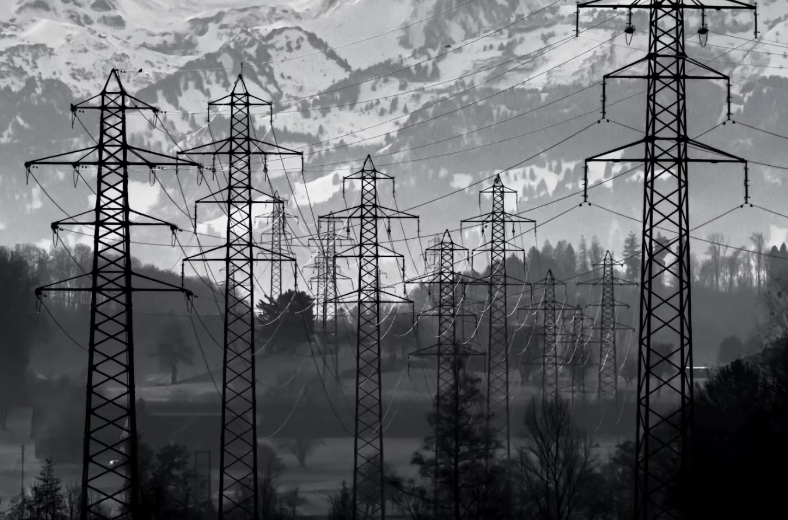

In the Netherlands we are using more and more electrical energy sources for our devices and heating in our home’s. We are also increasingly driving electric cars. Last year, 114,000 new fully electric cars were sold and this is expected again in 2024.

> Dutch grid operators are preparing the power grid for a sustainable future. They lay bigger cables and build new electricity houses to meet the growing demand for electricity. This is a historic renovation in which 1 in 3 streets in the Netherlands will be dug up in the coming years to replace the old cables and lay new ones.

Unfortunately, the rapidly growing demand for electricity is causing grid congestion, with the existing grid becoming overloaded. This can cause power outages and other problems. Grid operators are working on flexible solutions to tackle these challenges, but you are already seeing energy suppliers starting to charge a fee for feeding power back into the grid.


<sub>Photo by <a href="https://unsplash.com/photos/a-woman-in-a-red-dress-sitting-on-a-couch-8Pu6jVaZMXc?utm_content=creditCopyText&utm_medium=referral&utm_source=unsplash">Jan Huber</a> on <a href="https://unsplash.com/photos/a-woman-in-a-red-dress-sitting-on-a-couch-8Pu6jVaZMXc?utm_content=creditCopyText&utm_medium=referral&utm_source=unsplash">Unsplash</a></sub>

It’s wise to think carefully about using your own generated solar energy. Even though we have net metering in The Netherlands you get the following benefits:

1. Consuming your own energy can save you money;
2. You help relieve the burden on the power grid;
3. More and more energy suppliers will charge for customers with solar panels;
4. You can automate cool stuff in your home!

## Save costs with the FIBARO Home Center 3

I'll show you a practical example of how you can use your HC3 smartly to make optimal use of your own generated (solar) energy in your home. Let this example inspire you to further automate your energy management.

To measure the unused solar energy in your home, you need a P1 meter that is compatible with the HC3. For example you can use the official supported [P1 Meter WiFi Gateway & Quick App for HC3/HC3L](https://shop.jdkbenelux.com/en/P1-Meter-WiFi-Gateway-Quick-App-for-HC3-HC3L/P1M-WG).

### Electric bike example

In this first example, you automatically charge your electric bicycle as soon as you return enough energy back to the grid. In addition to a P1 meter, you also need a [FIBARO Wall Plug](https://www.fibaro.com/en/products/wall-plug/) for this.

To determine the correct values for the scene in your HC3, I use a [Gazelle Eclipse](https://www.gazelle.nl/modellen/eclipse) electric bike as an example. If you look in the manual, the charger for this bike can consume `930 Wh`. With this information you can automate the charging of the e-bike. But first your FIBARO system must meet the following requirements:

1. Configure the P1 meter Quick App;
2. Insert the Wall Plug into a power socket;
3. Include the FIBARO Wall Plug into your HC3;
4. Insert the bike charger into the Wall Plug;
5. Turn the Wall Plug off.

With Lua you can create a scene that is triggered when your Smart Meter return value is above `1000 W` or is exactly `0 W`:

```lua
-- DECLARATIONS (Conditions/Triggers)
{
  conditions = { {
      id = 42,
      isTrigger = true,
      operator = ">=",
      property = "value",
      type = "device",
      value = 1000
    }, {
      id = 42,
      isTrigger = true,
      operator = "==",
      property = "value",
      type = "device",
      value = 0
    } },
  operator = "any"
}
```

With the `sourceTrigger` [special variable](https://docs.joepverhaeg.nl/hc3-scenes-part3/) you can check wether you need to turn the Wall Plug on or off:

```lua
--ACTIONS
if sourceTrigger.value == 0 then
	hub.call(123, "turnOff")
else
	hub.call(123, "turnOn")
end
```

The above scene is very simple and can cause the charging cycle on and off frequently. By using [scene variables](https://docs.joepverhaeg.nl/hc3-scenes-part2/), you can ensure the battery charging continues for at least 1 hour (or more):

```lua
--ACTIONS
local currentime =  os.time(os.date("!*t"))
local switchtime = hub.getSceneVariable("switchtime") or 0
local elapsedtime = currentime - switchtime

if sourceTrigger.value == 0 then
    if elapsedtime > 3600 then -- min 1 hour charging
        -- turn plug off
        hub.call(123, "turnOff")
        hub.setSceneVariable("switchtime", 0)
        hub.debug("Scene57", "Turn electric bike charging off...")
    end
end

if sourceTrigger.value >= 1000 then
    -- turn plug on
    local switchstate = hub.getValue(123, "value")
		-- check if the wall plug is already on...    
		if switchstate == false then
        hub.call(123, "turnOn")
        hub.setSceneVariable("switchtime", currentime)
        hub.debug("Scene57", "Turn electric bike charging on...")
    end
end
```

### A note on unpredictable weather

These examples do not take unpredictable weather into account. It may therefore happen that your smart meter indicates that it is returning `1000 W` back into the grid, but that a short time later the value is less!