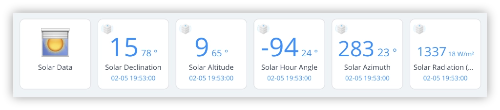
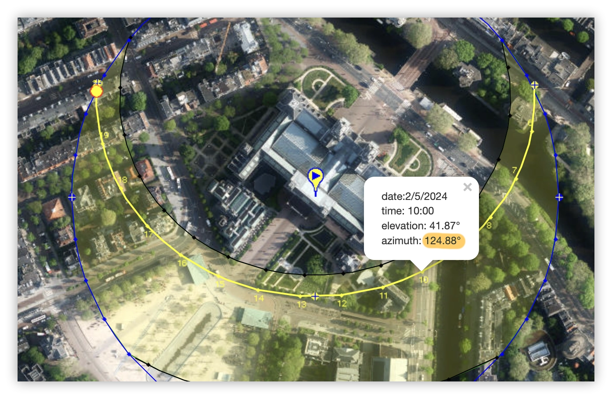
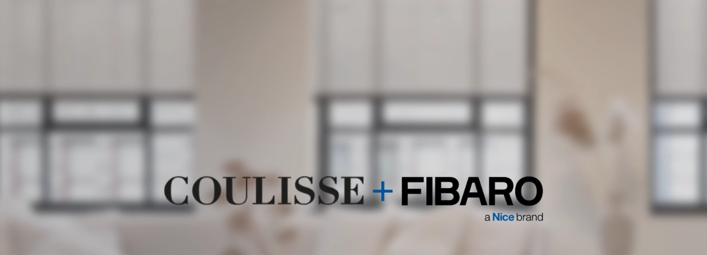
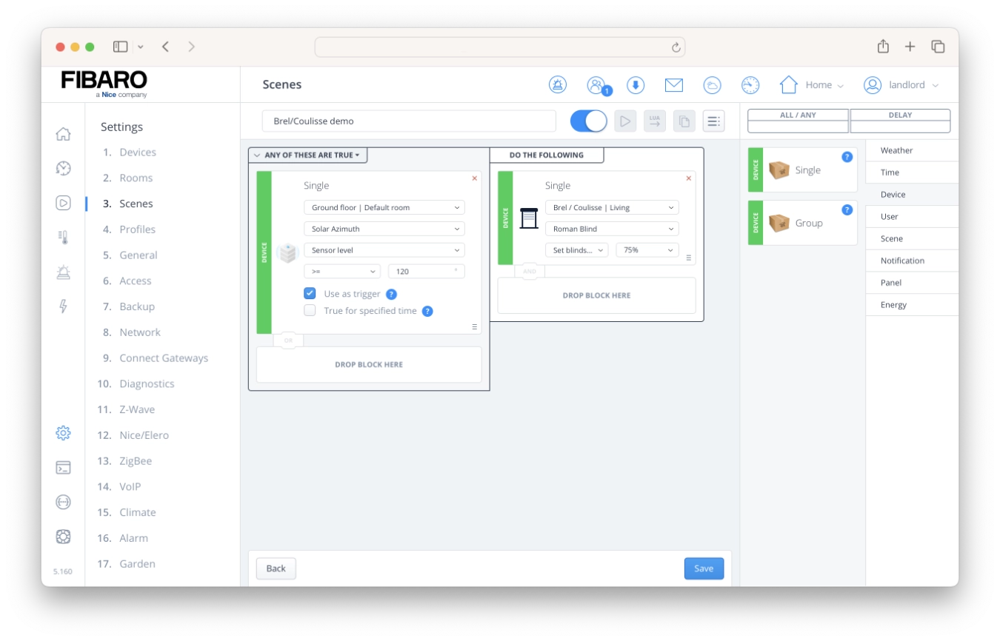
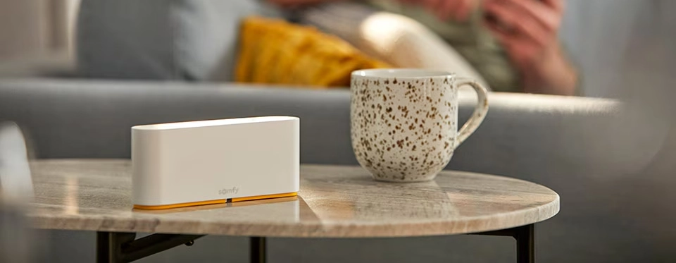

Knowing the sun's position, you can automatically adjust your blinds based on the time of the year. This method of automation does not only enhances indoor comfort but also helps in managing energy consumption more effectively.

## Why automate blinds based on sun azimuth?

Automating your blinds based on the sun's azimuth (the angle of the sun's position in the sky, measured horizontally from the North) offers the following advantages:

1. **Enhanced Comfort**: You can adjust your blinds before the room gets to bright or too hot. In spring the sun is lower in the sky than when it’s summer. By using the sun position allows you to automate your blinds to adjust precisely throughout the seasons to manage how much sunlight enters a room. This means your blinds can let in more light in the spring when it's cooler and less when it’s summer and the sun might be too bright and hot.
2. **Energy Efficiency**: By letting in sunlight you reduce the need for heating in spring, autumn and winter. By controlling sunlight exposure, your home can naturally stay warmer, thus reducing your energy usage and bills.
3. **Enjoying More Natural Light:** It’s nice to have more natural light inside your home because it’s very healthy. Natural light boosts your mood, improves your sleep, and helps your body produce vitamin D. When your blinds are open when the sun light is less intense, it make the rooms brighter and cheerier!
4. **Convenience**: Most people automate their blinds for the convenience of not having to manually adjust blinds several times a day. By using the sun’s azimuth your blinds are also optimised for comfort and energy efficiency!


## What is the concept of sun azimuth?

The sun’s azimuth is a celestial measurement used to describe the direction of the sun in the sky, relative to true north. It is measured in degrees, with north as 0°, east as 90°, south as 180°, and west as 270°. As the Earth rotates, the azimuth of the sun changes throughout the day, influencing how sunlight enters your home.

I created a [Quick App](https://marketplace.fibaro.com/items/solar-data-azimuth-calculator) to calculate the position of the sun at a certain time of the day:



## How to calculate seasonal azimuth data?

You can use the [SunEarthTools.com](https://www.sunearthtools.com/dp/tools/pos_sun.php?lang=en) website to check the positions of the sun at various times of the day throughout the year. For example, if you select a date in the summer, you will see that the sun azimuth has a different value than in the spring:



With this information and my [Solar Data Azimuth Calculator Quick App](https://marketplace.fibaro.com/items/solar-data-azimuth-calculator), you can easily create seasonal scenes for your blinds positions with your Yubii/FIBARO Home Center 3.

You can now collect the azimuth data for each window where a smart blind is positioned. Determine the values with help from the [SunEarthTools.com](https://www.sunearthtools.com/dp/tools/pos_sun.php?lang=en) website and the location of your house.



## Integrating Brel/Coulisse with FIBARO HC3

If you're exploring the world of window coverings, [Coulisse](https://www.coulisse.com/) is one of the best out there. They offer a wide variety of designs made from high-quality materials. To make their coverings smart they use [Motionblinds](https://www.coulisse.com/emea/en/motionblinds) smart technology that is being developed in the Netherlands.

With the [BREL/Coulisse Quick App](https://shop.fibarobenelux.com/en/BREL-Home-Quick-App/QA-BC) you can easily integrate your motorized blinds with the FIBARO Home Center 3 and automate them based on the season and position of the sun.

### Prerequisites

To start with this Brel/Coulisse example your FIBARO HC3 must meet the following requirements:

1. Functioning motorised blinds from [Brel](https://www.brel-home.nl/en/pro), [Coulisse](https://www.coulisse.com/emea/en/) or [Motionblinds](https://www.coulisse.com/emea/en/motionblinds);
2. The [BREL/Coulisse Quick App](https://shop.fibarobenelux.com/en/BREL-Home-Quick-App/QA-BC) installed and configured;
3. The [Solar Data Azimuth Calculator Quick App](https://marketplace.fibaro.com/items/solar-data-azimuth-calculator) installed;

### Automatically adjust the screen position to perfectly match the season

In the following screenshot you can see that you can create a simple block scene to automate a roman blind based on the sun’s azimuth:



However, this approach requires you to create a lot of scenes because you cannot combine opening and lowering in a single block scene. Therefore, I will show you an example of a Lua scene that you can further develop to your needs.

First I determined at which azimuth values the sun shines through the window. In my example this is between `120` and `160` degrees. I enter these values in the *declarations* section of the Lua scene:

```lua
-- DECLARATIONS (Conditions/Triggers)
{
  conditions = { {
      id = 42,
      isTrigger = true,
      operator = ">=",
      property = "value",
      type = "device",
      value = 120
    }, {
      id = 42,
      isTrigger = true,
      operator = "<=",
      property = "value",
      type = "device",
      value = 160
    } },
  operator = "all"
}
```

This will start the scene if the azimuth values are between `120` and `160` degrees.

> In this Lua scene I take a margin of 5 degrees, because the Azimuth Quick App updates every minute. It is therefore possible that this just jumps over the 120 degree value. Taking a small margin solves this problem.

In the *actions* block I retrieve the value from the [special variable](https://docs.joepverhaeg.nl/hc3-scenes-part3/)  `sourceTrigger` when the scene is started, so I can determine when a screen should open and/or close:

```lua
--ACTIONS
local screensClosed = hub.getSceneVariable("screensClosed") or 0
local azimuth = sourceTrigger.value

-- Close the livingroom screens...
if azimuth >= 120 and azimuth <= 125 and screensClosed == 0 then
    hub.call(42, 'setValue', 75)
    hub.setSceneVariable("screensClosed", 1)
end

-- Open the livingroom screens...
if azimuth <= 160 and screensClosed == 1 then
    hub.call(42, 'setValue', 0)
    hub.setSceneVariable("screensClosed", 0)
end
```

In spring the azimuth in my example is between `126` and `166` degrees. With this Lua scene the screens remain open to let in the beautiful spring sun. In the summer, when the sun is higher, the screens will close to keep the bright and hot sun outside.



## Advanced Somfy screen automation using the HC3

[Somfy](https://www.somfysystems.com/en-us/) is known for their high-quality motors that are reliable and easy to use. Their exterior sun screens are used in many houses to keep the sunlight outside in the summer, but I can imagine that in the spring, you would actually want the sun to shine through the window.

In this example the screens are located on the outside of your house and therefore I add an option to the scene that the screens do not close when the wind speed is above moderate.

> Most screens can withstand wind force 4, also known as moderate wind. Due to the large surface area of a sun screen, the wind can exert a lot of force on the product and it is important to keep them closed with strong wind.

### Prerequisites

To automate your Somfy screens, the basic principle is the same as above with my Brel/Coulisse example. To start with this Somfy TaHoma example your FIBARO HC3 must meet the following requirements:

1. Functioning [Somfy](https://www.somfysystems.com/en-us/) screens that are connected to the [Somfy TaHoma Switch](https://www.somfysystems.com/en-us/products/controls/tahoma);
2. The [Somfy TaHoma Switch Quick App](https://shop.fibarobenelux.com/en/Somfy-Tahoma-Switch-Quick-App/QA-SMF) installed and configured;
3. The [Solar Data Azimuth Calculator Quick App](https://marketplace.fibaro.com/items/solar-data-azimuth-calculator) installed;
4. A [weather station](https://docs.joepverhaeg.nl/ventus-w830/) or other wind meter connected to your HC3;

### Automatically pausing your wind screen automation on windy days for safety

Because this automation is somewhat more complex, I'll create a Lua scene. To determine the wind strength, I read the current value of the wind sensor. When the wind speed is above 25 km/h I don’t close the screens.

> Wind force 4 has a speed between 20-28 km/h. To give a little margin, I do not close the screens with a wind speed higher than 25 km/h.

The *declarations* block remains the same as you used earlier:

```lua
-- DECLARATIONS (Conditions/Triggers)
{
  conditions = { {
      id = 42,
      isTrigger = true,
      operator = ">=",
      property = "value",
      type = "device",
      value = 120
    }, {
      id = 42,
      isTrigger = true,
      operator = "<=",
      property = "value",
      type = "device",
      value = 160
    } },
  operator = "all"
}
```

In the actions block I retrieve an extra `windspeed` value to check that there is little to no wind, so that it is safe to lower the Somfy vertical exterior sun screen:

```lua
-- ACTIONS
local screensClosed = hub.getSceneVariable("screensClosed") or 0
local azimuth = sourceTrigger.value
**local windspeed = hub.getValue(283, "value")**

-- Close the livingroom screens if the wind force is lower then 4...
if azimuth >= 120 and azimuth <= 125
	**and windspeed <=25** and screensClosed == 0 then
    hub.call(42, 'setValue', 75)
    hub.setSceneVariable("screensClosed", 1)
end

-- Open the livingroom screens...
if azimuth <= 160 and screensClosed == 1 then
    hub.call(42, 'setValue', 0)
    hub.setSceneVariable("screensClosed", 0)
end
```

I hope this article has inspired you and that you enjoyed learning about the advanced possibilities for automating your blinds with the HC3.

<sub>Cover photo by [Coulisse](https://www.coulisse.com/), global specialist in window coverings.</sub>