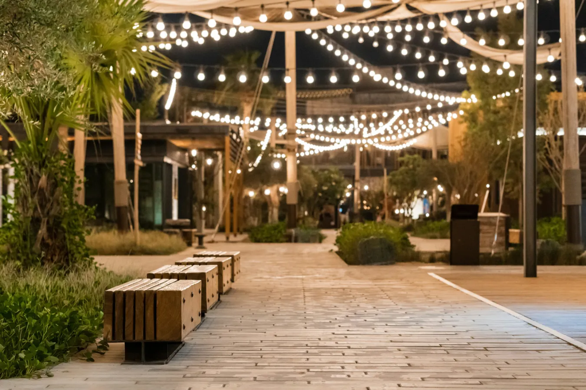
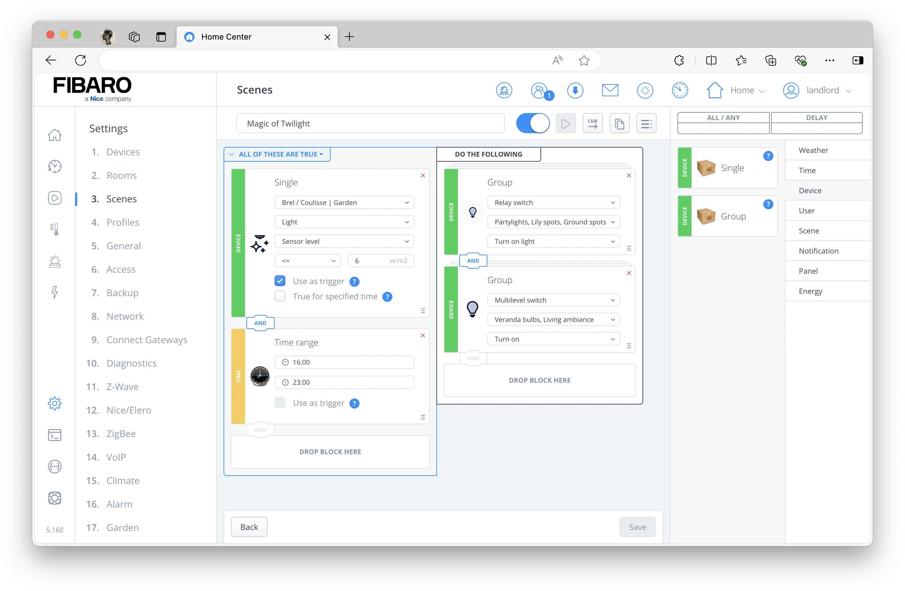

Picture yourself already nestled into your favorite chair in the garden. As the sun sets, your outdoor lights automatically create an intimate atmosphere, turning your garden into a romantic place.

To write a scene for this scenario might seem challenging, but it’s actually quite straightforward. Even without a light sensor, you can achieve impressive results. As long as you can control your garden lighting with the Home Center 3.

Photo by <a href="https://unsplash.com/@dhojayev?utm_content=creditCopyText&utm_medium=referral&utm_source=unsplash">Dovlet Hojayev</a> on <a href="https://unsplash.com/photos/a-row-of-benches-sitting-on-top-of-a-sidewalk-Ew1_xSNA-uM?utm_content=creditCopyText&utm_medium=referral&utm_source=unsplash">Unsplash</a>

## Prerequisites

I'll assume you've already linked your outdoor lights to the HC3. This can be a 12 volts outdoor party light or some [Philips Hue Outdoor Lights](https://www.philips-hue.com/en-us/explore-hue/propositions/smart-outdoor-lighting) integrated with the default or third party plug-in.

## Choosing between a light sensor or sunset value from the HC3

To make this work, you can use a light sensor connected to your HC3. I use the light sensor from my [Ventus Weather station](https://docs.joepverhaeg.nl/ventus-w830/), which reports in W/m². Most sensors report in lux, so you'll need to adapt the light values to your unit of measurement. If you don’t have a light sensor, you can use the sunset time trigger from the HC3.

## How the block scene works: An example

The block scene for automating your outdoor lights has the following steps:

1. Trigger based on the **outdoor light measurement** levels;
2. Only trigger in a **time window** between 16:00 and 23:00;
3. **Turn on** your most warm and cozy **garden lights**;
4. **Turn on** some **indoor lights** to create depth in your home when you look at your home from the garden.

You add a time window between 16:00 and 23:00 to your block scene so that the scene only runs in the afternoon and evening. This prevents the outdoor lights from turning on in the middle of the day when it is very cloudy.

When you are ready the block scene looks like the example below:

## Why I use device groups in a HC3 block scene?

To enhance the readability of the block scene you see that I create two device groups. One group for all outdoor lights and another for indoor lights. This clear separation allows you to quickly identify and adjust specific parts of your scene without getting lost when you have a lot of devices.

Cover photo by <a href="https://unsplash.com/@chrisdickens?utm_content=creditCopyText&utm_medium=referral&utm_source=unsplash">Chris Dickens</a> on <a href="https://unsplash.com/photos/building-surrounded-green-grass-xsqLnWVt-UM?utm_content=creditCopyText&utm_medium=referral&utm_source=unsplash">Unsplash</a>

