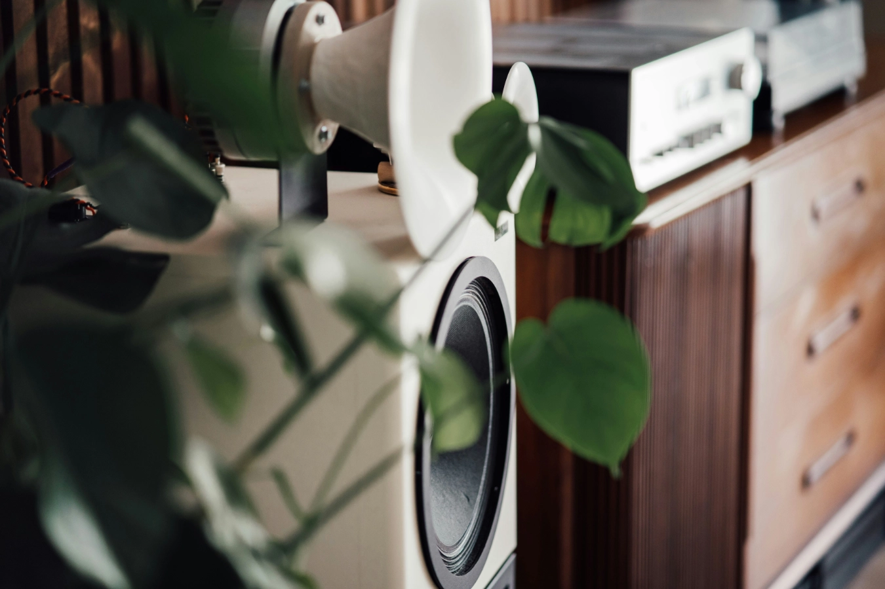
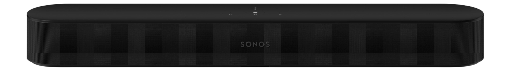
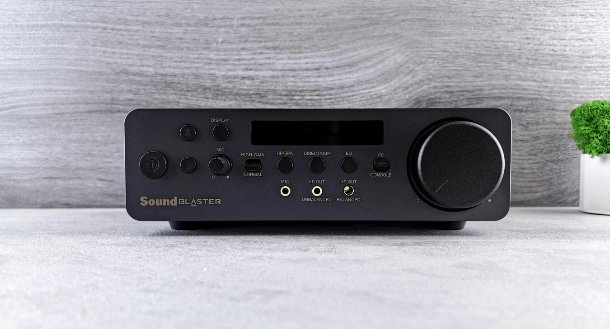

My latest **[Sonos Automation Controller Quick App](https://marketplace.fibaro.com/items/sonos-s2-automation-controller)** integrates your Sonos System seamless with your HC3. Leveraging the Sonos JSON API that is available in de Sonos S2 devices, my Quick App introduces an easy way to automate and control your Sonos speakers directly from your HC3 system.

You can build advanced Lua scenes to:

1. **Play** your **favorite** playlist on demand;
2. **Group** Sonos **speakers** for synchronized audio (and ungroup them);
3. **Initiate** and **pause** **playback** on a Sonos speaker (or group);
4. **Set** the **volume** of an individual, or a group of players;
5. **Increase** or **decrease** the **volume** of an individual, or a group of players **by percentage**;
6. **Play** a **Text to Speech** message on a Sonos speaker;
7. **Save** playback **states** and **resume** them later seamlessly.

## No more third party hassles: fully integrated Sonos control with HC3

The **[Sonos Automation Controller](https://marketplace.fibaro.com/items/sonos-s2-automation-controller)** bridges the gap between premium wireless audio and advanced home automation. By using the new local JSON API from Sonos, my Quick App offers better performance and stability and there is no need anymore for complicated workarounds or extra hardware, like a Raspberry Pi with Node-RED. Everything works seamlessly within your HC3 ecosystem.


<sub>Photo by <a href="https://unsplash.com/@jackdixon?utm_content=creditCopyText&utm_medium=referral&utm_source=unsplash">Jack Dixon</a> on <a href="https://unsplash.com/photos/a-close-up-of-a-speaker-with-a-plant-in-front-of-it-OUmQk2VSxGA?utm_content=creditCopyText&utm_medium=referral&utm_source=unsplash">Unsplash</a></sub>

## Use case: "Everybody Left Home" and "Welcome Back Home"

For example, I'll demonstrate a use case that highlights the power of automating your home audio system, showing what’s possible with your HC3 and Sonos setup, especially if you have more speakers than the average household:

1. **Everybody Left Home**

    When the last person leaves the house, a scene can trigger the following:

    ```lua
    hub.call(123, "savePlaybackStatusAndPause")
    ```

    - Saves the playback state of all Sonos players.
    - Pauses all players to conserve energy and avoid unnecessary noise.

2. **Welcome Back Home**

    When someone returns home, a scene can trigger the following:

    ```lua
    hub.call(123, "restorePlaybackStatus")
    ```

    - Restores the exact playback state from before the house was unoccupied.
    - Groups, playlists, and playback positions are re-established, so the audio experience picks up right where it left off.

As you can see, it's as simple as two commands to pause all players when everyone leaves the house and then restore the players to their previous state when someone returns.



## What are the Lua commands for Sonos automation?

Here’s an overview of what you can do with my **[Sonos Automation Controller](https://marketplace.fibaro.com/items/sonos-s2-automation-controller)** Quick App and how you can control your Sonos players with the HC3.

### 1. Play a favorite on a specific speaker

```lua
-- Example 1: Clear the current queue, add all songs from the playlist and shuffle the playlist
hub.call(123, "playFavorite", "100 Greatest Rock Songs", "Livingroom", 15, "queue=replace", "playmode=shuffle")

-- Example 2: Add the songs from the playlist to the end of the current queue and shuffle and repeat the playlist
hub.call(123, "playFavorite", "Mariah Carey: Merry Christmas", "Livingroom", 15, "queue=append", "playmode=shuffle,repeatAll")
```

- **Purpose**: Instantly play a favorite station or playlist.
- **Details**: This command tells the Sonos speaker in the *Living room* to play the favorite at volume **15**. Perfect for quick access to your favorite audio content.
- **Options**:
  - `playmode=`
      - `normal`: Plays the favorite as it is.
      - `repeatAll`: Repeats the entire playlist or station.
      - `repeatOne`: Repeats the current track.
      - `shuffle`: Shuffles the playlist or station.
      - `crossfade`: Enables crossfading between tracks.
  - `queue=`
      - `replace`: Clears the current queue and plays the favorite.
      - `append`: Adds the favorite to the end of the current queue.
      - `insert`: Inserts the favorite into the queue after the current track.
      - `insert_next`: Adds the favorite as the next track in the queue.

This flexibility allows you to customize how your favorite songs are played, whether you want a fresh start, add to the current playlist, or mix it up with shuffle or crossfade options.

### 2. Create a speaker group

The Quick App includes native speaker grouping, allowing you to automate dynamic synchronization. For instance, your Sonos system can automatically group speakers to play synchronized audio in any room where presence is detected!

> Imagine walking into your living room, and your Sonos speakers automatically group together to play your favorite playlist, while the kitchen speakers stop playing because you've left. This seamless automation enhances convenience and creates a personalized smart home experience.

```lua
hub.call(123, "createGroup", {"Livingroom", "Kitchen"})
```

- **Purpose**: Dynamically group speakers for synchronized playback.
- **Details**: This creates a group with the speakers *Living room* and *Kitchen*, allowing you to play audio across both rooms simultaneously.

### 3. Remove a speaker group

```lua
hub.call(123, "removeGroup", {"Livingroom", "Kitchen"})
```

- **Purpose**: Disband a previously created group.
- **Details**: This command removes the grouping between *Living room* and *Kitchen*, returning them to individual control.

### 4. Play a TTS audio clip

With Sonos TTS (Text To Speech), you can receive instant voice alerts for various scenarios, such as when a door or window is opened, a motion sensor is triggered, or even when it's time to take out the trash. This real-time communication ensures that you are always aware of your home's status, no matter where you are in the house!

The Sonos Automation Controller Quick App can create audio clips dynamically for playback using the Google Translate TTS feature. For instance, Sonos can announce the current weather for you:

```lua
local currentTemperature = hub.getValue(3, "Temperature)
-- Announce the current temperature in Dutch:
hub.call(123, "playTTS", "Kitchen", 10, "nl", "Het is " .. currentTemperature .. " graden buiten!")

-- Announce the current temperature in English:
hub.call(123, "playTTS", "Kitchen", 10, "en", "The temperature outside is " .. currentTemperature .. " degrees!")
```

- **Purpose**: Play a dynamic announcement.
- **Details**: This command tells the *Office* speaker to play an dynamically created announcement at volume **10**. Ideal for weather or traffic notifications.

If you prefer not to send your announcement text to a Cloud provider or often use the same messages, I recommend creating them in advance and hosting the MP3 files on a public web-based location accessible by the Sonos player.
A great tool for generating pre-recorded commands is [GTTS (Google Text-to-Speech)](https://gtts.readthedocs.io/en/latest/cli.html). For example, my example audioclip is hosted on my public GitHub account.

```lua
hub.call(123, "loadAudioClip", "Office", 5, "https://github.com/joepv/fibaro/raw/refs/heads/master/sonos-tts-example-eng.mp3")
```

- **Purpose**: Play a specific audio file or announcement.
- **Details**: This command tells the *Office* speaker to play an audio clip from a URL at volume **5**. Ideal for custom notifications, such as *"The doorbell has rung"* or *"Package delivered."*


<sub>Photo by <a href="https://unsplash.com/@zelebb?utm_content=creditCopyText&utm_medium=referral&utm_source=unsplash">Andrey Matveev</a> on <a href="https://unsplash.com/photos/a-radio-sitting-on-top-of-a-table-next-to-a-plant-E0J7u4OaJ1k?utm_content=creditCopyText&utm_medium=referral&utm_source=unsplash">Unsplash</a></sub>

### 5. Essential commands

In addition to the advanced features like TTS and speaker grouping, the Quick App also supports all the essential commands you'd expect for controlling your Sonos system. With simple Lua commands, you can **play**, **pause**, and **adjust the volume** of individual speakers or entire groups.

#### 1. Control playback

```lua
hub.call(123, "play", "Bedroom")
hub.call(123, "pause", "Bedroom")

```

- **Purpose**: Start or pause playback for groups.
- **Details**: If the *Bedroom* speaker is part of a group, these commands will control playback for the entire group. Simplifies group playback management without additional setup.

#### 2. Adjust volume levels

```lua
hub.call(123, "setPlayerVolume", "Office", 15)
hub.call(123, "setGroupVolume", "Kitchen", 15)

```

1. **Individual Player Volume**
    - **Command**: `setPlayerVolume`
    - **Purpose**: Adjust the volume for a specific Sonos speaker.
    - **Details**: This sets the exact volume level for a single speaker, independent of any group it may belong to. Useful for fine-tuning the sound in a specific room without affecting other areas.
2. **Group Volume**
    - **Command**: `setGroupVolume`
    - **Purpose**: Adjust the overall volume for all speakers in the group that the *Kitchen* speaker is part of.
    - **Details**: Sonos handles group volume intelligently. When you set the group volume, the *group coordinator* calculates the adjustments needed for each speaker in the group to ensure that the resulting average volume matches the desired level.
    - **How does the Sonos group volume algorithm work?**
        1. **Initial Average**: The coordinator starts by determining the current average volume across all grouped speakers.
        2. **Adjustment Calculation**: It calculates how each speaker's volume needs to change to achieve the new desired group volume.
        3. **Synchronized Update**: The coordinator adjusts its local volume and communicates with the other speakers in the group to modify their volumes accordingly.

        For example: if Speaker A is at volume 10 and Speaker B is at volume 20 (average = 15), setting the group volume to 25 will adjust both speakers proportionally to reach the new average.

        This dynamic adjustment makes it easy to manage multi-room audio without micromanaging individual speaker volumes, providing a seamless experience for users.

#### 3. Adjust volume levels by percentage

```lua
hub.call(123, "increasePlayerVolume", "Office", 25)
hub.call(123, "decreasePlayerVolume", "Office", 25)

hub.call(123, "increaseGroupVolume", "Kitchen", 10)
hub.call(123, "decreaseGroupVolume", "Kitchen", 10)
```

1. **Increase or decrease individual player volume**
   - **Command**: `increasePlayerVolume` or `decreasePlayerVolume`
       - **Purpose**: Adjust the volume for a specific Sonos speaker by a defined percentage.
       - **Details**: These commands raise or reduce the volume of the *Office* speaker by **25%**.

2. **Increase or decrease group volume**
    - **Command**: `increaseGroupVolume` or `decreaseGroupVolume`
        - **Purpose**: Adjust the overall volume for all speakers in the group that the *Kitchen* speaker is part of.
        - **Description**: These commands raise or reduce the volume of the entire group containing the *Kitchen* speaker by a defined percentage. You can reference any speaker in the group, and the adjustment will apply to all.

These commands are ideal for smoothly changing the volume without needing to manually set a specific volume level, making it a great solution for button-triggered actions.

### 6. Save and restore playback status

```lua
hub.call(123, "savePlaybackStatus")
hub.call(123, "restorePlaybackStatus")
```

- **Purpose**: Save the current playback state to a Global Variable called `SonosPlayerState`
- **Details**: These commands are invaluable for scenarios where you need to interrupt playback temporarily (e.g., when everybody left the house) and then resume exactly where you left off.

### 7. Save and restore playback state with **automatically pausing all players**

```lua
hub.call(123, "savePlaybackStatusAndPause")
hub.call(123, "restorePlaybackStatus")
```

1. **Save playback state and automatically pause all players**
    - **Command**: `savePlaybackStatusAndPause`
    - **Purpose**: Save the current playback state of all Sonos players and pause them automatically.
    - **Details**: This command is perfect for scenarios like an *"Everybody Left Home"* scene. It captures the exact playback state of all your Sonos speakers, including which ones are playing, what content they are playing, and their current positions in the track or playlist.

    The state is saved to a Global Variable called `SonosPlayerState` and then it pauses all players, ensuring a quiet home when nobody is present.

2. **Restore Playback State**
    - **Command**: `restorePlaybackStatus`
    - **Purpose**: Resume playback exactly where it left off.
    - **Details**: When you return home, use this command to restore the saved playback state. All players will resume playing their previous content seamlessly, with the same volume levels, groupings, and track positions.

    The state is retrieved from a Global Variable called `SonosPlayerState` that is set with the `savePlaybackStatusAndPause` command.


<sub>Photo by <a href="https://unsplash.com/@kstonematheson?utm_content=creditCopyText&utm_medium=referral&utm_source=unsplash">Kate Stone Matheson</a> on <a href="https://unsplash.com/photos/white-cat-sleeps-under-white-comforter-uy5t-CJuIK4?utm_content=creditCopyText&utm_medium=referral&utm_source=unsplash">Unsplash</a></sub>

### 8. Set a sleep timer

```lua
hub.call(556, "setSleepTimer", "Bedroom", "01:30")
```

- **Command**: `setSleepTimer`
- **Purpose**: Schedule a Sonos speaker to stop playback after a specified duration.
- **Details**: This command allows you to set a sleep timer for a specific speaker. For example, the above command sets a timer for 1 hour and 30 minutes for the *Bedroom* speaker. Once the timer expires, playback will automatically stop. This feature is perfect for winding down at night or scheduling music to turn off after a set period.
- **Examples of timer durations**
    - `00:15` sets a timer for 15 minutes.
    - `00:45` sets a timer for 45 minutes.
    - `03:00` sets a timer for 3 hours.

Setting the sleep timer directly on the player ensures seamless integration with your Sonos system, providing the same experience as the official app but with the added benefit of automation with scenes.

## Download the Sonos S2 Quick App from the FIBARO Marketplace

You can find the Quick App for download in the [FIBARO Marketplace](https://marketplace.fibaro.com/items/sonos-s2-automation-controller). Once [downloaded](https://marketplace.fibaro.com/items/sonos-s2-automation-controller), you can install it directly on your Home Center 3 by adding a new device in the *Settings* menu.

Simply set the Quick App variable `sonosIP` to the *IP address* of a Sonos speaker on your network, and you're all set. For the best performance, I recommend using the *IP address* of a player that's connected via a network cable, if available.