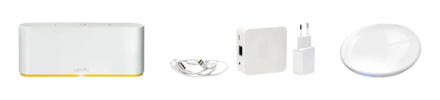
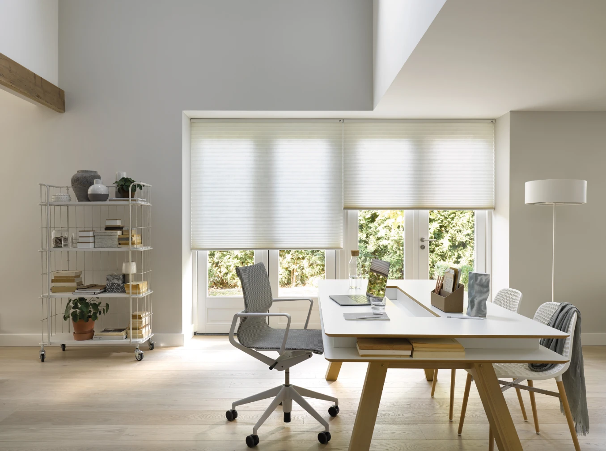
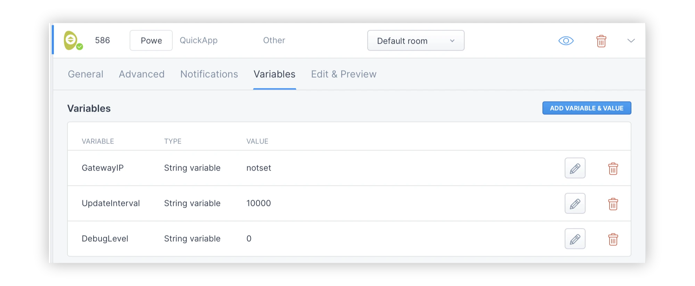
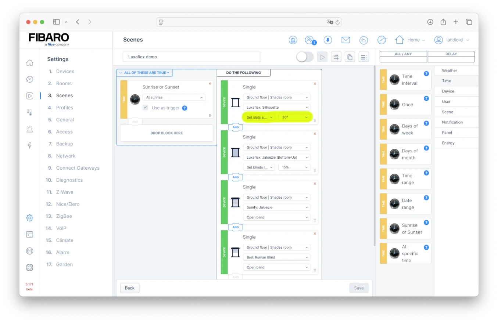

*To complete the smart shade Quick App trilogy, I developed a new integration for seamless control of Luxaflex (Hunter Douglas) shades with the Home Center 3.*

My third Quick App in my shades trilogy integrates Luxaflex (Hunter Douglas) devices into the Yubii Home and FIBARO System using the native local PowerView Automation Gen 3 Gateway API.

If you can't wait, you can find my Yubii Home and FIBARO QuickApp's here:

1. [Luxaflex (Hunter Douglas) PowerView Gen3](https://shop.jdkbenelux.com/en/Luxaflex-PowerView-Gen3-Quick-App/QA-LUX)
2. [Somfy TaHoma Switch](https://shop.jdkbenelux.com/en/Somfy-Tahoma-Switch-Quick-App/QA-SMF)
3. [Brel Home](https://shop.jdkbenelux.com/en/BREL-Home-Quick-App/QA-BM)

Before I highlight my new [PowerView Gen3 QuickApp](https://shop.jdkbenelux.com/en/Luxaflex-PowerView-Gen3-Quick-App/QA-LUX) I provide you an in-depth comparison of all three systems to help you better understand the differences between the products.

## 1. Luxaflex: The Premium Smart Shade Experience

Luxaflex (Hunter Douglas) is known for luxury, design innovation, and their PowerViewautomation. Their Gen3 gateway allows you to control shades effortlessly via smartphone, voice command, or scheduled automation. With the [Quick App for Luxaflex](https://shop.jdkbenelux.com/en/Luxaflex-PowerView-Gen3-Quick-App/QA-LUX) you can centralise the operation of your shades with the HC3 and Yubii Home system.

### Key Benefits of Luxaflex

1. **Superior Fabric & Design Options** – High-end materials and stylish designs.
2. **Seamless Smart Home Integration** – Works with Apple HomeKit, Amazon Alexa, and Google Assistant.
3. **Advanced Automation with PowerView** – Set schedules and control remotely.

Luxaflex is ideal for homeowners who value **sophisticated design and premium automation**.

## 2. Somfy: Versatile Motorization for Various Brands

Somfy specializes in **motorized solutions** that can be integrated with various window covering brands. Their **TaHoma Switch** provides smart home connectivity.

### Key Benefits of Somfy

1. **Compatible with Various Shade Brands** – Works with third-party manufacturers.
2. **Reliable Motorization Technology** – Trusted for home automation.
3. **TaHoma Smart Hub for Automation** – Centralized control for multiple devices.

While this blog is aimed at my Luxaflex integration for Yubii Home and HC3, I also offer an [Quick App for Somfy](https://shop.jdkbenelux.com/en/Somfy-Tahoma-Switch-Quick-App/QA-SMF), allowing seamless shade control across the different brands they support.

## 3. Brel Home: Smart Shades on a Budget

Brel Home offers **affordable motorized shades** with smart home compatibility. While not as premium as Luxaflex, they provide a balance of **functionality and cost-effectiveness**.

### Key Benefits of Brel Home

1. **Affordable Smart Shade Solutions** – Budget-friendly motorized options.
2. **App & Remote Control Options** – Simple user interface.
3. **Works with Home Automation Systems** – Compatible with select smart home platforms.

I've also developed an [Quick App for Brel Home](https://shop.jdkbenelux.com/en/BREL-Home-Quick-App/QA-BM), ensuring users can control their shades easily within their Yubii Home and HC3 smart home setup.

## Comparison Table: Which Smart Shade System is Right for You?

| Feature                           | Luxaflex              | Somfy           | Brel Home       |
| --------------------------------- | --------------------- | --------------- | --------------- |
| **Premium Fabrics & Design**      | ✔️ Yes                 | ❌ No            | ❌ No            |
| **Smart Home Integration**        | ✔️ Yes                 | ✔️ Yes           | ✔️ Limited       |
| **App Control**                   | ✔️ PowerView App       | ✔️ TaHoma App    | ✔️ Brel Home App |
| **Voice Control**                 | ✔️ Alexa, Google, Siri | ✔️ Alexa, Google | ✔️ Limited       |
| **Budget-Friendly**               | ❌ Premium             | ✔️ Mid-Range     | ✔️ Yes           |
| **Compatible with HC3 Quick App** | ✔️ Yes                 | ✔️ Yes           | ✔️ Yes           |

Luxaflex is known for its premium automation of it's shades, but by integrating a mix of Luxaflex, Somfy and/or Brel Home into the HC3, you can achieve premium automation across all systems, and even enhance it!

Photo Copyright &copy; <a href="https://www.luxaflexpress.nl">Luxaflex Nederland B.V.</a> Luxaflex is a legally registered trademark of Hunter Douglas.

## Discover the new Luxaflex QuickApp for Yubii Home and HC3

Now that I've explained why these three integrations with the Yubii Home and HC3 systems are so valuable, I'll show you how easy it is to integrate your Luxaflex shades like the well known favorite Duette's or Silhouette's with the HC3.

### How to install the PowerView Gen3 Quick App on your Yubii Home and HC3

1. Ensure that your PowerView **Gen3 gateway is powered on and that all shades are paired with the hub**!
2. **Open** your Home Center 3 **dashboard** by typing the correct URL for your HC3;
3. Go to **Settings** and **Devices;**
4. **Click** the blue **+** icon to add a new device;
5. In the **Add Device** dialog click on **Other Device;**
6. Choose **Upload File** and upload the `.fqax`file you received from JDK Benelux;

### How to configure the PowerView Gen3 Quick App

1. After you added the Quick App, **expand** the new PowerView **Gen3 Gateway** device;
2. **Select** the **Variables** tab;
3. Fill in the `GatewayIP` variable with the IP address of the PowerView **Gen3 hub;**
4. Click **Save**.

And that's it! All devices connected to the PowerView Gen3 Gateway should now be created on the Home Center 3.

### New feature: Tilting is now available in the Yubii Home App and WebGui!

With the Yubii Home app, you can take full control of your Luxaflex shades integrated with the HC3. Not only can you open and close your shades, but you also have **precise control over tilting** the slats for products like Venetian blinds. Additionally, you can set custom scenes and scenarios, automate your shades based on time of day or other triggers, and even slats control is now available in block scenes!

This enhanced control gives you the flexibility to create the perfect ambiance in any room, whether you're looking to maximize natural light, ensure privacy, or create specific lighting conditions for different activities throughout the day. The intuitive interface makes it easy for you, if you're not technical, to adjust your shades precisely how you want them.

## Conclusion: Smart shade automation is easy!

With these three QuickApps for the Yubii Home and Home Center 3, you now have complete control over the best smart shades in the market, regardless of whether you choose [Luxaflex](https://shop.jdkbenelux.com/en/Luxaflex-PowerView-Gen3-Quick-App/QA-LUX), [Somfy](https://shop.jdkbenelux.com/en/Somfy-Tahoma-Switch-Quick-App/QA-SMF), or [Brel Home](https://shop.jdkbenelux.com/en/BREL-Home-Quick-App/QA-BM). Each system offers unique advantages, and thanks to these integrations, you can enjoy premium automation features across all platforms.

Credits: title photo Copyright &copy; <a href="https://www.luxaflexpress.nl">Luxaflex Nederland B.V.</a> Luxaflex is a legally registered trademark of Hunter Douglas.