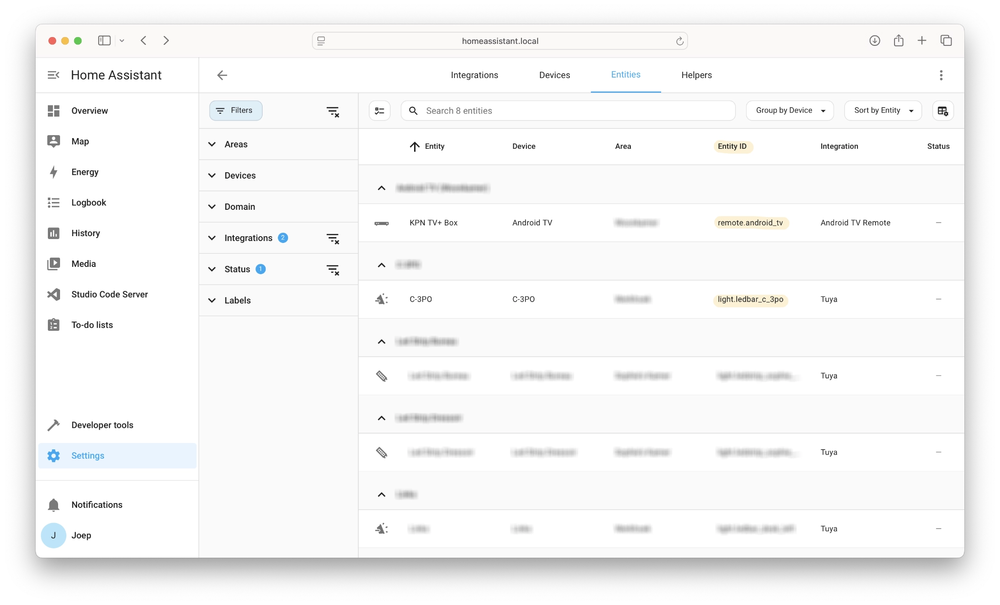
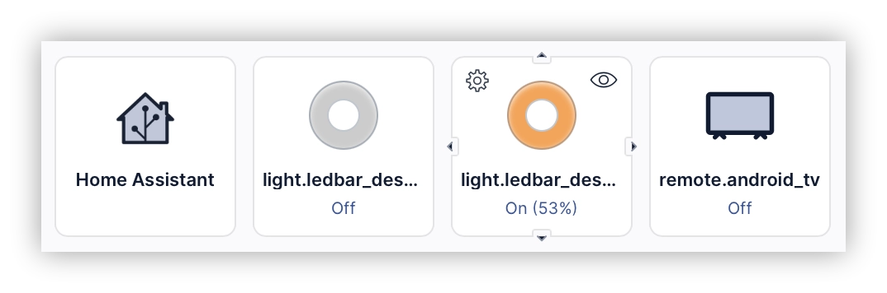

Tuya smart lights are difficult to integrate with the Home Center 3 (HC3). While some integrations exist on the FIBARO forum, they're cumbersome to set up and result in a hacky implementation. Regular readers of my blog know that I avoid these types of solutions in my smart home.

Therefore I stepped into the world of Home Assistant (HA), as they have an official Tuya integration since Home Assistant version 0.74. The integration works via the cloud, but that is ok for now.

> Since I'm already installed and running Home Assistant, I connected Android TV box as well. I might want to develop a native Android TV integration in the future, but coding it is very time-consuming.

## Goals

I want my Home Center 3 (HC3) to talk to Home Assistant, but only for two things I use daily:

1. **Tuya smart lights** (the cheap WiFi ones that don’t integrate natively with FIBARO).
2. **Android TV** (to control my living room setup with scenes).


## Why this works for me

I only need specific devices to communicate between my HC3 and Home Assistant. I don’t want a complete HA entities sync to reduce network traffic and clutter in my Home Center setup. My HC3 remains my central system for automation and scenes, while HA handles the specialized Tuya and Android TV functions.

For now, I developed a streamlined integration for Tuya and Android TV that works reliably through HA's WebSocket API. Let’s say: “I just made this setup good enough for my use case.”

## How to get it working

1. Install Home Assistant.
2. Add the Tuya and Android TV Remote integrations to HA.
3. Create a long-lived access token for Home Assistant.
4. Install my [Home Assistant Quick App](https://marketplace.fibaro.com/items/home-assistant-tuya-android-tv-remote) on your HC3.
5. Configure the entities to create the devices on your HC3.

When configured the QuickApp listens to events and sends commands via the Home Assistant WebSocket API.

## Create a long-lived access token for Home Assistant

Go to your **profile** → **Security** → ***Long-lived access tokens*** and click the **create token** button to create a new long-lived access token that you can use to authenticate the Quick App to your HA instance. Make sure to save this token, as you'll need it for the Quick App configuration in the next step.

## How to configure the Home Assistant Quick App?

After you downloaded my [Home Assistant Quick App](https://marketplace.fibaro.com/items/home-assistant-tuya-android-tv-remote) from the [FIBARO Marketplace](https://marketplace.fibaro.com/items/home-assistant-tuya-android-tv-remote), you go to **Settings** → **Devices** and select the device. First change the following variables:

1. **Server**: HA server FQDN or IP and port number (ex: `192.168.1.1:8123`)
2. **Token**: long-lived access token you created in the previous step

## How to configure the HA entities that the HC3 will use?

Edit the Quick App and in the top of the `main` file add your Tuya led devices and Android TV Remote entities to the `HASS_ENTITIES` table:

```lua
HASS_ENTITIES = {
    { entityId = "light.ledbar_c_3po", hassIntegration = "Tuya" },
    { entityId = "light.ledbar_r2d2",hassIntegration = "Tuya" },
    { entityId = "remote.android_tv", hassIntegration = "AndroidTV" }
}
```

The `entityId` is the `id` of the `entity` in Home Assistant. You can find these in **Settings** → **Devices & services** → **Entities**



When you save the Quick App, the HC3 will create child devices for the entities and update their statuses directly:



## Download

You can download my [Home Assistant Quick App](https://marketplace.fibaro.com/items/home-assistant-tuya-android-tv-remote) from the [FIBARO Marketplace](https://marketplace.fibaro.com/items/home-assistant-tuya-android-tv-remote).

## Final note

This is not a polished integration. I put this Home Assistant Quick App together for my own use. I’m sharing it to help you easily add Tuya lights or your Android TV to your HC3 with HA as a middle man. If you're looking to develop something for your HC3 using Home Assistant, this is a great place to start.