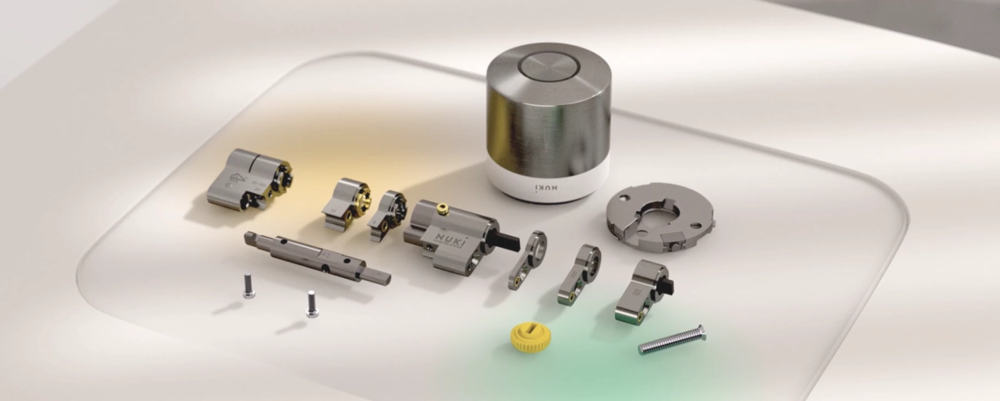
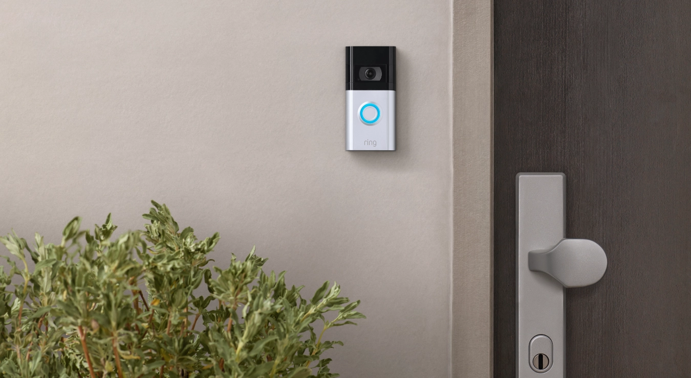
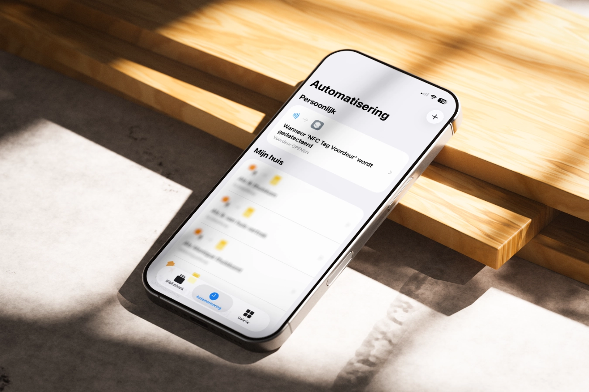

Smart Lock technology is awesome, but it feels like you’re forced into using a vendor specific ecosystem. Therefore it took me quite a while to find the perfect Smart Lock for my home.

## What I looked for in the perfect Smart Lock

After seeing several friends and colleagues install smart locks, I started forming a clear list of what my ideal setup should include:

1. **My iPhone should act as the key.**
2. **My daughter doesn’t have a phone yet**, so she needs a way to unlock the door with her **fingerprint**.
3. The lock must **work both automatically and manually**, so it can open and close even without power or an app.
4. **Long battery life**, so I don’t have to worry about frequent battery changes or recharging.
5. A **clean, modern design** that fits nicely with the look of our house.
6. The lock has to be a **European product**, built to uphold strong **quality and privacy standards**.

## Why I chose the Nuki Smart Lock Ultra

Eventually, I came across [Nuki](https://nuki.io), a European brand known for its minimalist, Scandinavian-inspired smart locks that blend seamlessly with any door and are simple to install.

The [Smart Lock Ultra](https://nuki.io/en-nl/products/smart-lock-ultra) features an integrated **Universal Cylinder**, rated with the industry’s highest security mark (**SKG\*\*\***) and fully certified according to EN 1303 and DIN 18252 standards.

## How to unlock your Nuki Smart Lock like with Apple Home Key (best alternative)

So I had finally found my smart lock. The only feature missing was **Apple Home Key** support. However, since Nuki’s hardware and software are fully developed in Europe, and given my focus on privacy and data security in line with EU standards, it was still the clear winner for me.

*So, I got a little creative...*

### A smarter way to unlock with an NFC tag

To recreate the Apple Home Key entry experience, I sticked an NFC tag inside my doorbell housing so I can discreetly scan it with my iPhone.

### Enhanced security: NFC actions work only when your phone is unlocked

These small, inexpensive NFC chips can be programmed to trigger actions on your iPhone with the Apple Shortcuts app. You can also configure your shortcut so that NFC actions only work when the phone is unlocked. Just like using Apple Wallet to make a payment.

## Setting up the NFC tag: place, and pair with your iPhone

Getting your NFC tag ready for your Nuki Smart Lock is easier than you might think. Let me show you the simple steps so you can have an unlock experience that’s quick, discreet, and works with your iPhone:

1. **Buy an iPhone compatible NFC tag**
    - iPhone XR, XS, 11, and newer can read NFC tags in the background, while older models (7, 8, X) require an app to be open.
    - I confirmed that **NTAG215** NFC tags are fully compatible with the iPhone.
2. **Place the NFC tag**
    - Place the NFC tag behind your doorbell or any other discreet spot near the door.
    - Make sure it’s close enough for your phone to scan without removing anything.
3. **Apple Shortcuts**
    - Use Apple Shortcuts to pair your NFC tag.
    - Set up an automation with the Nuki App to send the "unlock" command.
    - *I’ll walk you through the steps in the section below.*

### How to set up an NFC Tag to unlock a Nuki Smart Lock

Let me walk you through the steps to configure the Shortcuts App with Nuki on your iPhone:

#### Step 1: Create a New Automation

1. Open the **Shortcuts** app on your iPhone.
2. Go to the **Automation** tab → tap **+** → **Create Personal Automation**.
3. Scroll down and select **NFC**.
4. Tap **Scan** and hold your phone near your hidden NFC tag to register it.
5. Give the tag a name (e.g., “Front Door Unlock”) and tap **Done**.

#### Step 2: Add the Nuki Unlock Action

1. Tap **Add Action** → search for the **Nuki App** → select **Nuki**.
2. Tap **Perform a lock action**.
3. Now you can directly choose **Unlock Door**.

#### Step 3: Set Privacy settings
- Tab the **icon** at the bottom of the screen.
- Tab **Privacy**.
- Disable **Allow execution on lock.**

#### Step 4: Test Your Shortcut

- Scan your NFC tag with your iPhone.
- Your Nuki lock should unlock instantly.
- Adjust the shortcut if you want additional actions, like turning on lights or sending a notification when the door is unlocked.

## **Notice of Non-Affiliation**

I’m not affiliated, associated, authorized, endorsed by, or in any way officially connected with [Nuki](https://nuki.io), or any of its subsidiaries or its affiliates. All product and company names as well as related images are registered trademarks of their respective owners.

Credits: title and lock photo Copyright &copy; <a href="https://www.nuki.io">Nuki Home Sollutions</a>. Ring Doorbell photo Copyright &copy; <a href="https://ring.com">Ring</a>
