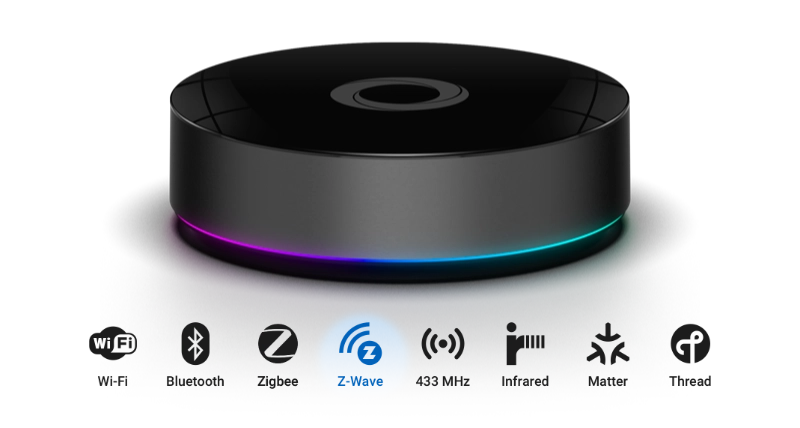
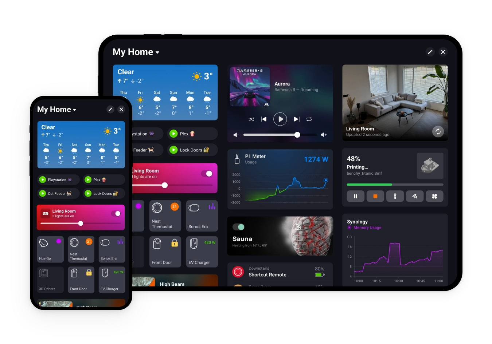
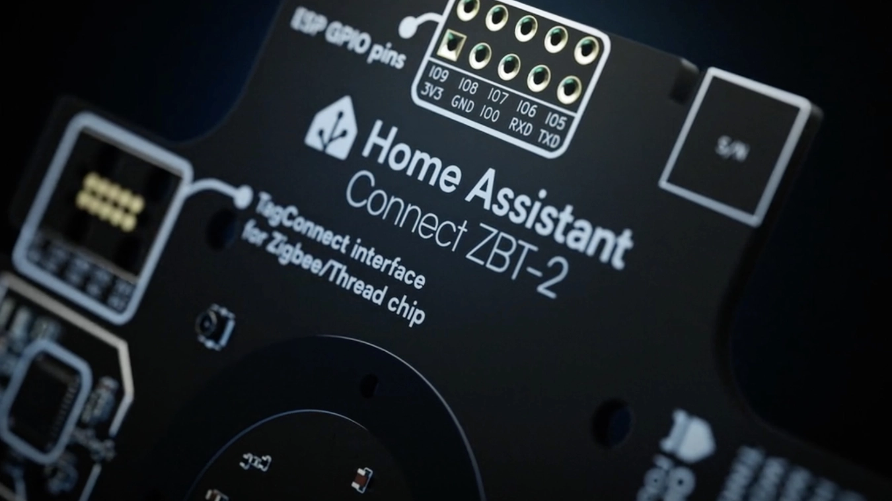

The [**Homey Pro 2026**](https://homey.app/en-us/news/introducing-homey-pro-2026/) is here! So it's time for a fresh look! 2 years ago, I [reviewed the Homey Pro (Early 2023)](https://docs.joepverhaeg.nl/homeypro/) version and I was mind blown.

With this blog I tried to create a personal review in a landscape full of AI-generated content. I compared the new Homey Pro with Home Assistant, which remains the most accessible option for retail consumers. My beloved Home Center 3, in contrast, is increasingly targeted at professional installers.

## Why I choose Z-Wave in this review

Because I chose the Home Center 3 years ago as the hub for my smart home, I automatically opted for the Z-Wave protocol.

That's why I compare the Homey Pro 2026 with Home Assistant (HA) and the ZWA-2 Z-Wave USB antenna. I try to explain the differences in a simple way so you can choose the system that fits your home, your time and your technical skills.

## Overview of both systems

### Homey Pro 2026

Homey Pro 2026 is an all-in-one smart home hub. It supports Zigbee, Z-Wave, Matter, Thread, Wi-Fi, Bluetooth, 433 MHz and Infrared. With the 2026 upgrade it got 4 GB of RAM. The heart of the system runs everything locally. You can configure almost everything through the Homey mobile app.

> You can read how the Homey Pro compares to a FIBARO Home Center 3 in [my 2023 article](https://docs.joepverhaeg.nl/homeypro/) where I compare these two systems. (see what I did there? 😀)

The above specifications are not entirely new, so what exactly does the 2026 model bring you? The hub now includes 4 GB of RAM, double the amount of the 2023 model. This allows more than 100 Homey Apps to run simultaneously, providing sufficient capacity for larger and more complex installations.

### Home Assistant with Connect ZWA-2

Home Assistant is an open source platform that you can install on your own [Raspberry Pi](https://www.raspberrypi.com), mini PC or you can [buy a smart hub build by Nabu Casa](https://www.home-assistant.io/green/). You can combine it with the [Home Assistant Connect ZWA-2](https://www.home-assistant.io/connect/zwa-2/) adapter if you want good Z-Wave support.

HA is very flexible and offers deep configuration options, but it requires more setup work and technical knowledge.

## User experience and ease of use

**Home Assistant** can feel overwhelming at the start, as it presents a largely empty installation that requires configuration before you can use it. I the past years HA has made significant improvements to its user interface and automation tools, making it more approachable for the general user.

Let's face it, **Homey Pro 2026** is the winner for non-techy users who want to build an advanced smart home. The platform focuses on simplicity and provides a intuitive app.

The app is designed for the times we live in. It is easy to navigate, set up automations, and monitor your smart home. Even if you have little technical experience, you can quickly understand how the system works and start building advanced automations.

## Device compatibility and protocol support

When you're figuring out which smart home system suits you best, device support is an important point on your list. Both Homey Pro 2026 and Home Assistant support a wide range of devices and communication protocols, but they approach this in different ways.

Home Assistant often relies on additional hardware such as USB adapters or network bridges. Homey includes these communication protocols directly in the hub. For advanced users this is usually not an issue, but it is for users who want flexibility without managing extra dongles or devices. If that it you, then Homey provides a simpler and more streamlined experience.

Let's brake it down:

| Feature           | Homey Pro 2026         | Home Assistant with ZWA-2                                            |
| ----------------- | ---------------------- | -------------------------------------------------------------------- |
| **Zigbee**        | Built in               | Supported with [ZBT-2](https://www.home-assistant.io/connect/zbt-2/) |
| **Z-Wave**        | Built in               | Supported with [ZWA-2](https://www.home-assistant.io/connect/zwa-2/) |
| **Matter**        | Built in               | Supported with [ZBT-2](https://www.home-assistant.io/connect/zbt-2/) |
| **Thread**        | Built in               | Supported with [ZBT-2](https://www.home-assistant.io/connect/zbt-2/) |
| **Wi-Fi devices** | Supported through apps | Supported through integrations                                       |
| **433 MHz**       | Built in               | Supported with adapters                                              |
| **Infrared**      | Built in               | Supported with adapters                                              |
| **Bluetooth**     | Built in               | Supported with adapters                                              |

As you can see in the table above, both systems support the same protocols. The difference is that Homey includes almost everything inside the hub, while Home Assistant depends on the hardware you choose.

## Automation and workflows

### Homey Pro

Creating automations is easy with the visual flow cards in the Homey App. To create more advanced automations you can use Advanced Flows.

 This feature is free for Homey Pro users and available in Homey Premium if you own another Homey hub. You can drag actions and conditions to build your automation.

 If you really want to create tailor-made automations in your home then you can even write scripts in JavaScript.

### Home Assistant

Home Assistant provides both visual automation editors and YAML-based configuration. It supports more advanced triggers, sensors, and logic.

To achieve a similar advanced Homey automation experience in Home Assistant, you need to manually install Node-RED and configure it to work with your devices and integrations.

Regular readers of my blog will know that I'm a huge fan of Homey's Advanced Flows, so I'm maybe a little bit biased here.

## User experience and ease of use

The user experience and ease of use can make a big difference when you choose a smart home platform. Homey Pro and Home Assistant offer powerful features, but they cater to different types of users.

Let's brake it down again:

| Feature                   | Homey Pro              | Home Assistant                  |
| ------------------------- | ---------------------- | ------------------------------- |
| **Mobile app**            | Clean, user-friendly   | Powerful but more complex       |
| **Device setup**          | Consistent and guided  | Flexible; often manual          |
| **Technical knowledge**   | Not required           | Required                        |
| **Menus & configuration** | Minimal, app-centric   | Many menus and screens          |
| **Learning curve**        | Shallow                | Steep                           |
| **Flexibility**           | Good for typical users | Extremely flexible once learned |

## Local control and privacy

Both systems work locally, but only Home Assistant can be fully configured when your Internet connection is offline. Homey Pro requires an Internet connection for their mobile app to connect. Even if your Internet goes down, Homey Pro will continue to run any automations that are already configured.

## Cost comparison

Home Assistant is free and open-source. But if you want a fair comparison with Homey Pro (2026), you need to factor in the cost of a Raspberry Pi with the communication hardware that Homey offers. That's why I've created a list to help you compare them:

| System                                                                 | Estimated Cost |
| ---------------------------------------------------------------------- | -------------- |
| Homey Pro 2026                                                         | About €399     |
| Home Assistant Core                                                    | Free           |
| [Raspberry Pi](https://www.raspberrypi.com) 5 / 4GB for Home Assistant | About €80      |
| [Raspberry Pi](https://www.raspberrypi.com) 5 housing                  | About €25      |
| [Raspberry Pi](https://www.raspberrypi.com) 5 27W USB-C adapter        | About €15      |
| SanDisk Ultra Micro SDHC 32GB for Home Assistant                       | About €20      |
| [ZWA-2 Z-Wave Adapter](https://www.home-assistant.io/connect/zwa-2/)   | About €60      |
| [ZBT-2 Zigbee Adapter](https://www.home-assistant.io/connect/zbt-2/)   | About €45      |
| [Rfxcom](http://rfxcom.com) USB RFX-433                                | About €80      |
| IR Remote Hub                                                          | About €25      |

As shown in the table above, Home Assistant can be a little bit cheaper, but it depends on the hardware you choose.

With Homey Pro, you get a polished user interface out of the box and an intuitive app to automate your smart home. And I didn't mention Homey's Advanced Flows, that provide powerful automation without the need for additional setup.

## Final Conclusion

If you have little to no technical knowledge and you want to build a smart home in 2026, I recommend the [Homey Pro 2026](https://homey.app/nl-nl/).

But if you enjoy building systems yourself and want unlimited customization, choose [Home Assistant with the ZWA-2 adapter](https://www.home-assistant.io/connect/zwa-2/).

Both are excellent platforms. The best choice depends on how much time and technical energy you want to invest.