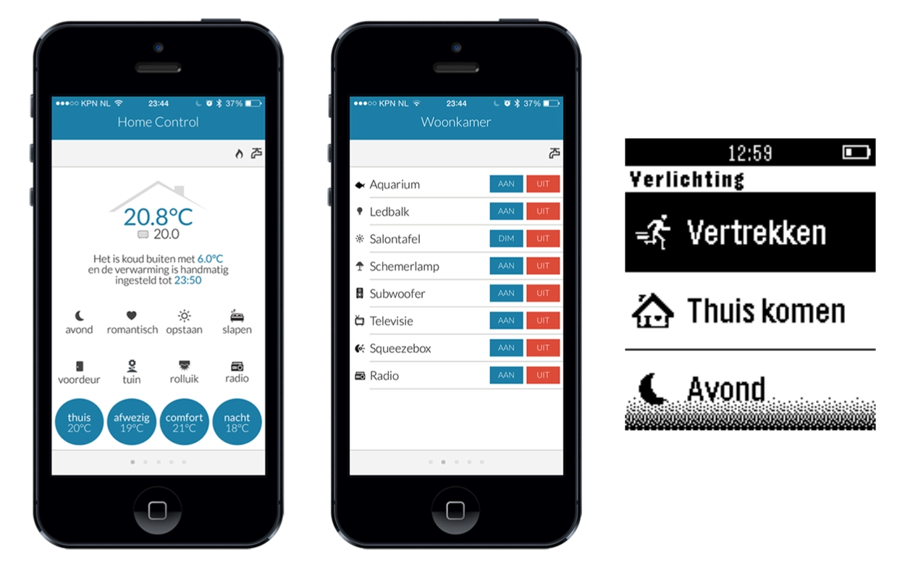

Building a smart home can be overwhelming with so many devices and protocols to choose from. In this blog, I'll share my experience why I use [Shelly](https://www.shelly.com) next to my [FIBARO](https://www.fibaro.com) devices, and how this combination has given me a reliable, easy-to-manage smart home that just works.

## How I Built My First Smart Home

When I started building my first smart home in 2012 I was experimenting with 433 MHz, Zigbee and Z-Wave devices in [Domoticz](https://www.domoticz.com). Setting up automations and managing different devices was a learning experience about how to build a stable smart home.

I'm proud to have built a custom HTML control interface for my iPhone 5 and an app for my Pebble Classic back then. It was an exciting time, discovering all the possibilities of home automation and figuring out ways to make my devices work together.

## How My Current Smart Home Works

In 2018, I started building the smart home setup I still use today. I realized that reliability had to come first. I wanted a system that works for me.

That’s why I decided in 2018 to focus on **FIBARO for Z-Wave** (indoor) and **Shelly for Wi-Fi** (outdoor). For my garden devices, I went with Wi-Fi since my [Ubiquiti](https://www.ui.com) [UniFi](https://www.ui.com/us/en/wifi) Outdoor access point gives excellent coverage and Wi-Fi devices are more affordable. I chose Shelly devices knowing that moisture can cause malfunctions, and it wouldn't cost me much if they did. Surprisingly, over the past seven years, they have never let me down thanks to the weatherproof enclosures I use.

### FIBARO: Stability With Z-Wave devices

The **FIBARO Home Center 3 (HC3)** is the heart of my setup. Since [Nice](https://www.niceforyou.com) acquired FIBARO, they’ve been rebranding the HC3 as **[Yubii Home](https://www.yubiihome.com)**. The core functionality remains the same, but the new name reflects their platform and vision for the smart home of 2026.

The HC3 uses Z-Wave technology and provides a robust mesh network, making automations reliable and consistent. Once set up, it just works. I’ve never experienced any device action failures in my home.

Therefore I'm writing a [real-time integration with my Homey Pro](https://www.linkedin.com/posts/joepverhaeg_home-automation-installers-how-much-time-activity-7413670131807195136-oOtO), so I don't need to spend re-configuring my Z-Wave network as I'm experimenting with the new functionality of the Homey Pro 2026.

### Shelly: Reliable Wi-Fi With MQTT

**Shelly Gen1** devices are the heart of my garden setup. When configured with MQTT, they have a local network connection on my home network (no internet connection required).

Their firmware is rock-solid and with a local MQTT broker running on my Linux server, I was able to connect them seamlessly to my HC3 using my own Shelly MQTT based Quick App.

Controlling the lights from the HC3 is on-the-spot. The whole setup feels very smooth.

## Shelly Devices I Use In My Smart Garden

| Device               | Type             | Notes                           |
| -------------------- | ---------------- | ------------------------------- |
| Shelly 1 Gen1        | Wi-Fi switch     | Reliable for single loads       |
| Shelly 1 Gen3        | Wi-Fi switch     | Faster, improved firmware       |
| Shelly Duo RGBW GU10 | Wi-Fi RGBW light | Makes the trees glow like magic |

## Why I Trust Z-Wave And Shelly For A Reliable Smart Home?

This combination has given me a rock-solid smart home. My HC3 takes care of all the core Z-Wave automations flawlessly, while the Shelly devices handle their Wi-Fi-controlled lights and switches without a hitch. After years of experimenting with different brands, setups, and even building my own control apps, it’s a comfort to have a system that just works.

The key benefits of my smart home setup are:

- **Reliable:** Automations run consistently.
- **Simple:** Everything is controlled from the HC3 (or Homey Pro).
- **Scalable:** Adding new devices is straightforward.

## Relax And Unwind: The Smart Home That Works For You

After a long day at work, I love unwinding, sitting in the garden on warm summer evenings, watching the trees glow with color. Knowing that everything is running smoothly and reliably without having to troubleshoot why some lights aren’t turning on.

Credits: Title Photo by <a href="https://unsplash.com/@pramodtiwari?utm_content=creditCopyText&utm_medium=referral&utm_source=unsplash">Pramod Tiwari</a> on <a href="https://unsplash.com/photos/a-desktop-computer-sitting-on-top-of-a-desk-zzztvnONclM?utm_content=creditCopyText&utm_medium=referral&utm_source=unsplash">Unsplash</a> (monitor editing by myself)
