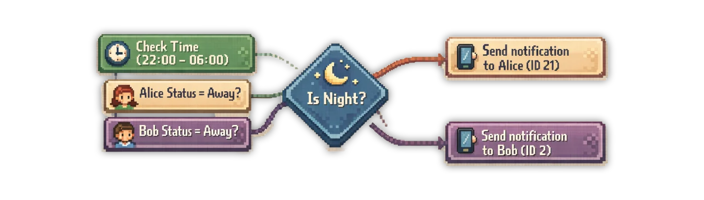

We all like fresh air, but if the windows are open for too long, you are wasting energy because your HVAC is heating up the rooms for nothing.

## Why I Build This Quickapp

Good ventilation is essential for a healthy home. Ideally, you should open your windows for 15 minutes a day. This will bring a breath of fresh air into your rooms, but if you're like me, you sometimes forget to close the upstairs windows on these winter days before going to work.

I also had this problem with my garage door. If I accidentally left it open, cold air got into my house and I was wasting energy.

That's why I created a [Door/Window Notifier Quick App](https://marketplace.fibaro.com/items/sonos-s2-automation-controller) for my FIBARO Home Center 3.

This QuickApp allows you to monitor a selection of doors and windows and receive a notification if they remain open longer than a predefined period.


<sub><a href="https://www.pexels.com/photo/a-smartphone-displaying-a-stopwatch-21792124/">Photo by Image Hunter</a></sub>

## Features

The QuickApp features easy configuration options in the Yubii App or Web GUI, allowing you to toggle sensors on and off without diving into the variables or code.

- **Multi-Device Selection**: Easily select which windows and doors you want to monitor directly from the Yubii Home App.
- **Configurable Timeouts**: Set different "maximum open times" for windows and doors (e.g., 15 minutes for a window, but maybe only 5 minutes for a door).
- **Smart Notifications**: Get alerted immediately when a threshold is exceeded, so you can take action.

## Installation

1. Download the `.fqa` file from the [FIBARO Marketplace](https://marketplace.fibaro.com/items/sonos-s2-automation-controller).
2. Log in to your Home Center 3.
3. Navigate to **Settings** > **Devices**.
4. Click the **+** icon and select **Add Device**.
5. Choose **Other Device** > **Upload File** and select the downloaded QuickApp.

## Configuration

Once installed, you’ll find two main configuration sections when you select the device within your Yubii Home or HC3 dashboard:

### Select Windows & Doors To Monitor

The **Select Windows to Monitor** and **Select Doors to Monitor** dropdowns will automatically populate with your available sensors. Simply check the boxes for the specific rooms or windows (e.g., *Bedroom*) you want the QuickApp to track.


### Define Maximum Open Time

You can **customize** exactly **how long** a sensor is allowed to be **breached** before an alert is triggered:

- **Windows**: Generally set between 15 minutes and an hour to allow for proper ventilation.
- **Doors**: Usually set to a shorter interval for better climate control or security.

Simply use the **dropdown** menu to **select** your **preferred timeout**.

## How it Works

The QuickApp automatically discovers the devices in your HC3 matching the type `com.fibaro.doorSensor` and `com.fibaro.windowSensor`. Once active it runs a background process that monitors the status of the selected devices.

The moment a sensor state changes to *breached*, a timer starts. If the sensor remains open for the full duration of your *maximum open time*, the QuickApp triggers a notification. If the door or window is closed before the timer hits zero, the process is immediately reset.

## Customizing Your Notifications

By default, the QuickApp is set up to notify the primary user (*id:2*), which is typically the account created during the initial setup of your HC3.

Since I’ve kept the QuickApp code open source, you can easily tweak this behavior. I’ve placed the logic right at the top of the Lua file, so even if you aren't a programmer, you can quickly adjust it to suit your needs.



### Example: Geofencing and Time Filtering

Below is an example of how you can customize the code. This snippet ensures that a notification is only sent if someone is actually at home (based on a `Global Variable` or geofencing) and suppresses alerts between 22:00 and 06:00:

**Note:** In this example, I am assuming you have two `Global Variables` that track whether **Sarah** or **Max** are at home, which are updated via your own geofencing method.

```lua
function QuickApp:sendPush(message)
 -- Example: Defining nighttime window
 local currentTime = os.date("%H:%M")
 local isNight = (currentTime >= "22:00" or currentTime < "06:00")

 -- Example: Check global variables for presence
 local aliceIsAway = hub:getGlobalValue("AliceStatus") == "Away"
 local bobIsAway   = hub:getGlobalValue("BobStatus") == "Away"

 -- Example: Alice has user id: 21
 if not isNight and not aliceIsAway then
  self:trace("Send a window/door notification to: Alice")
  hub.alert("push", { [1] = 21 }, message)
 end

 -- Example: Bob has user id: 2
 if not isNight and not bobIsAway then
  self:trace("Send a window/door notification to: Bob")
  hub.alert("push", { [1] = 2 }, message)
 end
end
```

This level of customization is what makes your smart home truly intelligent. You can even take it a step further by integrating your Sonos system for spoken announcements. If you're interested in setting that up, check out my previous post on [Sonos TTS for the FIBARO HC3](https://docs.joepverhaeg.nl/sonos-tts/), where I walk you through the process.

## Summary

This QuickApp is build to be a *set it and forget it* solution to ensure your home remains secure and energy-efficient. No more worrying about your windows or garage door that stays open to long when it’s cold winter weather. From now on your HC3 will let you know when action is needed!

## QuickApp Download

💙 **Support & Fair Use**<br />
This QuickApp is provided free and my website is ad-free. If you are an installer or deploy this for clients, supporting the project with a donation is strongly encouraged. [You can donate here 🔗](https://docs.joepverhaeg.nl/donate)

⬇️ **Download**<br />
You can find the [Window/Door Notifier QuickApp](https://marketplace.fibaro.com/items/sonos-s2-automation-controller) in the [FIBARO Marketplace](https://marketplace.fibaro.com/items/sonos-s2-automation-controller).

