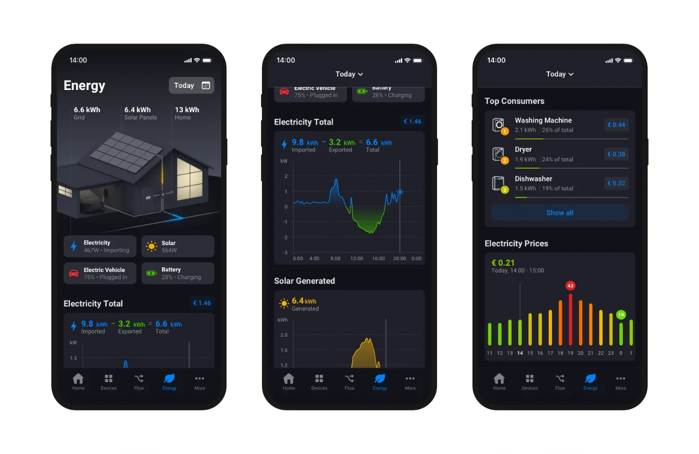
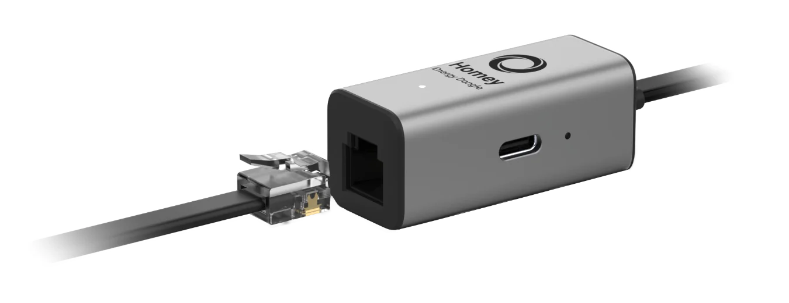
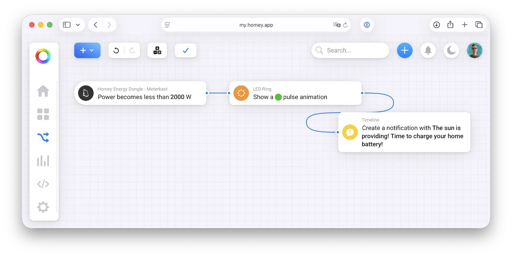
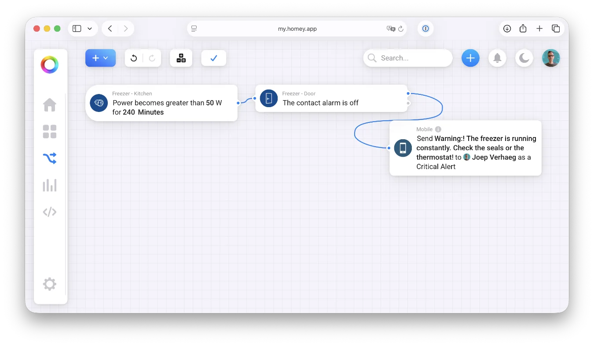

Let’s cut straight to the point with the question everyone is asking: **Why choose the Homey Energy Dongle instead of the HomeWizard P1 Meter?**

## Native Integration with Homey

The Homey Energy Dongle is built for the Homey ecosystem. While the HomeWizard P1 Meter works with Homey via their API, the Homey dongle is a native extension of your Homey ecosystem.

I managed to get it configured and visible in the app in **less than a minute**. I connected it to my smart meter, opened the Homey app and done!

## P1 Passthrough for EV charging

The Homey Energy dongle has a built-in splitter for another P1 reader. Most smart meters only have one P1 port. If you have an EV charging station that uses a physical cable for load balancing, your P1 port is already occupied, so you’d need a cheap splitter that doesn’t always work. The Homey Dongle solves this problem, because you can plug your car charger P1 interface into the dongle.

This ensures that you do not get an extremely high load on your electricity phases, which would cause your earth leakage circuit breaker to trip.

## Usage: Identify Power Hungry Devices

While the most P1 dongles show you what energy enters (and leaves) your home, the real "Energy Transition" win happens when you tackle the individual big spenders.

Homey’s Energy tab is a powerful insight, but it reaches its full potential when you measure at the socket level.

Let me explain.

### Pro-Tip: A Wall Plug for Every Appliance

If you put a smart plug (like a Fibaro Wall Plug or HomeWizard Energy Socket) behind your fridge and freezer in your house you get insight in their power usage and you get another benefit:

1. **Visibility:** In the Homey Energy tab, you’ll see exactly what percentage of your monthly bill goes to that old freezer in the shed.
2. **Savings Potential:** You’d be surprised how much power a 10-year-old fridge pulls from the grid compared to modern ones.
3. **Health Monitoring:** This is a nice feature. By monitoring the power draw, you can set up a Homey Flow to see if your appliance is failing. If your freezer suddenly pulls a constant 100W instead of cycling on and off, your thermostat might be broken or the seals are gone. Your Homey can notify you before your food defrosts!

## Smart Flows: Orchestrating the Data

To help a little bit with the energy transition here in the Netherlands, I’ve put together an example flow that turns your energy data into an automated action.

### Intelligently Charging Your Home Battery with Homey

Since I haven't added a physical home battery to my setup yet, I’ve built a demo flow to illustrate the logic behind smart charging of your home battery.

When your solar production exceeds your home's demand, Homey steps in to top up your battery. This allows you to store that energy and strategically feed it back to the grid only when it makes the most (financial) sense.

This flow is designed to give you a head start in making your home truly energy-efficient:

#### Flow 1: The "Free Energy" Indicator

- **WHEN:** The power becomes less than 2000W.
- **THEN:** Set the LED ring of your Homey to green (or send a notification: *"The sun is providing! Time to start the heavy machinery."*).

### The Appliance Health Check (Freezer Malfunction Alert)

Another example is that most people only realize their freezer is dying when they see a puddle on the floor. By then, it’s too late.

By tracking the power usage of your appliances, you can spot trouble weeks before it becomes a disaster. A healthy fridge or freezer should "pulse”, it draws power to cool down and then idles. If your Homey data shows a constant, flat line of high power consumption, it’s a red flag that your appliance is struggling to keep its cool.

Let me show you how you can set up a health check flow to create an early warning system:

#### Flow 2: The Appliance Health Check (Maintenance Alert)

- **WHEN:** The power of the "Freezer Plug" has been above 50W for more than 4 hours.
- **AND:** (Optional) Door sensor is closed.
- **THEN:** Send a push notification: *"Warning: The freezer is running constantly. Check the seals or the thermostat!"*

## Conclusion

The Homey Energy Dongle is the bridge between the energy transition and your comfort. It removes the friction of third-party APIs and provides a nice foundation for your energy management. By combining it with wall plugs, you're not just monitoring; you're mastering your home's efficiency.